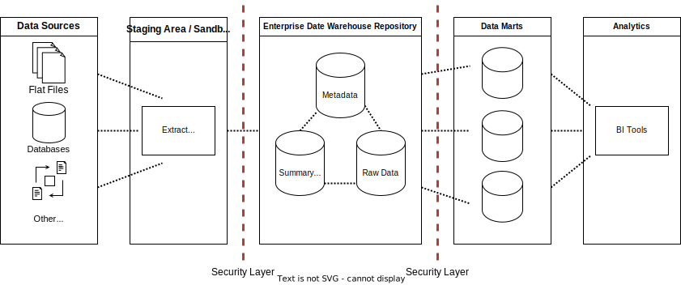
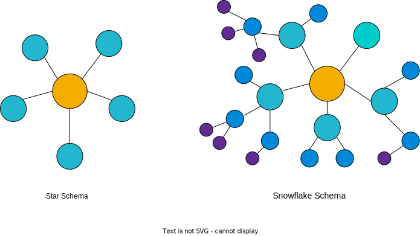

# Getting Started with Data Warehousing and BI Analytics <!-- omit from toc -->


## Table of Contents <!-- omit from toc -->

- [1. An Introduction to Data Warehouses, Data Marts, and Data Lakes](#1-an-introduction-to-data-warehouses-data-marts-and-data-lakes)
  - [1.1. Data Warehouse Overview](#11-data-warehouse-overview)
  - [1.2. Data Marts Overview](#12-data-marts-overview)
  - [1.3. Data Lakes Overview](#13-data-lakes-overview)
- [2. Designing, Modeling and Implementing Data Warehouses](#2-designing-modeling-and-implementing-data-warehouses)
  - [2.1. Cubes, Rollups, and Materialized Views and Tables](#21-cubes-rollups-and-materialized-views-and-tables)
    - [2.1.1. Data Cube](#211-data-cube)
    - [2.1.2. Materialized Views](#212-materialized-views)
  - [2.2. Facts and Dimensional Modeling](#22-facts-and-dimensional-modeling)
    - [2.2.1. Create the Schema on the Data Warehouse Using PostgreSQL](#221-create-the-schema-on-the-data-warehouse-using-postgresql)
  - [2.3. Data Modeling Using Star and Snowflake Schemas](#23-data-modeling-using-star-and-snowflake-schemas)
    - [2.3.1. Star Schema Vs. Snowflake Schema](#231-star-schema-vs-snowflake-schema)
    - [2.3.2. Normalization](#232-normalization)
  - [2.4. Staging Areas for Data Warehouses](#24-staging-areas-for-data-warehouses)
  - [2.5. Populating a Data Warehouse](#25-populating-a-data-warehouse)
    - [2.5.1. Populating a Data Warehouse: An Ongoing Process](#251-populating-a-data-warehouse-an-ongoing-process)
    - [2.5.2. Populating Data](#252-populating-data)


<br>
<br>

****************
## 1. An Introduction to Data Warehouses, Data Marts, and Data Lakes

### 1.1. Data Warehouse Overview

A data warehouse is a system that gathers data from multiple sources into a single, central, and consistent data store to support various data analytics requirements.

**Data Warehouse Analytics**: Data warehouse systems enable data mining, artificial intelligence, and machine learning applications. The Extract, Transform, Load (ETL) process facilitates fast front-end reporting, delivering critical information quickly. Online Analytical Processing (OLAP) allows for fast, flexible, multidimensional data analysis in business intelligence and decision support applications.

**Data Warehouse Deployment**: Data warehouses have traditionally been hosted *on-premises* within enterprise data centers. In recent times, *Cloud Data Warehouses (CDWs)* have gained popularity, offering scalable, pay-as-you-go services accessible via the cloud.

**Benefits of Data Warehouse**: The key benefits of data warehouses include:
- Centralizing data from disparate sources into a single, reliable data store.
- Improving data quality through data integration and standardization.
- Enhancing data access performance for faster business insights.
- Enabling large-scale BI functions like data mining, AI, and machine learning, leading to smarter decision-making.
- Offering organizations the means to realize competitive advantages and gains through improved data quality and faster insights.

**Popular Data Warehouse Vendors and Offerings**:
1. **Oracle**: Offers Oracle Exadata for on-premises or Oracle Public Cloud deployment.
2. **IBM**: Provides IBM Netezza for cloud deployment on IBM Cloud, AWS, Azure, and private clouds.
3. **Amazon**: Offers Amazon RedShift with proprietary hardware and software in the cloud.
4. **Snowflake**: A multi-cloud analytics solution compliant with data privacy regulations.
5. **Google**: Provides Google BigQuery as a flexible, multi-cloud data warehouse solution.
6. **Microsoft**: Offers Azure Synapse Analytics with code-free visual ETL/ELT processes and support for both cloud and on-premises deployment.
7. **Teradata**: Offers Vantage, a multi-cloud data platform for enterprise analytics with unified data lakes and warehouses.
8. **Vertica**: Provides a hybrid-cloud data warehouse system with multi-cloud support and fast data transfer rates.
9. **IBM**: Offers Db2 Warehouse with scalability, parallel processing, and containerized scale-out capabilities.
10. **Oracle**: Provides Autonomous Data Warehouse in Oracle Public Cloud and on-premises with automated security features.

**Data Warehouse Evaluation Criteria**: Organizations use various criteria to evaluate data warehouse systems, including:
1. **Location**: Data warehouses can exist on-premises, on appliances, or on one or more cloud locations. Considerations include data security, privacy requirements, and data access speed.
2. **Features and Capabilities**: Evaluate architecture, scalability, data types supported (e.g., structured, semi-structured, unstructured), and batch/streaming data processing.
3. **Ease of Implementation**: Consider data governance, data migration, data transformation capabilities, and system optimization.
4. **User Management**: Implement a zero-trust security policy, manage and validate system users, and have notifications and reports to address issues promptly.
5. **Ease of Use and Skills**: Assess whether the staff has the skills to implement the chosen technology and the support from the implementation partner.
6. **Support Considerations**: Verify vendor support hours, channels, and the availability of service level agreements (SLAs) for uptime, security, and scalability.
7. **Cost Considerations**: Calculate the total cost of ownership (TCO), including infrastructure, software licensing, data migration, administration, and recurring support and maintenance costs.

**On-Premises vs. Public Cloud**: Organizations might choose on-premises installations for strict data security and privacy requirements. Public cloud options offer benefits like economies of scale, powerful compute power, and flexible price-for-performance options.

**Total Cost of Ownership (TCO)**: When evaluating costs, consider not only the initial expenses but also the TCO for running the system over several years, including infrastructure, software licensing, data migration, administration, and support and maintenance costs.


### 1.2. Data Marts Overview

A data mart is an isolated part of a larger enterprise data warehouse, built to serve a specific business function, purpose, or user community. It provides specific support for tactical decision-making.

**Data Mart Structure**: Data marts are designed to provide relevant data efficiently, saving time for end users and supporting tactical decision-making. They have a *relational database structure* with a *star or snowflake schema*, consisting of a *central fact table surrounded by dimension tables* for context.

**Comparison to Other Data Repositories**:

| Data Marts                                                         | Databases                                             |
| ------------------------------------------------------------------ | ----------------------------------------------------- |
| OLAP systems optimized for read-intensive queries                  | OLTP systems optimized for write-intensive operations |
| Use transactional databases (Txn DB) or warehouses as data sources | Use operational applications as sources of data       |
| Contain clean, validated analytical data                           | Contain raw, unprocessed transactional data           |
| Accumulate historical data for trend analysis                      | May not retain older data                             |

| Data Marts                               | Data Warehouses                                |
| ---------------------------------------- | ---------------------------------------------- |
| Small data warehouse with tactical scope | Large repositories with broad, strategic scope |
| Lean and fast                            | Large and slow                                 |


**Types of Data Marts**:
1. **Dependent Data Marts**: Draw data from the enterprise data warehouse and offer analytical capabilities within its restricted scope, inheriting the security of the warehouse.
2. **Independent Data Marts**: Bypass the data warehouse and directly source data from operational systems or external sources, requiring custom ETL pipelines and separate security measures.
3. **Hybrid Data Marts**: Partially depend on the enterprise data warehouse and combine inputs from data warehouses and external systems.

**Purpose and Advantages**:
- Provide relevant data to end-users when needed.
- Accelerate business processes with efficient query response times.
- Enable data-driven decision-making in a cost-efficient manner.
- Ensure secure access and control over data.


### 1.3. Data Lakes Overview

A data lake is a storage repository that can store large amounts of structured, semi-structured, and unstructured data in its raw or native format. Each data element is given a unique identifier and tagged with metadata, making it a flexible and agile repository.

**Benefits of Data Lakes**:
1. **Versatility**: Data lakes can store all types of data, including unstructured, semi-structured, and structured data from different sources.
2. **Scalability**: Data lakes can scale from terabytes to petabytes of data, making them suitable for handling massive datasets.
3. **Time Savings**: Data lakes save time by not requiring data to be pre-defined, structured, or transformed before loading.
4. **Data Reuse**: Data lakes allow fast and flexible reuse of data for various current and future use cases.

**Comparison to Data Warehouses**:
- **Data Integration**: Data lakes store data in its raw and unstructured form, while data warehouses require data to be processed and conformed to standards before loading.
- **Schema Definition**: Data lakes do not require a predefined schema, whereas data warehouses need a schema designed and implemented before loading data.
- **Data Quality and Governance**: Data lakes may have raw and uncurated data, whereas data warehouses have curated data adhering to data governance guidelines.
- **Users**: Data scientists, data developers, and machine learning engineers typically use data lakes, while business analysts and data analysts use data warehouses.

**Deployment Technologies**: Data lakes can be deployed using various technologies, including cloud object storage like Amazon S3, large-scale distributed systems like Apache Hadoop, relational database management systems, and NoSQL data repositories.

**Use Cases**: Data lakes can be used as self-serve staging areas for various use cases, including machine learning development and advanced analytics.

Overall, data lakes were created to address the limitations of data warehouses, and depending on an organization's requirements, both data warehouses and data lakes may be needed as they serve different needs. Data lakes provide a flexible and agile repository for raw and diverse data, enabling organizations to harness the full potential of their data for various analytics and decision-making tasks.

<br>
<br>

****************
## 2. Designing, Modeling and Implementing Data Warehouses

The details of the architecture of a data warehouse depend on intended usage of the platform. Requirements can include:
- Report generation and dashboarding
- Exploratory data analysis
- Automation and machine learning
- Self-serve analytics



Vendor-specific reference architectures:
- Adaptation of general model
- Interoperability
- Tool integrations tested

Vendors Offer proprietary reference EDW architectures based on the general model, that are tested to ensure interoperability.

### 2.1. Cubes, Rollups, and Materialized Views and Tables

#### 2.1.1. Data Cube

A data cube is generated from a star schema and is defined by a set of dimensions. Each cell in the cube is defined by a fact of interest from the schema, such as "total sales in thousands of dollars".

The coordinates of the cube are defined by "dimensions" that are selected from the star schema, such as Product categories, State/Province, and Year.

**Operations on Data Cubes**:

1. **Slicing**: Selecting a *single member* from a dimension to analyze a subset of the cube. (For example, selecting only year 2023 from the year dimension)
2. **Dicing**: Selecting a *subset of values* from a dimension, effectively shrinking it.
3. **Drilling Up and Down**: Moving between levels of hierarchy and drilling into subcategories within a dimension.
4. **Pivoting**: Rotating the data cube, changing the point of view for analysis.
5. **Rolling Up**: Summarizing along a dimension by applying aggregations.

#### 2.1.2. Materialized Views

A materialized view is a local, read-only copy, or snapshot, of the results of a query.

**Use Cases**:

1. **Replicating Data**: Used in staging databases as part of ETL processes.
2. **Precomputing Expensive Queries**: Caching results of expensive queries such as joins or aggregations for use in data analytics environments.

**Properties of Materialized Views**:

Materialize views also have options for automatically refreshing the data, thus keeping query results up-to-date.

**Refresh Options**:

- **Never**: Populated only when created.
- **Upon Request**: Manually or scheduled refresh after changes.
- **Immediately**: Automatically refresh after every statement.

Since materialized views can be queried, you can safely work with them without affecting the source database.

**Examples**:

To create a materialized view in PostgreSQL:

```sql
CREATE MATERIALIZED VIEW my_mat_view 
TABLESPACE my_tablespace
AS
SELECT * FROM my_table

-- Optional parameters
WITH REFRESH [FORCE | ON [COMMIT | DEMAND]], [NO] DATA, NO OIDS, CHECK OPTION;

-- Refresh the materialized view to update the data (optional)
REFRESH MATERIALIZED VIEW my_mat_view WITH NO DATA;
```

In addition to the `WITH REFRESH [FORCE | ON [COMMIT | DEMAND]]` option, there are a few more refresh options available when creating a materialized view in PostgreSQL. Here are some of them:

1. `WITH REFRESH FAST`

  Attempts to update the materialized view incrementally, only modifying the changed rows in the underlying tables.

  ```sql
  CREATE MATERIALIZED VIEW my_mat_view
  AS
  SELECT * FROM my_table
  
  WITH REFRESH FAST;
  ```

2. `WITH DATA`
 
  Specifies that the materialized view should be populated with data. This is the default behavior if `WITH DATA` or `WITH NO DATA` is not specified.

  ```sql
  CREATE MATERIALIZED VIEW my_mat_view
  AS
  SELECT * FROM my_table

  WITH DATA;
  ```

3. `WITH NO DATA`

  Specifies that the materialized view should not be populated with data initially.

  ```sql
  CREATE MATERIALIZED VIEW my_mat_view
  AS
  SELECT * FROM my_table

  WITH NO DATA;
  ```

4. `WITH CHECK OPTION`
   
  Ensures that all rows inserted or updated in the materialized view satisfy the given condition.
  
  ```sql
  CREATE MATERIALIZED VIEW my_mat_view
  AS
  SELECT * FROM my_table

  WITH CHECK OPTION;
  ```

5. `WITH NO CHECK OPTION`

  Disables the check option, allowing rows that do not satisfy the condition to be inserted or updated.

  ```sql
  CREATE MATERIALIZED VIEW my_mat_view
  AS
  SELECT * FROM my_table

  WITH NO CHECK OPTION;
  ```

### 2.2. Facts and Dimensional Modeling

Facts in data warehousing are usually quantifiable measures (like temperature or number of sales) but can also be qualitative. Dimensions in data warehousing are attributes providing context to facts, e.g., location or time.


**Fact Tables:**

- **Definition:** Contains facts of a business process, linked to dimension tables via foreign keys.
- **Contents:** Additive measures (e.g., sales amounts) and foreign keys. Fact tables can be at a detail or aggregated level (summary tables).

**Types of Fact Tables:**
- **Accumulating Snapshot Fact Tables:** Record events in a well-defined business process (e.g., order processing stages).

  For example, the following accumulating snapshot fact table captures a snapshot of a sale at different stages (order placed, payment made, build started, build completed, and shipped), providing a comprehensive view of the sales process:

  | SaleID | VehicleID | SalespersonID | SaleDate           | SaleAmount | PaymentStatus | BuildStartDate     | BuildEndDate       | ShipDate           |
  | ------ | --------- | ------------- | ------------------ | ---------- | ------------- | ------------------ | ------------------ | ------------------ |
  | 101    | 501       | 301           | 2023-08-17 10:30AM | $30,000    | Pending       | 2023-08-18 01:00PM | 2023-08-19 03:00PM | 2023-08-20 11:00AM |
  | 102    | 502       | 302           | 2023-08-18 02:45PM | $25,000    | Paid          | 2023-08-19 11:00AM | 2023-08-19 02:00PM | 2023-08-20 10:30AM |
  | 103    | 503       | 303           | 2023-08-19 04:15PM | $35,000    | Paid          | 2023-08-20 09:30AM | 2023-08-20 12:30PM | 2023-08-21 10:00AM |

  - Each row represents a unique sale identified by `SaleID`.
  - `VehicleID` and `SalespersonID` are foreign keys linking to dimension tables.
  - `SaleDate` represents the date and time of the sale.
  - `SaleAmount` is the total amount of the sale in dollars.
  - `PaymentStatus` indicates whether the payment is pending or paid.
  - `BuildStartDate`, `BuildEndDate`, and `ShipDate` represent different stages in the order fulfillment process.

**Dimension Tables:**
- **Definition:** Variables categorizing facts, used for filtering, grouping, and labeling.
- **Contents:** Attributes related to dimensions (e.g., product details, employee information). Dimension tables are joined to fact tables via foreign keys.


#### 2.2.1. Create the Schema on the Data Warehouse Using PostgreSQL


**Step 1:** Start the PostgreSQL server, by running the command below:

```bash
start_postgres
```

**Step 2:** Create the database on the data warehouse.

Using the `createdb` command of the PostgreSQL server, we can directly create the database from the terminal.

```bash
createdb -h localhost -U postgres -p 5432 myDatabase
```

In the above command
- `-h` mentions that the database server is running on the localhost
- `-U` mentions that we are using the user name postgres to log into the database
- `-p` mentions that the database server is running on port number 5432


**Step 3:** Create the schema .sql file

Use the following sql script to create tables and set their relations:

```sql
BEGIN;

CREATE TABLE public."FactBilling"
(
    rowid integer NOT NULL,
    customerid integer NOT NULL,
    monthid integer NOT NULL,
    billedamount integer NOT NULL,
    PRIMARY KEY (rowid)
);

CREATE TABLE public."DimMonth"
(
    monthid integer NOT NULL,
    year integer NOT NULL,
    month integer NOT NULL,
    monthname "char" NOT NULL,
    quarter integer NOT NULL,
    quartername "char" NOT NULL,
    PRIMARY KEY (monthid)
);

CREATE TABLE public."DimCustomer"
(
    customerid integer NOT NULL,
    category "char" NOT NULL,
    country "char" NOT NULL,
    industry "char" NOT NULL,
    PRIMARY KEY (customerid)
);

ALTER TABLE public."FactBilling"
    ADD FOREIGN KEY (customerid)
    REFERENCES public."DimCustomer" (customerid)
    NOT VALID;


ALTER TABLE public."FactBilling"
    ADD FOREIGN KEY (monthid)
    REFERENCES public."DimMonth" (monthid)
    NOT VALID;

END;
```

Save the above script as schema.sql

**Step 4:** Create the schema

Run the command below to create the schema in the under `myDatabase` database.

```bash
psql  -h localhost -U postgres -p 5432 -d myDatabase < schema.sql
```


### 2.3. Data Modeling Using Star and Snowflake Schemas

**Star Schema**

Graph-based model with a central fact table linked to dimension tables.
In a star schema, fact and dimension tables (as nodes) are connected by relations.
This schema type is commonly used for specialized data warehouses (data marts).

**Snowflake Schema**

An extension of the star schema where dimensions are normalized, meaning that the levels or hierarchies of dimensions are separated into child tables.
A schema need not to be fully normalized to be considered a snowflake, as long as at least one of its dimensions has its levels separated.

**Note:** Normalizing dimensions reduces storage footprint by avoiding redundant data.




**Star Schema Design Considerations**

To design a star schema, you need to follow these steps:

1. Choose a business process that you want to model, such as sales, inventory, or customer service.
2. Decide the level of detail that you want to store in your data warehouse, such as yearly, quarterly, or daily data.
3. Identify the dimensions that describe your business process, such as date, time, product, customer, and location.
4. Identify the facts that measure your business process, such as sales amount, quantity sold, or profit margin. By following these steps, you can create a star schema that consists of a fact table and several dimension tables.


#### 2.3.1. Star Schema Vs. Snowflake Schema

Star schemas are optimized for reads and are widely used for designing data marts, whereas snowflake schemas are optimized for writes and are widely used for transactional data warehousing. A star schema is a special case of a snowflake schema in which all hierarchical dimensions have been denormalized, or flattened.

| Attribute                     | Star schema                | Snowflake schema                |
| ----------------------------- | -------------------------- | ------------------------------- |
| Read speed                    | Fast                       | Moderate                        |
| Write speed                   | Moderate                   | Fast                            |
| Storage space                 | Moderate to high           | Low to moderate                 |
| Data integrity risk           | Low to moderate            | Low                             |
| Query complexity              | Simple to moderate         | Moderate to complex             |
| Schema complexity             | Simple to moderate         | Moderate to complex             |
| Dimension hierarchies         | Denormalized single tables | Normalized over multiple tables |
| Joins per dimension hierarchy | One                        | One per level                   |
| Ideal use                     | OLAP systems, Data Marts   | OLTP systems                    |


**Comparing Benefits**

The snowflake, being completely normalized, offers the least redundancy and the smallest storage footprint. If the data ever changes, this minimal redundancy means the snowflaked data needs to be changed in fewer places than would be required for a star schema. In other words, writes are faster, and changes are easier to implement.
 
However, due to the additional joins required in querying the data, the snowflake design can have an adverse impact on read speeds. By denormalizing to a star schema, you can boost your query efficiency.

You can also choose a middle path in designing your data warehouse. You could opt for a partially normalized schema. You could deploy a snowflake schema as your basis and create views or even materialized views of denormalized data. You could for example simulate a star schema on top of a snowflake schema. At the cost of some additional complexity, you can select from the best of both worlds to craft an optimal solution to meet your requirements.

**Practical Differences**

Most queries you apply to the dataset, regardless of your schema choice, go through the fact table. Your fact table serves as a portal to your dimension tables.

The main practical difference between star and snowflake schema from the perspective of an analyst has to do with querying the data. You need more joins for a snowflake schema to gain access to the deeper levels of the hierarchical dimensions, which can reduce query performance over a star schema. Thus, data analysts and data scientists tend to prefer the simpler star schema.
 
Snowflake schemas are generally good for designing data warehouses and in particular, transaction processing systems, while star schemas are better for serving data marts, or data warehouses that have simple fact-dimension relationships. For example, suppose you have point-of-sale records accumulating in an Online Transaction Processing System (OLTP) which are copied as a daily batch ETL process to one or more Online Analytics Processing (OLAP) systems where subsequent analysis of large volumes of historical data is carried out. The OLTP source might use a snowflake schema to optimize performance for frequent writes, while the OLAP system uses a star schema to optimize for frequent reads. The ETL pipeline that moves the data between systems includes a denormalization step which collapses each hierarchy of dimension tables into a unified parent dimension table.

#### 2.3.2. Normalization

**Redundancy Reduction**

Both star and snowflake schemas benefit from the application of normalization. Normalizing a table means to create, for each dimension:
1. A surrogate key to replace the natural key, that is, the unique values of the given column, and
2. A lookup table to store the surrogate and natural key pairs.

Each surrogate key’s values are repeated exactly as many times within the normalized table as the natural key was before moving the natural key to its new lookup table. Thus, you did nothing to reduce the redundancy of the original table. 

However, dimensions typically contain groups of items that appear frequently, such as a "city name" or "product category". Since you only need one instance from each group to build your lookup table, your lookup table will have many fewer rows than your fact table. If there are child dimensions involved, then the lookup table may still have some redundancy in the child dimension columns. In other words, if you have a hierarchical dimension, such as "Country", "State", and "City", you can repeat the process on each level to further reduce the redundancy.

**Note:** further normalizing your hierarchical dimensions has no effect on the size or content of your fact table - star and snowflake schema data models share identical fact tables.

**Data Size Reduction**

When you normalize a table, you typically reduce its data size, because in the process you likely replace expensive data types, such as strings, with much smaller integer types. But to preserve the information content, you also need to create a new lookup table that contains the original objects.

You might wonder if the new table takes up more space than the normalized table you just created. This might not matter much for small data, but for big data or fast-growing data, it will matter eventually. Your fact table will grow faster than your dimension tables, so it makes sense to normalize your fact table to at least a star schema level. Then you need to decide which schema is better - star or snowflake.

**Note:** There's a tradeoff between storage and compute in data warehouse design. Precomputed dimensions that are seldom used may waste disk space thus, it is recommended to use SQL functions to compute dimensions on demand instead of joining tables in a snowflake schema.

### 2.4. Staging Areas for Data Warehouses

A staging area is an intermediate storage for ETL processes, thus acts as a bridge between data sources and target data repositories (warehouses, marts, etc.). Staging areas are often transient, meaning they are erased after successfully running ETL workflows. However, they can be used for archival, troubleshooting, optimizing and monitoring ETL jobs.

**Implementation of Staging Areas**

- **Variety:** Can be implemented using simple flat files (e.g., CSV), SQL tables in a relational database, or as a self-contained database instance within a BI platform.
- **Tools:** Managed using scripting languages (e.g., Bash or Python) or integrated into data warehousing/BI platforms (e.g., Cognos Analytics).

**Functions of Staging Areas**

- **Integration:** Consolidation of data from multiple source systems.
- **Change Detection:** Managing extraction of new and modified data.
- **Scheduling:** Sequencing and scheduling tasks within ETL workflows.
- **Data Cleansing and Validation:** Handling missing values, deduplication.
- **Aggregation:** Summarizing data (e.g., daily sales to weekly averages).
- **Normalization:** Enforcing consistency in data types or category names.

**Benefits of Staging Areas**

- **Decoupling:** Separates operations (validation, cleansing) from source environments.
- **Risk Mitigation:** Minimizes the risk of corrupting source-data systems.
- **Recovery:** Facilitates easy recovery if extracted data becomes corrupted.
- **Simplification:** Eases ETL workflow construction, operation, and maintenance.


### 2.5. Populating a Data Warehouse

#### 2.5.1. Populating a Data Warehouse: An Ongoing Process

**Types of Loads**

- **Initial Load:** Creation of fact and dimension tables, loading transformed and cleaned data.
- **Incremental Loads:** Periodic loading of new data, often daily or weekly.
- **Full Refresh:** Rarely done, typically for major schema changes or catastrophic failures.

**Frequency**

- Fact tables are dynamic and need frequent updates.
- Dimension tables are more static and change infrequently.


**Tools for Automating Data Population**

- Database utilities (e.g., Db2 Load utility).
- ETL data pipeline tools (e.g., Apache Airflow, Apache Kafka).
- Custom scripts using Bash, Python, and SQL.
- IBM InfoSphere DataStage for job compilation and execution.

#### 2.5.2. Populating Data

**Prerequisites**

- Modeled schema
- Staged data in tables or files
- Mechanisms for data quality verification

**Steps for Initial Load**

1. Instantiate the data warehouse and schema.
2. Create production tables.
3. Establish relationships between fact and dimension tables.
4. Load transformed and cleaned data into tables from staging area.

**Incremental Loads (Ongoing Loads)**

- **Automation**
  - Use scripts in ETL data pipelines.
  - Schedule incremental loads based on organizational needs.
  - Logic to determine new or updated data in the staging area.

- **Methods for Change Detection**
  - Relational database management systems often have mechanisms for identifying new, changed, or deleted records.
  - Timestamps indicating when data was first written and modified.
  - Brute-force comparison if source data isn't too large.

**Periodic Maintenance**

Data warehouse needs periodic maintenance (monthly, or yearly) to archive the data that's not likely to be used and ensure the data warehouse runs smoothly.

You can script both the deletion of older data and its archiving to slower and less costly storage.

