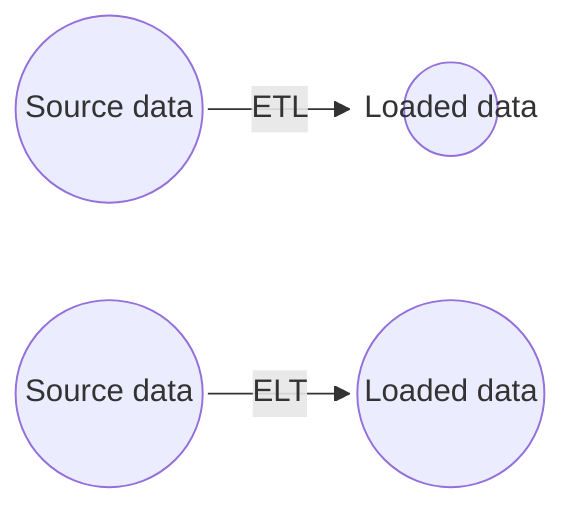
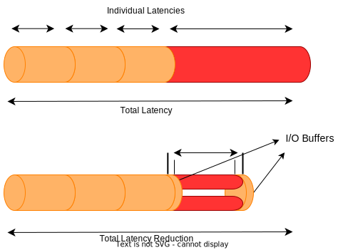
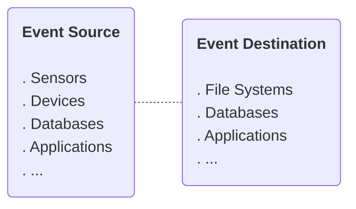
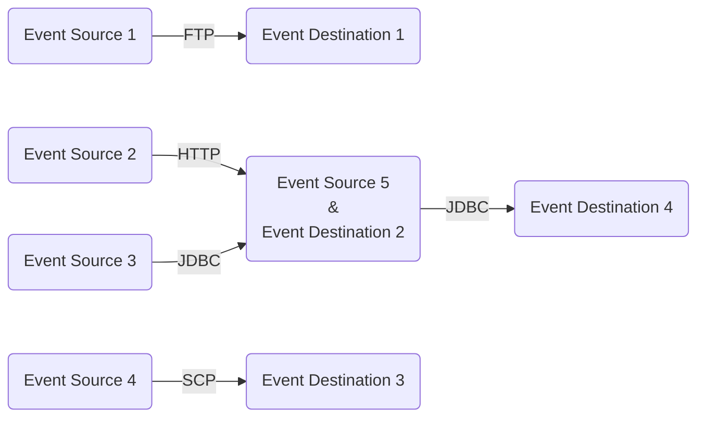
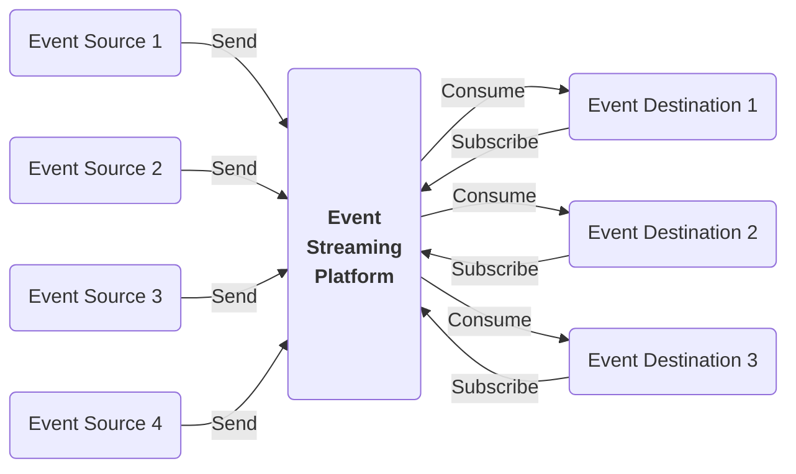
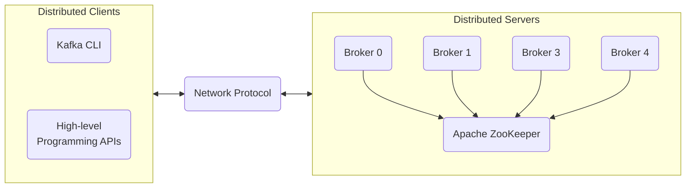
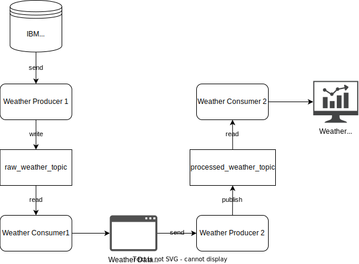
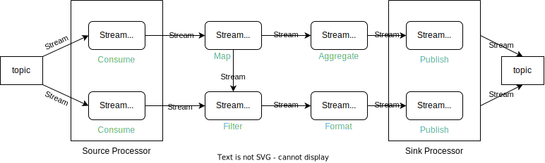
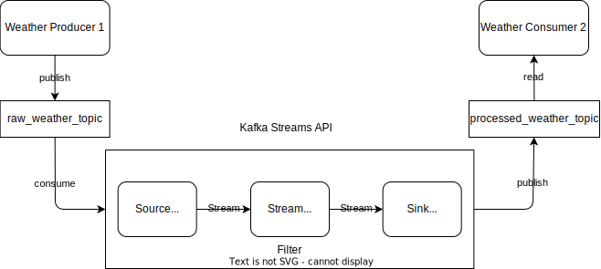

# ETL and Data Pipelines with Shell, Airflow and Kafka <!-- omit from toc -->


## Table of Contents <!-- omit from toc -->

- [1. ETL and ELT Processes](#1-etl-and-elt-processes)
  - [1.1. ETL vs ELT](#11-etl-vs-elt)
  - [1.2. Data Extraction Techniques](#12-data-extraction-techniques)
  - [1.3. Data Transformation Techniques](#13-data-transformation-techniques)
  - [1.4. Data Loading Techniques](#14-data-loading-techniques)
  - [1.5. ETL Tools](#15-etl-tools)
- [2. ETL \& Data Pipelines: Tools and Techniques](#2-etl--data-pipelines-tools-and-techniques)
  - [2.1. ETL Using Shell Scripts](#21-etl-using-shell-scripts)
  - [2.2. An Introduction to Data Pipelines](#22-an-introduction-to-data-pipelines)
  - [2.3. Key Data Pipeline Processes](#23-key-data-pipeline-processes)
  - [2.4. Batch VS Streaming Data Pipelines Use Cases](#24-batch-vs-streaming-data-pipelines-use-cases)
- [3. Apache Airflow](#3-apache-airflow)
- [4. Apache Kafka](#4-apache-kafka)
  - [4.1. Distributed Event Streaming Platform Components](#41-distributed-event-streaming-platform-components)
  - [4.2. Apache Kafka Overview](#42-apache-kafka-overview)
  - [4.3. Building Event Streaming Pipeline Using Kafka](#43-building-event-streaming-pipeline-using-kafka)
  - [4.4. Kafka Streaming Process](#44-kafka-streaming-process)
  - [4.5. Working with Streaming Data Using Kafka](#45-working-with-streaming-data-using-kafka)
    - [4.5.1. Kafka CLI](#451-kafka-cli)
    - [4.5.2. Kafka Python Client](#452-kafka-python-client)


<br>
<br>

****************

## 1. ETL and ELT Processes

**ETL** is an automated data pipeline engineering methodology used to acquire and prepare data for analytics environments like data warehouses or data marts. The **extraction** phase involves obtaining data from multiple sources, while the **transformation** phase involves preparing the data to meet the requirements of the target system and intended use. Finally, the **loading** phase involves writing the transformed data to a new destination environment for visualization, exploration, further transformation, and modeling.

Use cases for ETL include capturing and digitizing analog data, preparing transaction history for analysis in OLAP systems, engineering features or KPIs for dashboards and machine learning models, and facilitating prediction and augmented decision making. ETL processes play a crucial role in curating and making data accessible to end users for various purposes.

**ELT** is an automated data pipeline engineering methodology where data is acquired and directly loaded into its destination environment, such as a data lake, *without immediate transformation*. The transformation is performed on-demand using modern analytics tools in the destination environment. ELT processes are commonly used in high-performance computing and Big Data scenarios, including handling scalability, real-time analytics on streaming data, and integrating highly distributed data sources. The emergence of ELT is attributed to the evolution of cloud computing solutions, which can handle large volumes of asynchronous and distributed data with practically unlimited scalability. Cloud platforms offer flexibility, cost-efficiency, and a clean separation between data movement and processing.

ELT allows for a variety of applications from the same source of data, **without information loss or dependence on upstream transformations**. Cloud-based analytics platforms are well-suited for handling Big Data and facilitating ELT processes. The trend of ELT is driven by the advancements in cloud platform technologies.

### 1.1. ETL vs ELT

| ETL (Extract, Transform, Load)                                                   | ELT (Extract, Load, Transform)                                                                                                                                                    |
| -------------------------------------------------------------------------------- | --------------------------------------------------------------------------------------------------------------------------------------------------------------------------------- |
| Transformations occur within the data pipeline before reaching the destination.  | Transformations are decoupled from the data pipeline and happen in the destination environment.                                                                                   |
| Typically a fixed process with a specific function.                              | Flexible process that makes data readily available for self-serve analytics.                                                                                                      |
| Primarily handles structured, relational data.                                   | Handles any kind of data, including structured and unstructured data.                                                                                                             |
| Scalability can be a problem due to reliance on on-premise computing resources.  | Leverages on-demand scalability offered by cloud computing services to handle Big Data.                                                                                           |
| Modifying ETL pipelines requires time and effort from the development team.      | Provides more agility, allowing end users to connect to and experiment with raw data, create their own dashboards, and run predictive models themselves.                          |
| Traditional ETL includes an intermediate storage facility called a staging area. | ELT processes often utilize a data lake as a self-serve repository for storing and manipulating raw data.                                                                         |
| ETL is still relevant and has its applications.                                  | ELT is an evolving trend favored for its ability to address pain points such as lengthy time-to-insight, scalability challenges posed by Big Data, and the siloed nature of data. |

### 1.2. Data Extraction Techniques

Data extraction techniques include:
- OCR (Optical character recognition) → Digitize text scanned from paper documents
- ADC (Analog-to-Digital converters) → Digitize analog audio recordings and signals
- CCD (Charged-Coupled Devices) → Capture and digitize images 
- Mail, phone, or in-person surveys and polls
- Cookies, user logs
- Web scraping
- APIs
- Database querying → SQL languages for querying relational databases and NoSQL for querying document, key-value, graph, or other non-structured data repositories
- Edge computing → Such as video cameras that have built-in processing that can extract features from raw data

### 1.3. Data Transformation Techniques

Data transformations can involve various operations, such as:
- Data typing → Casting data into different types
- Data structuring → Converting one data format to another
- Anonymizing, encrypting
- Cleaning operations
- Normalizing → Converting data to common units
- Filtering, sorting, aggregating, binning
- Joining data sources

**Schema-on-write** is the conventional *ETL approach*, where the data must be conformed to a defined schema prior to loading to a destination, such as a relational database. The idea is to have the data *consistently* structured for stability and for making subsequent *queries much faster*, but this comes at the cost of *limiting the versatility* of the data.

**Schema-on-read** relates to the modern *ELT approach*, where the schema is applied to the raw data after reading it from the raw data storage. This approach is *versatile* since it can obtain multiple views of the same source data using ad-hoc schemas. Users potentially *have access to more data* since it doesn't need to go through a rigorous pre-processing step.


There are many ways in which information can be *lost in transformation*. For ETL processes, any lost information may or may not be recoverable, whereas with ELT, all the original information content is left intact because the data is simply copied over as-is.



Example of ways information can be lost in transformation processes include:
- Lossy data compression
- Filtering
- Aggregation
- Edge computing devices

### 1.4. Data Loading Techniques

Data loading techniques include:
- Full loading
- Incremental Loading
- Scheduled Loading
- On-demand
- Batch and stream
- Push and pull → The data can be either pushed to a server or pushed to clients by a server
- Parallel and serial

**Batch Loading vs. Stream Loading**:
- Batch Loading:
  - Full Loading: Initial loading of a complete data set into a database.
  - Incremental Loading: Inserting new data or updating existing data after the initial full loading.
  - Scheduled Loading: Loading data on a periodic basis.
  - On-Demand Loading: Loading data as required, based on specific needs.
- Stream Loading:
  - Continuous streaming of data to its destination in real-time.
**Push vs. Pull**:
- Push Method:
  - Server pushes data to clients as it becomes available.
  - Examples include push notifications and instant messaging services.
- Pull Method:
  - Clients initiate requests for data from a server.
  - Server responds and delivers the requested data.
  - Examples include RSS feeds and email.
**Parallel Loading**:
- Employing parallel loading for improved efficiency:
  - Loading data simultaneously from multiple data streams.
  - Splitting a large file into smaller chunks and loading them concurrently.


### 1.5. ETL Tools

Python (Pandas):
- Ease of use: rule recommendations for extracting, transforming, and loading data
- Prototyping ETL pipelines and exploratory data analysis

Dask:
- Similar data frame API to Pandas
- Scaling up to Big Data

Vaex:
- Similar data frame API to Pandas
- Scaling up to Big Data

Apache Spark:
- Similar data frame API to Pandas
- Scaling up to Big Data

PostgreSQL:
- SQL-like alternative to DataFrame APIs
- Data warehousing and data connection capabilities

Apache Airflow:
- Programmatically authoring, scheduling, and monitoring data pipeline workflows
- Scalability with parallel compute nodes
- Integration with various cloud platforms

Talend Open Studio:
- Drag-and-drop GUI for creating ETL pipelines
- Collaboration, monitoring, and scheduling capabilities
- Supports big data migration, profiling, and data warehousing

AWS Glue:
- Fully managed ETL service for preparing and loading data for analytics
- Automated data pipeline creation and schema suggestion
- Integration with AWS services

Panoply:
- Focus on ELT pipelines
- Data connection and integration without code
- SQL functionality for generating views of data
- Integration with dashboard and BI tools

Alteryx:
- Drag-and-drop accessibility to built-in ETL tools
- Self-service data analytics platform
- No need for SQL or programming knowledge for complex data pipelines

IBM InfoSphere DataStage:
- Designing, developing, and running ETL and ELT pipelines
- Drag-and-drop framework for developing workflows
- Parallel processing and enterprise connectivity for scalability

IBM Streams:
- Streaming data pipeline technology
- Real-time analytical applications using SPL, Java, Python, or C++
- Blending data in motion with data at rest
- Ingesting and analyzing high volumes of events with low latency


| ETL Tool                 | Language          | Scalability | Performance | Data Sources     | Data Transformation | Data Loading | Real-Time Processing | Cost |
| ------------------------ | ----------------- | ----------- | ----------- | ---------------- | ------------------- | ------------ | -------------------- | ---- |
| Python (with Pandas)     | Python            | Limited     | Moderate    | Various          | Yes                 | Yes          | No                   | Free |
| Dask                     | Python            | Scalable    | Moderate    | Various          | Yes                 | Yes          | No                   | Free |
| Vaex                     | Python            | Moderate    | High        | Various          | Yes                 | Yes          | No                   | Free |
| Apache Spark             | Scala/Java/Python | Highly      | High        | Various          | Yes                 | Yes          | Yes                  | Free |
| PostgreSQL               | SQL               | Limited     | Moderate    | Databases        | Yes                 | Yes          | No                   | Free |
| Apache Storm             | Java              | Scalable    | High        | Various          | Yes                 | Yes          | Yes                  | Free |
| SQLstream                | SQL               | Scalable    | High        | Databases        | Yes                 | Yes          | Yes                  | Paid |
| Apache Samza             | Java/Scala        | Scalable    | High        | Various          | Yes                 | Yes          | Yes                  | Free |
| Apache Kafka             | Java/Scala        | Scalable    | High        | Messaging System | No                  | No           | Yes                  | Free |
| Azure Stream Analytics   | SQL               | Scalable    | High        | Various          | Yes                 | Yes          | Yes                  | Paid |
| IBM Streams              | Streams           | Scalable    | High        | Various          | Yes                 | Yes          | Yes                  | Paid |
| AWS Glue                 | Python/Scala      | Scalable    | High        | Various          | Yes                 | Yes          | No                   | Paid |
| Panoply                  | SQL               | Limited     | Moderate    | Databases        | Yes                 | Yes          | No                   | Paid |
| Apache Airflow           | Python            | Scalable    | Moderate    | Various          | Yes                 | Yes          | No                   | Free |
| Talend Open Studio       | Java              | Scalable    | High        | Various          | Yes                 | Yes          | No                   | Free |
| Alteryx                  | Proprietary       | Limited     | Moderate    | Various          | Yes                 | Yes          | No                   | Paid |
| IBM InfoSphere DataStage | Proprietary       | Scalable    | High        | Various          | Yes                 | Yes          | No                   | Paid |


<br>
<br>

****************

## 2. ETL & Data Pipelines: Tools and Techniques

### 2.1. ETL Using Shell Scripts

```bash
#!/bin/bash

# Step 1: Extract - Fetch data from a source

# Assuming the data source is a log file named 'source.log'
source_file="source.log"

# Step 2: Transform - Perform transformations on the data

# Assuming the transformation involves filtering and extracting specific lines
transformed_file="transformed.txt"
grep "ERROR" "$source_file" | awk '{print $2, $3}' > "$transformed_file"

# Step 3: Load - Load the transformed data into a target

# Assuming the target is a PostgreSQL database
database_name="mydatabase"
table_name="mytable"

# Assuming you have PostgreSQL command line client installed and configured
psql -U username -d "$database_name" <<EOF
CREATE TABLE IF NOT EXISTS $table_name (
  timestamp timestamp,
  message text
);

\copy $table_name FROM '$transformed_file' WITH (FORMAT csv, DELIMITER ' ');

EOF

# Step 4: Cleanup - Remove temporary files

rm "$transformed_file"
```

In this example, we follow the ETL process, but with an added pipeline between the transformation and loading steps. Here's a breakdown of the script:

1. **Extract**: The script assumes that the data is stored in a log file named `source.log`.

2. **Transform**: The script uses the `grep` command to filter out lines containing "ERROR" from the source log file. Then, it uses the `awk` command to extract the second and third columns (assuming they contain the timestamp and the log message, respectively). The transformed data is saved to `transformed.txt`.

3. **Load**: The transformed data is loaded into a PostgreSQL database. The script uses the `psql` command to connect to the database and execute SQL statements. First, it creates a table if it doesn't already exist. Then, it uses the `\copy` command to load the transformed data from the text file into the specified table.

4. **Cleanup**: Finally, the script removes the temporary file `transformed.txt`.


To schedule the script to run at specific intervals, you can use the cron job. Follow these steps:

1. Open the terminal and run the command `crontab -e` to open the crontab file.

2. Add the following line to the crontab file to schedule the script to run, for example, every day at 2 AM:

   ```bash
   0 2 * * * /path/to/your/script.sh
   ```

   Make sure to replace `/path/to/your/script.sh` with the actual path to your shell script.

3. Save the crontab file and exit the editor.

The cron job will now execute the script according to the specified schedule. You can modify the cron schedule to suit your specific requirements. For more advanced scheduling options, you can refer to the cron syntax documentation.

### 2.2. An Introduction to Data Pipelines 

A data pipeline is a sequential set of connected processes where the output of one process serves as the input for the next process. Data pipelines specifically focus on moving or modifying data from one place or form to another.

**Data Pipeline Performance**: Two key performance considerations in data pipelines are:
   - **Latency**: The total time it takes for a single data packet to pass through the pipeline, which is determined by the cumulative time spent in each processing stage. Latency is limited by the slowest process in the pipeline.
   - **Throughput**: The amount of data that can be processed and fed through the pipeline per unit of time. Increasing the size of data packets processed within a given time period enhances throughput.

**Data Pipeline Use Cases**:
   - Copying data from one location to another, such as in file backups.
   - Integrating disparate raw data sources into a data lake.
   - Moving transactional records to a data warehouse.
   - Streaming data from IoT devices for real-time monitoring or alerting systems.
   - Preparing raw data for machine learning development or production.
   - Sending and receiving messages, such as email, SMS, or online video meetings.


### 2.3. Key Data Pipeline Processes

Stages of data pipeline processes:

- **Extraction**: Data is extracted from one or more data sources.
- **Ingestion**: Extracted data is ingested into the pipeline.
- **Transformation**: Optional stages within the pipeline where data can be transformed.
- **Loading**: Final loading of the transformed data into a destination facility.
- **Scheduling and Triggering**: Mechanisms for scheduling or triggering the execution of pipeline jobs.
- **Monitoring**: Continuous monitoring of the data pipeline's workflow to ensure data integrity.
- **Maintenance and Optimization**: Regular maintenance and optimization activities to keep the pipeline running smoothly.


Some data pipeline monitoring considerations:

- **Latency**: Monitoring the time it takes for data packets to flow through the pipeline.
- **Throughput Demand**: Monitoring the volume of data passing through the pipeline over time.
- **Errors and Failures**: Monitoring for errors and failures caused by factors such as network overloading or system failures.
- **Utilization Rate**: Monitoring the utilization of pipeline resources to optimize cost.
- **Event Logging and Alerting**: Implementing a system to log events and alert administrators in case of failures.


Handling unbalanced loads:

- **Load Balancing**: Ideally, all stages of the pipeline should take the same amount of time to process a packet, avoiding bottlenecks and ensuring load balancing.

- **Parallelization**: If a stage in the pipeline becomes a bottleneck, it can be parallelized by splitting the data into multiple concurrent stages. This reduces latency and improves overall performance.

- **I/O Buffers**: Introducing input and output buffers between stages with varying delays helps smooth out data flow and improve throughput. Buffers can be used to regulate the output of stages with variable processing rates and distribute loads on parallelized stages.




### 2.4. Batch VS Streaming Data Pipelines Use Cases

**Differentiating Batch and Streaming Data Pipelines**:
- Batch Data Pipelines: Operate on datasets as one big unit, typically running periodically on a fixed schedule or triggered by data size. Used when accuracy is critical and recency of data is not a requirement.
- Streaming Data Pipelines: Ingest packets of information one-by-one in real-time, processing records or events as they occur. Used when minimal latency and near-real-time results are needed.

The use case differences between batch and streaming data processing come down to a tradeoff between accuracy and latency requirements. With batch processing, for example, data can be cleaned. And thus you can get higher quality output, but this
comes at the cost of increased latency. If you require low latency, your tolerance
for faults likely has to increase.

**Micro-Batch and Hybrid Lambda Data Pipelines**:
- Micro-Batch Processing: Reducing batch size and increasing refresh rate to achieve near-real-time processing and lower overall latency. Useful when only short windows of data are required for transformations.
- Lambda Architecture: A hybrid architecture combining batch and streaming data pipelines. Historical data is processed in the batch layer, while real-time data is streamed to the speed layer. The two layers are integrated in the serving layer, filling the "latency gap."

Lambda architecture can be used in cases where access to earlier data is required
but speed is also important. We usually choose a Lambda architecture we are aiming for accuracy and speed.

**Use Cases for Batch Data Pipelines**:
- Periodic data backups.
- Loading transaction history.
- Customer order processing and billing.
- Data modeling on slowly varying data.
- Sales forecasting and weather forecasting.
- Analysis of historical data.
- Diagnostic medical image processing.

**Use Cases for Streaming Data Pipelines**:
- Watching movies, listening to music, or podcasts.
- Social media feeds and sentiment analysis.
- Fraud detection.
- User behavior analysis and targeted advertising.
- Stock market trading.
- Real-time product pricing.
- Recommender systems.


<br>
<br>

****************

## 3. Apache Airflow

1. **Apache Airflow Overview**
   - Apache Airflow is a platform for programmatically authoring, scheduling, and monitoring workflows.
   - Workflows are represented as Directed Acyclic Graphs (DAGs) consisting of tasks with dependencies.
   - Airflow is not a data streaming solution but primarily a workflow manager.
   - Key features include automated data pipeline creation, ease of use with rule recommendations and drag-and-drop GUI, transformation support, and security and compliance features.
   - Popular tools and libraries for building data pipelines include Pandas, Dask, Vaex, Apache Spark, and PostgreSQL.
   - Examples of Airflow-related tools are Apache Airflow, Talend Open Studio, AWS Glue, Panoply, Alteryx, IBM InfoSphere DataStage, and IBM Streams.

2. **Advantages of Representing Data Pipelines as DAGs in Airflow**
   - DAGs are directed acyclic graphs used to represent workflows in Airflow.
   - DAGs define tasks and their dependencies, specifying the order of execution.
   - DAGs are defined as Python scripts that instantiate DAG objects and define tasks using operators.
   - Airflow Scheduler handles the execution of tasks on workers based on the specified dependencies.
   - Advantages of representing workflows as DAGs include scalability, dynamism, extensibility, and maintainability.

3. **Apache Airflow UI**
   - The Airflow User Interface provides a comprehensive view of DAGs, tasks, and their statuses.
   - DAGs can be visualized in different ways, such as tree view and graph view.
   - The UI allows for task instance selection, code review, and task duration analysis.
   - Airflow UI simplifies monitoring, scheduling, and management of workflows, making it user-friendly and collaborative.

4. **Build a DAG Using Airflow**
   - Airflow DAGs are defined as Python scripts with logical blocks: library imports, DAG arguments, DAG definition, task definitions, and task pipeline.
   - Tasks are instantiated using operators such as Bash Operator, Python Operator, and SQL Operator.
   - Dependencies between tasks are specified using the `>>` notation, defining the order of task execution.
   - DAGs can have a schedule interval for repeated execution.

5. **Airflow Logging and Monitoring**
   - Airflow provides logging capabilities for monitoring task status and diagnosing issues.
   - Log files are stored locally, and for production deployments, they can be sent to cloud storage or search engines like Elasticsearch and Splunk.
   - Airflow UI allows for easy access and review of task events.
   - Metrics, including counters, gauges, and timers, are produced to monitor component health.
   - Metrics should be sent to dedicated repositories like Prometheus via StatsD for monitoring and analysis.


<br>
<br>

****************

## 4. Apache Kafka

### 4.1. Distributed Event Streaming Platform Components

In the context of event streaming, an event is a type of data which describes the entity’s observable state updates over time. For example, The GPS coordinates of a moving car.

An Event, as a special type for data, has different formats:
- **Primitive** such as a plain text, number, or date.
  ```json
  "Hello"
  ```
- **A Key-Value Pair** and its value can be a primitive data type, or complex data type like list, tuple, JSON, or even bytes.
  ```json
  Key: "car_id_1"
  Value: (43.82, -79.48)
  ```
- **A Key-Value with a Timestamp** to make it time-sensitive.
  ```json
  Key: "patient_id"
  Value: (125, 85)
  Timestamp: 2021-07-01 12:00
  ```

The continuous event transportation between an event source and an event destination is called **event streaming**.




In a real-world scenario, event streaming can be really complicated with multiple distributed event sources and destinations, as data transfer pipelines may be based on different communication protocols such as: FTP(File Transfer Protocol),HTTP(Hypertext Transfer Protocol), JDBC(Java Database Connectivity), SCP(Secure copy), and so on.



An event destination can also be an event source simultaneously. To overcome such a challenge of handling different event sources and destinations, we will need to employ the *Event Stream Platform*, or *ESP*. An ESP acts as a middle layer among various event sources and destinations and provides a unified interface for handling event-based ETL. As such, all event sources only need to send events to an ESP instead of sending them to the individual event destination.



Some common components of ESP systems are:
- **Event broker**: the core component that receives and consumes events
- **Event storage**: used for storing events from event sources
- **Analytic and query engine**: used for querying and analyzing the stored events

The Event broker is the core component of an ESP. It normally contains three sub-components: *ingester*, *processor*, and *consumption*:

- The *ingester* is designed to efficiently receive events from various event sources.
- The *processor* performs operations on data such as serializing and deserializing; compressing and decompressing; encryption and decryption; and so on.
- The *consumption* component retrieves events from event storage and efficiently distributes them to subscribed event destinations.


### 4.2. Apache Kafka Overview

Apache Kafka is an Event Streaming Platform (ESP) and the most popular event streaming platform which has many built-in capabilities and can be used in various application scenarios such as:
- Tracking user activities, metric streaming, hardware and software monitoring.
- Collecting and integrating logs into a centralized repository.
- Payments and transactions for banks, insurance, and FinTech companies.
- High throughput and reliable data transportation services.

Main Features and Benefits of Kafka:

- Highly scalable and handles high data throughput and concurrency.
- Fault-tolerant and highly reliable with event storage divided into partitions and replications.
- Stores events permanently for flexible consumption.
- Open source, free to use, and customizable.

The architecture of Kafka is based on a distributed client-server model. It involves *Kafka brokers* that serve as event brokers, and *ZooKeeper* is used for management. Data exchange in Kafka is facilitated through a TCP-based network communication protocol. Kafka offers a range of client options, including Kafka CLI, high-level programming APIs, and third-party clients.



### 4.3. Building Event Streaming Pipeline Using Kafka

Kafka is a distributed event streaming platform with the following core components:
- Brokers: Dedicated servers that receive, store, process, and distribute events.

  **Note**: Brokers are synchronized and managed by another dedicated server called ZooKeeper.

- Topics: Containers or databases to store specific types of events (logs, transactions, etc.).
- Partitions: Divisions of topics spread across different brokers for scalability.
- Replications: Duplicate partitions stored in multiple brokers for fault-tolerance.

**Kafka Producers**: Client applications that publish events to topic partitions. They can optionally associate events with keys, which allows events with the same key to be published to the same partition, ensuring better ordering.

**Kafka Consumers**: Client applications that subscribe to topics and read stored events. Consumers read events in the same order they were published and store an offset for each topic partition to track the last read position. Offset can be reset to zero to read all events from the beginning again. Consumers and producers are fully decoupled. As such, producers don't need to synchronize with consumers, and after events are stored in topics, consumers can have independent schedules to consume them.

**Kafka CLI**: The Kafka command line interface provides various powerful script files for managing the event streaming pipeline.
- The `kafka-topics` script is used for creating, listing, describing, and deleting topics.

```bash
# Create a topic:
kafka-topics --bootstrap-server localhost:9092 --topic topic_name --create --partitions 2 --replication-factor 2

# List topics:
kafka-topics --bootstrap-server localhost:9092 --list

# Get topic details:
Kafka-topics --bootstrap-server localhost:9092 --describe topic_name

# Delete a topic:
kafka-topics --bootstrap-server localhost:9092 --topic topic_name --delete
```

- The `kafka-console-producer` script is used to start a producer and publish events to a topic, with the option to associate events with keys.

```bash
# Start the producer to a topic, without keys:
kafka-console-producer --broker-list localhost:9092 --topic log_topic

> log1
> log2
> log3

# Start the producer to a topic, with keys:
kafka-console-producer --broker-list localhost:9092 --topic user_topic --property "parse.key=true" --property "key.separator=,"

> user1, login website
> user1, click the top item
> user1, logout website
```

- The `kafka-console-consumer` script is used to start a consumer and read the events from topics.

```bash
# Subscribe to and read **new** events from the log_topic, offset 1:
kafka-console-consumer --bootstrap-server localhost:9092 --topic log_topic

> (offset 2) log3
> (offset 3) log4

# Read all events from the log_topic, offset 0:
kafka-console-consumer --bootstrap-server localhost:9092 --topic log_topic --from-beginning 
```

**Building an Event Streaming Pipeline Example**: An end-to-end event streaming pipeline example can be created with the following steps:
1. Set up a Kafka cluster with brokers and topics (e.g., weather and Twitter).
2. Create producers to publish event data to the respective topics.
3. Create consumers to read events from the topics and push them to event destinations (e.g., a database).
4. Use a DB writer to parse JSON data and insert it into the database.
5. Analyze and visualize the data in a dashboard.


### 4.4. Kafka Streaming Process

Kafka Streams API is a client library designed to facilitate data processing in event streaming pipelines. It processes and analyzes data stored in Kafka topics, with both input and output being Kafka topics. The API ensures that each record is processed only once and handles one record at a time.

**Stream Processing Applications**: In event streaming, data engineers often need to process data beyond just transporting it. Stream processing applications involve tasks like data filtering, aggregation, and enhancement. While ad hoc data processors can be used for simple cases, Kafka Streams API provides a more efficient and scalable solution.



*Using ad hoc data processor in an event streaming pipeline*

**Stream Processing Topology**: Kafka Streams API is based on a computational graph known as a stream processing topology. In this topology, each node represents a stream processor that receives streams from its upstream processors, performs data transformations (e.g., mapping, filtering), and produces output streams to its downstream processors. The edges of the graph represent I/O streams.



The stream processing topology contains two special types of processors:
- *Source Processor*: It acts like a consumer, consuming streams from Kafka topics and forwarding the processed streams to downstream processors.
- *Sink Processor*: It acts like a producer, publishing received streams to a Kafka topic.

**Example Application**: The Kafka Streams topology contains three stream processors: 
- The source processor consumes raw weather streams from the raw weather topic and forwards them to the stream processor.
- The stream processor filters the stream based on high temperatures and forwards the filtered stream to the sink processor.
- The sink processor publishes the output to the processed weather topic.



*Using Kafka stream processor in weather stream processing pipeline*


### 4.5. Working with Streaming Data Using Kafka

#### 4.5.1. Kafka CLI 

**Step 1 - Download and extract Kafka**

Open a new terminal and run the commands below:

```bash
wget https://archive.apache.org/dist/kafka/2.8.0/kafka_2.12-2.8.0.tgz
```

Extract kafka from the zip file by running the command below:

```bash
tar -xzf kafka_2.12-2.8.0.tgz
```

**Step 2 - start ZooKeeper**

ZooKeeper is required for Kafka to work. Start the ZooKeeper server:

```bash
cd kafka_2.12-2.8.0
bin/zookeeper-server-start.sh config/zookeeper.properties
```

You can be sure it has started when you see an output like this:


**Step 3 - Start the Kafka broker service**

Start a new terminal and run the commands below. This will start the Kafka message broker service:

```bash
cd kafka_2.12-2.8.0
bin/kafka-server-start.sh config/server.properties
```

**Step 4 - Create a topic**

To create a topic named `news`, start a new terminal and run the command below:

```bash
cd kafka_2.12-2.8.0
bin/kafka-topics.sh --create --topic news --bootstrap-server localhost:9092
```

**Step 5 - Start Producer**

You need a producer to send messages to Kafka. Run the command below to start a producer.

```bash
bin/kafka-console-producer.sh --topic news --bootstrap-server localhost:9092
```

Once the producer starts, and you get the `>` prompt, type any text message and press enter.

**Step 6 - Start Consumer**

You need a consumer to read messages from kafka. To do so, open a new terminal and run the command below to listen to the messages in the topic `news`.

 ```bash
cd kafka_2.12-2.8.0
bin/kafka-console-consumer.sh --topic news --from-beginning --bootstrap-server localhost:9092
 ```
You should see all the messages you sent from the producer appear here.

You can go back to the producer terminal and type some more messages, one message per line, and you will see them appear here.


**Kafka directories**:

Kafka uses the directory */tmp/kafka-logs* to store the messages.

The main folder has the below 3 sub directories.

| Directory | Contents                                     |
| --------- | -------------------------------------------- |
| bin       | shell scripts to control kafka and zookeeper |
| config    | configuration files                          |
| logs      | log files for kafka and zookeeper            |


#### 4.5.2. Kafka Python Client

`kafka-python` is a Python client for the Apache Kafka distributed stream processing system, which aims to provide similar functionalities as the main Kafka Java client and with it, you can easily interact with your Kafka server such as managing topics, publish, and consume messages in Python programming language.

**Step 1 - Install kafka-python**

```bash
pip install kafka-python
```

**Step 2 - Create a KafkaAdminClient object**

The main purpose of `KafkaAdminClient` class is to enable fundamental administrative management operations on kafka server such as creating/deleting topic, retrieving, and updating topic configurations and so on.

```python
admin_client = KafkaAdminClient(bootstrap_servers="localhost:9092", client_id='test')
```

**Step 3 - Create a new topic**

To create new topics, we first need to define an empty topic list:

```python
topic_list = []
```

Then we use the `NewTopic` class to create a topic with name equals `bankbranch`,
`num_partitions` equals to 2, and `replication_factor` equals to 1.

```python
new_topic = NewTopic(name="bankbranch", num_partitions= 2, replication_factor=1)
topic_list.append(new_topic)

# Create new topics
admin_client.create_topics(new_topics=topic_list)
```

**Step 4 - Describe a topic**

```python
# Check topics configuration
configs = admin_client.describe_configs(
    config_resources=[ConfigResource(ConfigResourceType.TOPIC, "bankbranch")])
```

**Step 5 - Create a Kafka producer**

```python
# Define and create a KafkaProducer
producer = KafkaProducer(value_serializer=lambda v: json.dumps(v).encode('utf-8'))
```
**Note**: Since Kafka produces and consumes messages in raw bytes, we need to encode our JSON messages and serialize them into bytes. For the `value_serializer` argument, we define a lambda function to take a Python dict/list object and serialize it into bytes.

```python
# Produce messages
producer.send("bankbranch", {'atmid':1, 'transid':100})
producer.send("bankbranch", {'atmid':2, 'transid':101})
```

**Step 6 - Create a Kafka consumer**

```python
# Define and create a KafkaConsumer subscribing to the topic "bankbranch"
consumer = KafkaConsumer('bankbranch')

# print all available messages
for msg in consumer:
    print(msg.value.decode("utf-8"))
```


<br>
<br>

****************