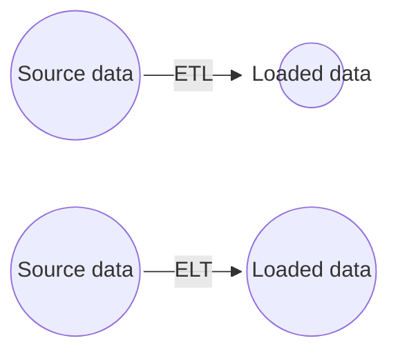

# ETL and Data Pipelines with Shell, Airflow and Kafka <!-- omit from toc -->

## Table of Contents <!-- omit from toc -->

- [1. ETL and ELT Processes](#1-etl-and-elt-processes)
  - [1.1. ETL vs ELT](#11-etl-vs-elt)
  - [1.2. Data Extraction Techniques](#12-data-extraction-techniques)
  - [1.3. Data Transformation Techniques](#13-data-transformation-techniques)
  - [1.4. Data Loading Techniques](#14-data-loading-techniques)
  - [1.5. ETL Tools](#15-etl-tools)

 
 

****************

## 1. ETL and ELT Processes

**ETL** is an automated data pipeline engineering methodology used to acquire and prepare data for analytics environments like data warehouses or data marts. The **extraction** phase involves obtaining data from multiple sources, while the **transformation** phase involves preparing the data to meet the requirements of the target system and intended use. Finally, the **loading** phase involves writing the transformed data to a new destination environment for visualization, exploration, further transformation, and modeling.

Use cases for ETL include capturing and digitizing analog data, preparing transaction history for analysis in OLAP systems, engineering features or KPIs for dashboards and machine learning models, and facilitating prediction and augmented decision making. ETL processes play a crucial role in curating and making data accessible to end users for various purposes.

**ELT** is an automated data pipeline engineering methodology where data is acquired and directly loaded into its destination environment, such as a data lake, *without immediate transformation*. The transformation is performed on-demand using modern analytics tools in the destination environment. ELT processes are commonly used in high-performance computing and Big Data scenarios, including handling scalability, real-time analytics on streaming data, and integrating highly distributed data sources. The emergence of ELT is attributed to the evolution of cloud computing solutions, which can handle large volumes of asynchronous and distributed data with practically unlimited scalability. Cloud platforms offer flexibility, cost-efficiency, and a clean separation between data movement and processing.

ELT allows for a variety of applications from the same source of data, **without information loss or dependence on upstream transformations**. Cloud-based analytics platforms are well-suited for handling Big Data and facilitating ELT processes. The trend of ELT is driven by the advancements in cloud platform technologies.

### 1.1. ETL vs ELT

| ETL (Extract, Transform, Load)                                                   | ELT (Extract, Load, Transform)                                                                                                                                                    |
| -------------------------------------------------------------------------------- | --------------------------------------------------------------------------------------------------------------------------------------------------------------------------------- |
| Transformations occur within the data pipeline before reaching the destination.  | Transformations are decoupled from the data pipeline and happen in the destination environment.                                                                                   |
| Typically a fixed process with a specific function.                              | Flexible process that makes data readily available for self-serve analytics.                                                                                                      |
| Primarily handles structured, relational data.                                   | Handles any kind of data, including structured and unstructured data.                                                                                                             |
| Scalability can be a problem due to reliance on on-premise computing resources.  | Leverages on-demand scalability offered by cloud computing services to handle Big Data.                                                                                           |
| Modifying ETL pipelines requires time and effort from the development team.      | Provides more agility, allowing end users to connect to and experiment with raw data, create their own dashboards, and run predictive models themselves.                          |
| Traditional ETL includes an intermediate storage facility called a staging area. | ELT processes often utilize a data lake as a self-serve repository for storing and manipulating raw data.                                                                         |
| ETL is still relevant and has its applications.                                  | ELT is an evolving trend favored for its ability to address pain points such as lengthy time-to-insight, scalability challenges posed by Big Data, and the siloed nature of data. |

### 1.2. Data Extraction Techniques

Data extraction techniques include:
- OCR (Optical character recognition) → Digitize text scanned from papare documents
- ADC (Analog-to-Digital converters) → Digitize analog audio recordings and signals
- CCD (Charged-Coupled Devices) → Capture and digitize images 
- Mail, phone, or in-person surveys and polls
- Cookies, user logs
- Web scraping
- APIs
- Database querying → SQL languages for querying relational databases and NoSQL for querying document, key-value, graph, or other non-structured data repositories
- Edge computing → Such as video cameras that have built-in processing that can extract features from raw data

### 1.3. Data Transformation Techniques

Data transformations can involve various operations, such as:
- Data typing → Casting data into different types
- Data structuring → Converting one data format to another
- Anonymizing, encrypting
- Cleaning operations
- Normalizing → Converting data to common units
- Filtering, sorting, aggregating, binning
- Joining data sources

**Schema-on-write** is the conventional *ETL approach*, where the data must be conformed to a defined schema prior to loading to a destination, such as a relational database. The idea is to have the data *consistently* structured for stability and for making subsequent *queries much faster*, but this comes at the cost of *limiting the versatility* of the data.

**Schema-on-read** relates to the modern *ELT approach*, where the schema is applied to the raw data after reading it from the raw data storage. This approach is *versatile* since it can obtain multiple views of the same source data using ad-hoc schemas. Users potentially *have access to more data* since it doesn't need to go through a rigorous pre-processing step.

There are many ways in which information can be *lost in transformation*. For ETL processes, any lost information may or may not be recoverable, whereas with ELT, all the original information content is left intact because the data is simply copied over as-is.

Example of ways information can be lost in transformation processes include:
- Lossy data compression
- Filtering
- Aggregation
- Edge computing devices

### 1.4. Data Loading Techniques

Data loading techniques include:
- Full loading
- Incremental Loading
- Scheduled Loading
- On-demand
- Batch and stream
- Push and pull → The data can be either pushed to a server or pushed to clients by a server
- Parallel and serial

**Batch Loading vs. Stream Loading**:
- Batch Loading:
  - Full Loading: Initial loading of a complete data set into a database.
  - Incremental Loading: Inserting new data or updating existing data after the initial full loading.
  - Scheduled Loading: Loading data on a periodic basis.
  - On-Demand Loading: Loading data as required, based on specific needs.
- Stream Loading:
  - Continuous streaming of data to its destination in real-time.
**Push vs. Pull**:
- Push Method:
  - Server pushes data to clients as it becomes available.
  - Examples include push notifications and instant messaging services.
- Pull Method:
  - Clients initiate requests for data from a server.
  - Server responds and delivers the requested data.
  - Examples include RSS feeds and email.
**Parallel Loading**:
- Employing parallel loading for improved efficiency:
  - Loading data simultaneously from multiple data streams.
  - Splitting a large file into smaller chunks and loading them concurrently.

### 1.5. ETL Tools

Python (Pandas):
- Ease of use: rule recommendations for extracting, transforming, and loading data
- Prototyping ETL pipelines and exploratory data analysis

Dask:
- Similar data frame API to Pandas
- Scaling up to Big Data

Vaex:
- Similar data frame API to Pandas
- Scaling up to Big Data

Apache Spark:
- Similar data frame API to Pandas
- Scaling up to Big Data

PostgreSQL:
- SQL-like alternative to DataFrame APIs
- Data warehousing and data connection capabilities

Apache Airflow:
- Programmatically authoring, scheduling, and monitoring data pipeline workflows
- Scalability with parallel compute nodes
- Integration with various cloud platforms

Talend Open Studio:
- Drag-and-drop GUI for creating ETL pipelines
- Collaboration, monitoring, and scheduling capabilities
- Supports big data migration, profiling, and data warehousing

AWS Glue:
- Fully managed ETL service for preparing and loading data for analytics
- Automated data pipeline creation and schema suggestion
- Integration with AWS services

Panoply:
- Focus on ELT pipelines
- Data connection and integration without code
- SQL functionality for generating views of data
- Integration with dashboard and BI tools

Alteryx:
- Drag-and-drop accessibility to built-in ETL tools
- Self-service data analytics platform
- No need for SQL or programming knowledge for complex data pipelines

IBM InfoSphere DataStage:
- Designing, developing, and running ETL and ELT pipelines
- Drag-and-drop framework for developing workflows
- Parallel processing and enterprise connectivity for scalability

IBM Streams:
- Streaming data pipeline technology
- Real-time analytical applications using SPL, Java, Python, or C++
- Blending data in motion with data at rest
- Ingesting and analyzing high volumes of events with low latency

| ETL Tool                 | Language          | Scalability | Performance | Data Sources     | Data Transformation | Data Loading | Real-Time Processing | Cost |
| ------------------------ | ----------------- | ----------- | ----------- | ---------------- | ------------------- | ------------ | -------------------- | ---- |
| Python (with Pandas)     | Python            | Limited     | Moderate    | Various          | Yes                 | Yes          | No                   | Free |
| Dask                     | Python            | Scalable    | Moderate    | Various          | Yes                 | Yes          | No                   | Free |
| Vaex                     | Python            | Moderate    | High        | Various          | Yes                 | Yes          | No                   | Free |
| Apache Spark             | Scala/Java/Python | Highly      | High        | Various          | Yes                 | Yes          | Yes                  | Free |
| PostgreSQL               | SQL               | Limited     | Moderate    | Databases        | Yes                 | Yes          | No                   | Free |
| Apache Storm             | Java              | Scalable    | High        | Various          | Yes                 | Yes          | Yes                  | Free |
| SQLstream                | SQL               | Scalable    | High        | Databases        | Yes                 | Yes          | Yes                  | Paid |
| Apache Samza             | Java/Scala        | Scalable    | High        | Various          | Yes                 | Yes          | Yes                  | Free |
| Apache Kafka             | Java/Scala        | Scalable    | High        | Messaging System | No                  | No           | Yes                  | Free |
| Azure Stream Analytics   | SQL               | Scalable    | High        | Various          | Yes                 | Yes          | Yes                  | Paid |
| IBM Streams              | Streams           | Scalable    | High        | Various          | Yes                 | Yes          | Yes                  | Paid |
| AWS Glue                 | Python/Scala      | Scalable    | High        | Various          | Yes                 | Yes          | No                   | Paid |
| Panoply                  | SQL               | Limited     | Moderate    | Databases        | Yes                 | Yes          | No                   | Paid |
| Apache Airflow           | Python            | Scalable    | Moderate    | Various          | Yes                 | Yes          | No                   | Free |
| Talend Open Studio       | Java              | Scalable    | High        | Various          | Yes                 | Yes          | No                   | Free |
| Alteryx                  | Proprietary       | Limited     | Moderate    | Various          | Yes                 | Yes          | No                   | Paid |
| IBM InfoSphere DataStage | Proprietary       | Scalable    | High        | Various          | Yes                 | Yes          | No                   | Paid |

 
 

****************