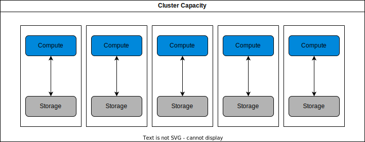
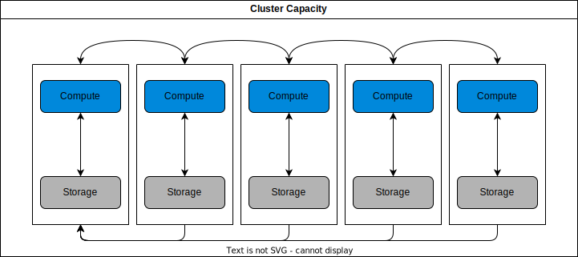
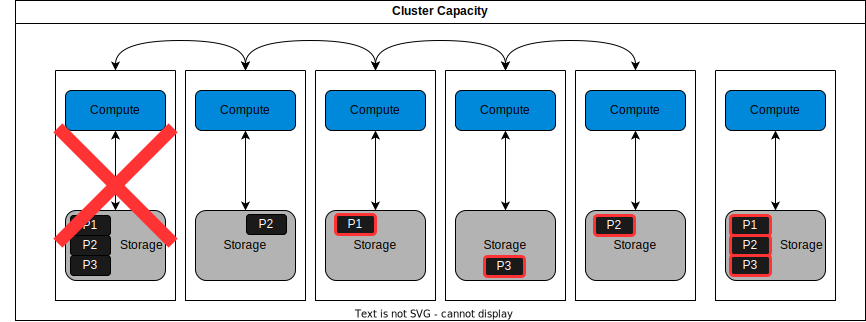
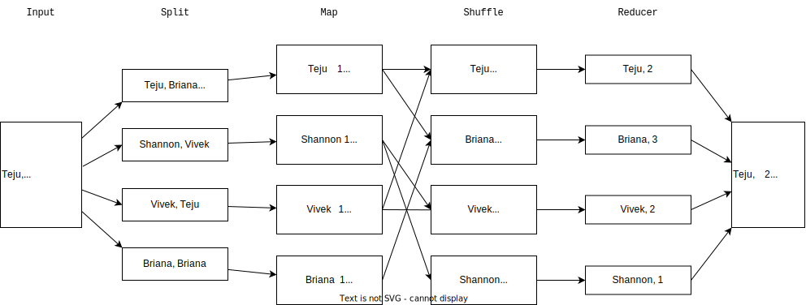
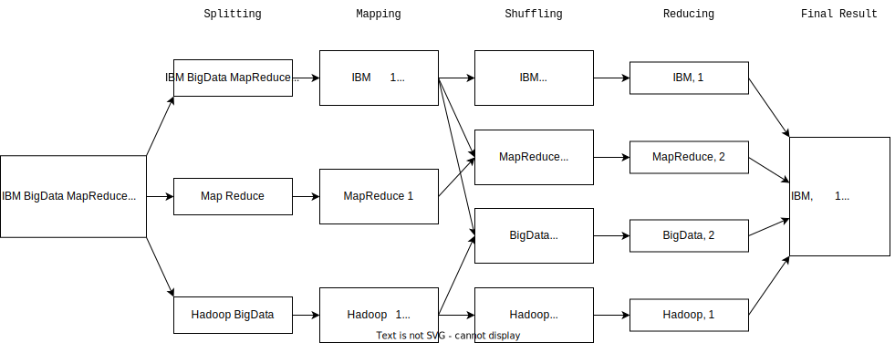
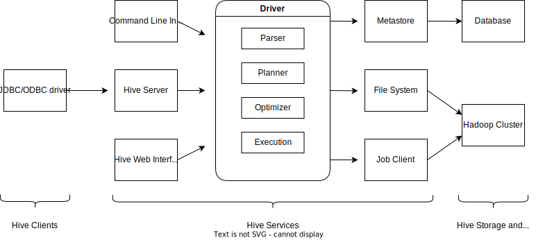
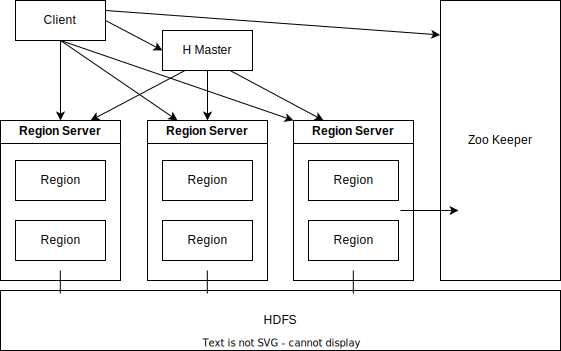

# Introduction to Big Data with Spark and Hadoop <!-- omit from toc -->


## Table of Contents <!-- omit from toc -->

- [1. Introduction to Big Data](#1-introduction-to-big-data)
  - [1.1. What is Big Data](#11-what-is-big-data)
    - [1.1.1. The Core V's of Big Data](#111-the-core-vs-of-big-data)
  - [1.2. Parallel Processing and Scalability for Big Data](#12-parallel-processing-and-scalability-for-big-data)
  - [1.3. Big Data Tools and Ecosystem](#13-big-data-tools-and-ecosystem)
- [2. Introduction to the Hadoop Ecosystem](#2-introduction-to-the-hadoop-ecosystem)
  - [2.1. MapReduce](#21-mapreduce)
    - [2.1.1. MapReduce Practical Example - WordCount](#211-mapreduce-practical-example---wordcount)
  - [2.2. Hadoop Ecosystem](#22-hadoop-ecosystem)
    - [2.2.1. Stages of Hadoop Ecosystem](#221-stages-of-hadoop-ecosystem)
  - [2.3. Hadoop Distributed File System (HDFS)](#23-hadoop-distributed-file-system-hdfs)
    - [2.3.1. HDFS Concepts](#231-hdfs-concepts)
  - [2.4. Hive](#24-hive)
    - [2.4.1. Hive Introduction](#241-hive-introduction)
    - [2.4.2. Hive Architecture](#242-hive-architecture)
  - [2.5. HBase](#25-hbase)
    - [2.5.1. HBase Introduction](#251-hbase-introduction)
    - [2.5.2. HBase Architecture](#252-hbase-architecture)
  - [2.6. Summary](#26-summary)


<br>
<br>

****************
## 1. Introduction to Big Data


### 1.1. What is Big Data

Bernard Marr defines big data as the digital trace generated in the current digital era:

> "The basic idea behind the phrase 'Big Data' is that everything we do is increasingly leaving a digital trace (or data), which we can use and analyze to become smarter. The driving forces in this brave new world are access to ever-increasing volumes of data and our ever-increasing technological capability to mine that data for commercial insights."
>---Bernard Marr

**Big Data vs. Small Data:**

| Small Data                                                                                   | Big Data                                                                                 |
| -------------------------------------------------------------------------------------------- | ---------------------------------------------------------------------------------------- |
| Small enough for human inference                                                             | Data generated in huge volumes and could be structured, semi-structured, or unstructured |
| Accumulated slowly                                                                           | Needs processing to generate insights for human consumption                              |
| Relatively consistent and structured data usually stored in known forms such as JSON and XML | Arrives continuously at enormous speed from multiple sources                             |
| Mostly located in storage systems within enterprises or data centers                         | Comprises any forms of data including video, photos, and more                            |


**Characteristics of Big Data:**

- **Volume:** Massive data generated continuously, stored in the Cloud or specialized server farms.
- **Variety:** In various forms like text, images, audio, and videos.
- **Structure:** Often lacks structure, requiring specialized programs for interpretation.

> "Big data is high-**volume**, high-**velocity** and/or high-**variety** information assets that demand cost-effective, innovative forms of information processing that enable enhanced insight, decision making, and process automation."
> --- Gartner

#### 1.1.1. The Core V's of Big Data

1. **Velocity:** Speed of data arrival, processed close to real-time or in batches.

    - **Description:**
      - Data that is generated fast
      - Process that never stops   
    - **Attributes:**
      - Batch
      - Close to real time
      - Streaming
    - **Drivers:**
      - Improved connectivity and hardware
      - Rapid response times

2. **Volume:** Increase in the amount of data stored over time.

    - **Description:**
      - Scale of data
      - Increased amount of stored data
    - **Attributes:**
      - Petabytes
      - Exa
      - Zetta
    - **Drivers:**
      - Increase in data sources
      - Higher resolution sensors
      - Scalable hardware infrastructure

3. **Variety:** Diversity in data forms.

    - **Description:**
      - Data that comes from machines, people, and processes
      - Structured, semi structured, and unstructured data
    - **Attributes:**
      - Structure, complexity, and origin
    - **Drivers:**
      - Mobile technologies
      - Scalable infrastructure
      - Resilience
      - Fault recovery
      - Efficient storage and retrieval

4. **Veracity:** Quality, origin, accuracy, and consistency of data.

    - **Description:**
      - Quality, origin, and conformity of facts
      - Accuracy of data
      - Data that comes from people and processes
    - **Attributes:**
      - Consistency and completeness
      - Ambiguity
      - Ambiguity
    - **Drivers:**
      - Cost and traceability
      - Robust insgestion
      - ETL mechanisms

**Note:** The fifth V of big data is **Value** which is the outcome of making intelligent business decisions from leveraging the previous four V's. The ultimate organizational goals is to produce values in the form of faster and smarter decisions, efficient resource use, and discovering new opportunities. Big Data supports innovation and thus creates value.


### 1.2. Parallel Processing and Scalability for Big Data

**Linear vs. Parallel Processing**

- **Linear Processing:**
  - **Sequential Nature:** Executing a set of instructions sequentially.
  - **Error Impact:** If an error occurs, the entire sequence restarts.
  - **Suitability:** Best for minor tasks, inefficient for complex tasks like Big Data.

- **Parallel Processing:**
  - **Parallel Execution:** Instructions distributed to multiple nodes, executed simultaneously.
  - **Error Handling:** Errors can be fixed and executed locally, independent of others.
  - **Benefits for Big Data:** Reduced processing times, lower memory and processing requirements, flexibility in adding/removing nodes.

**Data Scaling and Scaling Strategies**

Data Scaling is a technique for managing, storing, and processing data overflow.

- **Scaling Up (Vertically):** Increasing capacity of a single node.
- **Scaling Out (Horizontally):** Adding nodes horizontally, forming a *computing cluster*. This scaling method handles growing data volumes more effectively and reduces infrastructure costs.


**Embarrassingly Parallel Calculations**

In this form of calculation, a computing cluster is formed and workloads are easily divided and run independently. If any one process fails, it has no impact on the others and can simply be rerun.



**Example:** Changing date format in a large dataset split into smaller chunks across nodes.

Sometimes, sorting a large data set adds significant complexity to the process. Now, the multiple computations must coordinate with one another because each process needs to be aware of the state of its peer processes in order to complete the calculation. This requires sending messages across a network to each other or writing them to a file system that is accessible to all processes on the cluster. The level of complexity increases significantly, because you are basically asking a cluster of computers to behave as a single computer.
Most calculations done in enterprise environments are like this and are considered *"embarrassingly parallel with some not so easy"* calculations.

**Design Principles in Hadoop Ecosystem**

In the Hadoop ecosystem, the concept of *"bringing compute to the data"* is a central idea in the design of the cluster. The cluster is designed in a way that computations on certain pieces, or partitions, of the data will take place right at the location of the data when possible. The resulting output will also be written to the same node (Data Locality).




**Fault Tolerance in Parallel Computing**

Fault tolerance is system's ability to continue operating without interruption despite component failures.

In Hadoop FileSystem (HDFS):
- Copies of data partitions stored on multiple nodes.
- Recovery from a node failure involves copying data from other nodes.




### 1.3. Big Data Tools and Ecosystem

**Categories of Big Data Tools**

- Data Technologies
- Analytics and Visualization
- Business Intelligence
- Cloud Service Providers
- NoSQL Databases
- Programming Tools

**Data Technologies**

- **Role:** Designed for analyzing, processing, and extracting meaningful information from Big Data.
- **Capabilities:** Handle structured and unstructured data, offer high-performance parallel processing.
- **Examples:** Apache Hadoop, Apache HDFS, Apache Spark. Vendors: Cloudera, Databricks.

**Analytics and Visualization**

- **Role:** Examine large data to find patterns; visualize trends via graphs, charts, maps.
- **Examples:** Tableau, Palantir, SAS, Pentaho, Teradata.

**Business Intelligence (BI)**

- **Role:** Transform raw data into actionable information for business analysis.
- **Techniques:** Include probability, statistics, and flowcharts.
- **Examples:** Cognos, Oracle, PowerBI, Business Objects, Hyperion.

**Cloud Service Providers**

- **Role:** Offer infrastructure, support, shared computing resources for storing, processing, and analyzing data.
- **Examples:** AWS, IBM, GCP, Oracle.
- **Models:** Provide "software as a service" (SaaS) for data aggregation, processing, and visualization.

**NoSQL Databases**

- **Role:** Tailor-made for Big Data processing; store and process vast amounts of data at scale.
- **Structure:** Store data in documents (not relational tables).
- **Types:** Document databases, key-value stores, wide-column databases, graph databases.
- **Examples:** MongoDB, CouchDB, Cassandra, Redis.

**Programming Tools**

- **Role:** Perform large-scale analytical tasks, operationalize Big Data.
- **Functions:** Cover data collection, cleaning, exploration, modeling, visualization.
- **Examples:** R, Python, SQL, Scala, Julia.


<br>
<br>

****************
## 2. Introduction to the Hadoop Ecosystem

Hadoop is an open-source framework designed for processing enormous datasets. Hadoop is not a database but an ecosystem for handling processes and jobs in parallel and it is  optimized for processing massive quantities of structured, unstructured, or semi-structured data.

**History of Hadoop:**

- **(1999) Founding:** Apache Software Foundation established.
- **(2002) Nutch Project:** Doug Cutting and Mike Cafarella created Nutch (web search engine).
- **(2006) Evolution to Hadoop:** Nutch project split into web crawler and distributed processing; the latter became Hadoop, released to Apache Software Foundation in **2008**.


**Core Components of Hadoop:**

- **Hadoop Common:** Collection of utilities and libraries supporting other Hadoop modules.
- **HDFS (Hadoop Distributed File System):** Handles large datasets on commodity hardware.
- **MapReduce:** Processes data by splitting it into smaller units and processing them simultaneously.
- **YARN (Yet Another Resource Negotiator):** Prepares RAM and CPU for various processing types, such as batch, stream, interactive, and graph.

**Drawbacks of Hadoop:**

- **Transaction Processing:** Inefficient due to lack of random access.
- **Dependencies:** Challenges with tasks that can't be parallelized or have dependencies within the data.
- **Low Latency:** Not suitable for low latency data access.
- **Small Files:** Inefficient for processing lots of small files.
- **Intensive Calculations:** Not ideal for intensive calculations with little data.

**Tools Built on Hadoop:** Tools like Hive and Pig address some of Hadoop's shortcomings.

- **Hive:** Provides SQL-like query and statistical functions.
- **Pig:** Offers a multi-query approach to minimize data scans.


### 2.1. MapReduce

MapReduce is a programming pattern enabling massive scalability across Hadoop clusters. It is an essential component of Apache Hadoop and it's a processing technique and model for distributed computing.

> Distributed computing is a system with multiple components located on different machines that communicate actions in one view to the end user.

Many MapReduce is primarily based on Java but supports other languages like C++, Python, Ruby, and R.

**MapReduce Algorithm**

Consists of two primary tasks: **Map** and **Reduce**.

- **Map Task:** Takes input data, performs mapping tasks to extract key-value pairs, creating preliminary output. Further data sorting and organizing goes on before the preliminary output is sent to the Reducer.
- **Reduce Task:** Works with multiple Map functions, aggregates pairs using keys, and produces the final output.

MapReduce keeps tracks of its tasks by creating unique keys to ensure all processes address the same problem.

**Visual Framework**

1. **Map Step:**
   - Converts data into key-value pairs.
   - Data split into separate files for parallel processing.
   - All key-values pairs in each split are worked on separately.

2. **Reduce Step:**
   - Processes data from Map through shuffling, sorting, and aggregation.
   - Final output stored in the Hadoop Distributed File System (HDFS).




**Advantages of MapReduce**

- **Parallel Processing:** Enables high-level parallel jobs across multiple nodes.
- **Flexibility:** Processes various data types (tabular and non-tabular).
- **Language Support:** Offers flexibility by supporting different programming languages.

**Common Use Cases**

- **Social Media:** Analyzing profile visits and interactions on platforms like LinkedIn and Instagram.

- **Entertainment (Netflix):** Recommending movies based on user watch history.

- **Finance:** Detecting anomalies in transactions for banks and credit card companies.

- **Advertising:** Understanding user behavior and engagement with ads in the advertisement industry.


#### 2.1.1. MapReduce Practical Example - WordCount

In this example, we will run the WordCount example with an input text and see how the content of the input file is processed by WordCount.

The steps outlined in this example use the single-node Hadoop Version 3.3.6. Hadoop is most useful when deployed in a fully distributed mode on a large cluster of networked servers sharing a large volume of data. However, for basic understanding, we will configure Hadoop on a single node.

- **Step 1: Download hadoop-3.2.3.tar.gz**
  
  ```bash
  curl https://dlcdn.apache.org/hadoop/common/hadoop-3.3.6/hadoop-3.3.6.tar.gz --output hadoop-3.3.6.tar.gz
  ```

- **Step 2: Extract the tar file in the currently directory**

  ```bash
  tar -xvf hadoop-3.3.6.tar.gz
  ```

- **Step 3: Navigate to the hadoop-3.3.6 directory**
  
  ```bash
  cd hadoop-3.3.6
  ```

  Check the hadoop command to see if it is setup. This will display the usage documentation for the hadoop script.

  ```bash
  bin/hadoop
  ```

- **Step 4: Create a sample data**  

  Run the following command to create data.txt in your current directory

  ```bash
  touch data.txt
  ```
  Then run the following command to append text to your txt file

  ```bash
  cat > data.txt
  ```
  
  Now add the following text and then press `CTRL` + `D` to save the data.

  ```
  IBM BigData MapReduce
  MapReduce
  Hadoop BigData
  ```

- **Step 5: Run the MapReduce application**

  Run the Map reduce application for wordcount on data.txt and store the output in /user/root/output

  ```bash
  bin/hadoop jar share/hadoop/mapreduce/hadoop-mapreduce-examples-3.3.6.jar wordcount data.txt output
  ```

  Once the word count runs successfully, you can run the following command to see the output file it has generated.

  ```bash
  ls output
  ```

  You should see `part-r-00000` with `_SUCCESS` indicating that the wordcount has been done.

  Run the following command to see the word count output.

  ```bash
  cat  output/part-r-00000
  ```

  


### 2.2. Hadoop Ecosystem

**Core Components of Hadoop** are "Hadoop common", "HDFS", "MapReduce", and "Yarn"

1. **Hadoop Common:**
   - Utilities and libraries supporting other Hadoop modules.
2. **Hadoop Distributed File System (HDFS):**
   - Stores and distributes collected data across multiple nodes.
3. **MapReduce:**
   - Processes Big Data in clusters, making it manageable.
4. **Yet Another Resource Negotiator (YARN):**
   - Resource manager across clusters.

**Extended Hadoop Ecosystem**

- Consists of libraries and software packages installed on top of the Hadoop core.
- Components supporting one another for Big Data processing.


#### 2.2.1. Stages of Hadoop Ecosystem

1. **Ingest:**
  
  | Tools | Function | Details |
  | ----- | -------- | ------- |
  | Flume | Collects, aggregates, and transfers data to the storage system | Has a simple and flexible architecture based on streaming data flows. Uses a simple extensible data model that allows for online analytic application. |
  | Sqoop | Transfers bulk data between relational databases and Hadoop | Accesses the database to understand the schema of the data. It then generates MapReduce code to import and export data as needed. Sqoop Allows you to quickly develop any other MapReduce applications that use the records that stored into HDFS. |

2. **Store:**

  | Tools | Function | Details |
  | ----- | -------- | ------- |
  | HBase | A column-oriented, non-relational database that runs on top of HDFS | Provides real time wrangling access to the HDFS. Uses hash tables to store data as indexes and allow for random access of data, which makes lookups faster. |
  | Cassandra | A scalable NoSQL database | It is designed in a way to have no single point of failure. | 

3. **Process and Analyze:**

  | Tools | Function | Details |
  | ----- | -------- | ------- |
  | Pig   | Analyzes large amounts of data | Operates on the client side of a cluster. It is a procedural data flow language and a procedural programming language which means, it follows an order and set of commands. |
  | Hive | It's used for creating reports | Operates on the server side of a cluster and it is a declarative programming language for report creation, which means it allows users to express which data they wish to receive. |

4. **Access:**

  |  Tools  | Function | Details |
  | ------- | -------- | ------- |
  | Impala  | Is a scalable system that allows non-technical users to search and access Hadoop | No programming skill is required. |
  | Hue     | Hue (Hadoop User Experience) is a user-friendly tool for data upload, browsing, and querying | It can run Pig jobs and workflows. It also provides a SQL editor for several query languages such as Hive and MySQL. |


### 2.3. Hadoop Distributed File System (HDFS)

HDFS is a distributed file system distributed across multiple servers, enabling file access or storage from any network or computer. It is the storage layer of Hadoop ecosystem. It splits the files into blocks, creates replicas of the blocks, and stores them on different machines. HDFS is built to access streaming data seamlessly.
HDFS uses a command line interface to interact with Hadoop. 

> Streaming means that HDFS provides a constant bitrate when transferring data rather than having the data being transferred in waves.


**Key Features of HDFS**

- **Cost Efficiency:** Utilizes inexpensive commodity hardware to store data, reducing storage costs.
- **Data Storage Capacity:** Capable of storing large amounts of data, including petabytes, in various formats (tabular and non-tabular).
- **Replication:** Makes copies of the data on multiple machines which minimizes the costs associated with data losses.
- **Fault Tolerance:** Achieves fault tolerance by replicating data blocks, ensuring data availability in case of hardware failure. If one machine crashes, a copy of the beta can be found somewhere else and work continues.
- **Scalability:** Highly scalable, allowing clusters to expand with the addition of nodes.
- **Portability:** Designed for easy movement across different platforms.


#### 2.3.1. HDFS Concepts

1. **Blocks:**
   - Files are split into smaller chunks called blocks (which is the minimum amount of data that can be read or written), offering fault tolerance.
   - Default block sizes can be configured (e.g., 64 or 128 megabytes).
2. **Nodes:**
   - Refers to individual systems responsible for storing and processing data.
   - Follows the primary/secondary concept.
  
  The Primary node (Name Node) regulates file access to the clients and maintains, manages, and assigns tasks to the secondary node (Data Node).
  
  There can be hundreds of data nodes in the HDFS that manage the storage system. These nodes are the actual workers in the HDFS system and take instructions from the primary node.
3. **Rack Awareness:**
   - A strategy to improve cluster performance by placing Data Nodes in proximity to the Name Node, reducing network traffic.
   - Achieved by keeping Rack ID information in the Name Node.
   - Replication can be done through rack awareness, which is done by making sure replicas of data node  are in different racks.

   > A rack is the collection of about 40 to 50 data nodes using the same network switch.

4. **Replication in HDFS:**
   - Provides backup of data blocks in case of crashes.
   - **Replication Factor:** Defines the number of copies of a data block.
  
  **Example:** 
  Imagine we have a 500 MB file with default chunk size of 128 MB and the replication factor is 2.
  
  Our file is divided into 4 blocks with sizes: 128 MB, 128 MB, 128 MB, and 116 MB. Then with the replication process, two copies of each block is created, ensuring eight copies in total for backup.

  HDFS uses the rack awareness concepts and saves the blocks indifferent racks to make sure that a copy is available in another rack.

  

5. **Read and Write Operations:**
   
   HDFS allows "write once, read many" operations. This means that you cannot edit files that are already stored in HDFS, but you can append new dat to them.

   - **Read Operation:**
      - Client sends a request to the Name node to get the location of the data nodes containing blocks.
      - Name Node verifies privileges and provides locations.
      - Client interacts with Data Nodes for reading through an FS Data Input stream object. And when it is done, the client will use the close method the end the session.
   - **Write Operation:**
      - Name Node confirms client privileges.
      - Checks if the file exists (if exists, the client gets an IO Exception message); if not, client gets write permission and Data Node locations.
      - Data Nodes create replicas and confirm to the client.

Hadoop utilizes a primary/secondary node architecture with a single name node as the primary node and multiple data nodes as secondary nodes in each cluster. Files are divided into blocks, which are then stored across the data nodes. The name node manages file operations like opening, closing, renaming, and mapping file blocks to data nodes. Data nodes handle client read and write requests, as well as the creation, replication, and deletion of file blocks following instructions from the name node.


### 2.4. Hive

#### 2.4.1. Hive Introduction

- **Definition:**
  - Hive is a data warehouse software within Hadoop, designed for managing large, tabular-type datasets and data analysis.
  - It's particularly useful for storing historical data for analysis and reporting.

- **Key Features:**
  - Scalability and speed, suitable for petabytes of data.
  - Familiarity with SQL (HiveQL) makes it user-friendly.
  - Supports various file formats (sequence files, record columnar files, text/flat files).
  - Facilitates data cleaning and filtering tasks.

- **Hive vs. Traditional RDBMS:**
  - Traditional RDBMS is for maintaining databases, using SQL, while Hive is for data warehousing and employs Hive Query Language (HiveQL).
  - RDBMS is geared for real-time data analysis; Hive is designed for static data analysis.
  - RDBMS allows unlimited read and write operations; Hive follows the write once, read many methodologies.
  - RDBMS handles up to terabytes; Hive is built for petabytes.
  - RDBMS enforces schema verification during data loading; Hive does not enforce schema verification.
  - RDBMS may lack built-in support for data partitioning; Hive supports partitioning.

#### 2.4.2. Hive Architecture



- **Hive Client:**
  - JDBC client for Java-based applications.
  - ODBC client for applications using the ODBC protocol.

- **Hive Services:**
  - **Hive Server:**
    - Executes queries and accommodates multiple clients.
    - Supports JDBC and ODBC clients.

  - **Driver:**
    - Takes query statements, monitors session progress, and stores metadata.
    - Communicates with the compiler.

  - **Optimizer:**
    - Enhances efficiency by transforming the execution plan and splitting tasks.

  - **Executor:**
    - Executes tasks following task splitting by the optimizer.

- **Meta Store:**
  - Stores metadata about tables.
  - Manages metadata centrally.

- **Hive Storage and Computing:**
  - Communicates with the Meta Store, file system, and job client.
  - Handles storing metadata information and query results in Hadoop cluster or HDFS.
  
In summary, Hive is a powerful tool within the Hadoop ecosystem, providing a familiar SQL-like interface for handling large datasets and performing data analysis efficiently. Its architecture is well-organized, with various components working together to enable seamless data processing and management.


### 2.5. HBase

#### 2.5.1. HBase Introduction

- HBase is a column-oriented, non-relational database management system running on top of the Hadoop Distributed File System (HDFS).
- It offers fault-tolerant storage for sparse datasets, particularly excelling in real-time data and random read and write access to Big Data.

> Fault tolerance refers to the working ability of a system or computer to continue working even in unfavorable conditions such as when a server crashes.

- **Features and Usage:**

  - **Fault Tolerance:** HBase ensures continued functionality even in unfavorable conditions, such as server crashes.

  - **Java API:** Provides an easy-to-use Java API for client access.

  - **Data Replication:** Supports data replication across clusters.

  - **Scalability and Real-time Processing:**
    - Linear scalability allows efficient handling of large datasets.
    - Suitable for write-heavy applications and real-time analytics.
    - Can be used for high-speed requirements because it offers consistent reads and writes.
    - HBase is a backup support for MapReduce jobs

  - **Column-Oriented and Dynamic Schema:**
    - It has no fixed column schema. Columns are defined by column families, allowing flexibility in schema changes.
    - Dynamic schema adaptation to changing application requirements.

    **Example:**

    In the following table, we defined three column families for the columns inside the patient records' table: "Patient Details", "Heart Rate", and "Timestamp"

    <style type="text/css">
    .tg  {border-collapse:collapse;border-spacing:0;}
    .tg td{border-color:black;border-style:solid;border-width:1px;font-family:Arial, sans-serif;font-size:14px;
      overflow:hidden;padding:10px 5px;word-break:normal;}
    .tg th{border-color:black;border-style:solid;border-width:1px;font-family:Arial, sans-serif;font-size:14px;
      font-weight:normal;overflow:hidden;padding:10px 5px;word-break:normal;}
    .tg .tg-baqh{text-align:center;vertical-align:top}
    .tg .tg-0lax{text-align:left;vertical-align:top}
    </style>
    <table class="tg">
    <thead>
      <tr>
        <th class="tg-baqh" colspan="2">Patient Details</th>
        <th class="tg-baqh">Heart Rate</th>
        <th class="tg-baqh">Timestamp</th>
      </tr>
    </thead>
    <tbody>
      <tr>
        <td class="tg-baqh">Patient Name</td>
        <td class="tg-baqh">Patient Age</td>
        <td class="tg-baqh">Heart Rate</td>
        <td class="tg-baqh">Timestamp</td>
      </tr>
      <tr>
        <td class="tg-0lax">Patient A</td>
        <td class="tg-0lax">28</td>
        <td class="tg-0lax">120 BPM</td>
        <td class="tg-0lax">8:50 AM</td>
      </tr>
      <tr>
        <td class="tg-0lax">Patient A</td>
        <td class="tg-0lax">28</td>
        <td class="tg-0lax">110 BPM</td>
        <td class="tg-0lax">9:00 AM</td>
      </tr>
      <tr>
        <td class="tg-0lax">Patient B</td>
        <td class="tg-0lax">30</td>
        <td class="tg-0lax">115 BPM</td>
        <td class="tg-0lax">10:10 AM</td>
      </tr>
      <tr>
        <td class="tg-0lax">Patient C</td>
        <td class="tg-0lax">77</td>
        <td class="tg-0lax">95 BPM</td>
        <td class="tg-0lax">12:00 AM</td>
      </tr>
    </tbody>
    </table>

    **Note:**
    - Predefine the table schema and specify column families
    - New columns can be added to column families at anytime
    - HBase schema is very flexible
    - HBase has master notes to manage the cluster and region service to perform the work


- **HBase vs. HDFS:**

  - **Data Storage:**
    - HBase stores data in tables with columns and rows.
    - HDFS stores data in a distributed manner across different nodes.
    - HBase allows for storing and processing of big data, while HDFS is for storing only

  - **Flexibility:**
    - HBase allows dynamic changes to the schema.
    - HDFS has a rigid architecture that doesn't allow dynamic changes.

  - **Workload Suitability:**
    - HBase suits read, write, update, and delete workloads on a record level.
    - HDFS is more suited for write-once and read in batch workloads.


#### 2.5.2. HBase Architecture



- **HMaster:**
  - It's a master server, monitoring and managing the region servers.
  - Assigns regions to region servers and distributes services.
  - Handles schema and metadata operations.

- **Region Servers:**
  - Receives read and write requests and assigns the requests to regions.
  - They are responsible for managing regions that are present in a distributed cluster.
  - Rather thank going through HMaster all the time, the region servers can communicate directly with the client to facilitate the requests.

- **Region:**
  - Basic building blocks of the HBase cluster.
  - Consists of column families and contains multiple stores, one for each column family. It has two components: HFile and Memstore.

- **ZooKeeper:**
  - Centralized service maintaining configuration information, to maintain healthy links between nodes.
  - Provides synchronization across distributed applications.
  - Tracks server failures and then, starts repairing the failed nodes.


### 2.6. Summary

<table>
<thead>
<tr>
<th>Term</th>
<th>Definition</th>
</tr>
</thead>
<tbody><tr>
<td>Anomaly detection</td>
<td>A process in machine learning that identifies data points, events, and observations that deviate from a data set's normal behavior. Detecting anomalies from time series data is a pain point that is critical to address for industrial applications.</td>
</tr>
<tr>
<td>Apache</td>
<td>This open-source HTTP server implements current HTTP standards to be highly secure, easily configurable, and highly extendible. The Apache Software License by the Apache Software Foundation builds and distributes it.</td>
</tr>
<tr>
<td>Apache Cassandra</td>
<td>It is a scalable, NoSQL database specifically designed not to have a single point of failure.</td>
</tr>
<tr>
<td>Apache Nutch</td>
<td>An extensible and scalable web crawler software product to aggregate data from the web.</td>
</tr>
<tr>
<td>Apache ZooKeeper</td>
<td>A centralized service for maintaining configuration information to maintain healthy links between nodes. It provides synchronization across distributed applications. It also tracks server failure and network partitions by triggering an error message and then repairing the failed nodes.</td>
</tr>
<tr>
<td>Big data</td>
<td>Data sets whose type or size supersedes the ability of traditional relational databases to manage, capture, and process the data with low latency. Big data characteristics include high volume, velocity, and variety.</td>
</tr>
<tr>
<td>Big data analytics</td>
<td>Uses advanced analytic techniques against large, diverse big data sets, including structured, semi-structured, and unstructured data, from varied sources and sizes, from terabytes to zettabytes.</td>
</tr>
<tr>
<td>Block</td>
<td>Minimum amount of data written or read, and also offers fault tolerance. The default block size can be 64 or 128 MB, depending on the user's system configuration. Each file stored need not take up the storage of the preconfigured block size.</td>
</tr>
<tr>
<td>Clusters</td>
<td>These servers are managed and participate in workload management. They allow enterprise applications to supersede the throughput achieved with a single application server.</td>
</tr>
<tr>
<td>Command-line interface (CLI)</td>
<td>Used to enter commands that enable users to manage the system.</td>
</tr>
<tr>
<td>Commodity hardware</td>
<td>Consists of low-cost workstations or desktop computers that are IBM-compatible and run multiple operating systems such as Microsoft Windows, Linux, and DOS without additional adaptations or software.</td>
</tr>
<tr>
<td>Data ingestion</td>
<td>The first stage of big data processing. It is a process of importing and loading data into IBM® WatsonX.data. You can use the Ingestion jobs tab from the Data manager page to load data securely and easily into WatsonX.data console.</td>
</tr>
<tr>
<td>Data sets</td>
<td>Created by extracting data from packages or data modules. They gather a customized collection of items that you use frequently. As users update their data set, dashboards and stories are also updated.</td>
</tr>
<tr>
<td>Data warehouse</td>
<td>Stores historical data from many different sources so users can analyze and extract insights from it.</td>
</tr>
<tr>
<td>Distributed computing</td>
<td>A system or machine with multiple components on different machines. Each component has its own job, but the components communicate with each other to run as one system for the end user.</td>
</tr>
<tr>
<td>Driver</td>
<td>Receives query statements submitted through the command line and sends the query to the compiler after initiating a session.</td>
</tr>
<tr>
<td>Executor</td>
<td>Executes tasks after the optimizer has split the tasks.</td>
</tr>
<tr>
<td>Extended Hadoop Ecosystem</td>
<td>Consists of libraries or software packages commonly used with or installed on top of the Hadoop core.</td>
</tr>
<tr>
<td>Fault tolerance</td>
<td>A system is fault-tolerant if it can continue performing despite parts failing. Fault tolerance helps to make your remote-boot infrastructure more robust. In the case of OS deployment servers, the whole system is fault-tolerant if the servers back up each other.</td>
</tr>
<tr>
<td>File system</td>
<td>An all-comprehensive directory structure with a root ( / ) directory and other directories and files under a logical volume. The complete information about the file system centralized in the /etc/filesystems file.</td>
</tr>
<tr>
<td>Flume</td>
<td>A distributed service that collects, aggregates, and transfers big data to the storage system. Offers a simple yet flexible architecture that streams data flows and uses an extensible data model, allowing online analytic applications.</td>
</tr>
<tr>
<td>Hadoop</td>
<td>An open-source software framework offering reliable distributed processing of large data sets using simplified programming models.</td>
</tr>
<tr>
<td>Hadoop Common</td>
<td>Fundamental part of the Apache Hadoop framework. It refers to a collection of primary utilities and libraries that support other Hadoop modules.</td>
</tr>
<tr>
<td>Hadoop Distributed File System (HDFS)</td>
<td>A file system distributed on multiple file servers, allowing programmers to access or store files from any network or computer. It is the storage layer of Hadoop. It works by splitting the files into blocks, creating replicas of the blocks, and storing them on different machines. It can access streaming data seamlessly. It uses a command-line interface to interact with Hadoop.</td>
</tr>
<tr>
<td>Hadoop Ecosystem</td>
<td>It splits big data analytics processing tasks into smaller tasks. The small tasks are performed in conjunction using an algorithm (MapReduce) and then distributed across a Hadoop cluster (nodes that perform parallel computations on big data sets).</td>
</tr>
<tr>
<td>Hadoop Ecosystem stages</td>
<td>The four main stages are: Ingest, store, process, analyze, and access.</td>
</tr>
<tr>
<td>HBase</td>
<td>A column-oriented, non-relational database system that runs on top of the Hadoop Distributed File System (HDFS). It provides real-time wrangling access to the Hadoop file system. It uses hash tables to store data in indexes and allow for random data access, making lookups faster.</td>
</tr>
<tr>
<td>High-throughput</td>
<td>Throughput quantifies the data processed in a timeframe. The target system needs robust throughput for heavy workloads with substantial data changes from the source database to prevent latency spikes. Performance objectives are frequently outlined with throughput targets. High throughput is achieved when most messages are delivered successfully, whereas low successful delivery rates indicate poor throughput and network performance.</td>
</tr>
<tr>
<td>Hive</td>
<td>It is a data warehouse infrastructure used in data query and analysis with an SQL-like interface. It helps in generating and creating reports. It is a declarative programming language allowing users to express which data they wish to receive.</td>
</tr>
<tr>
<td>Hive client</td>
<td>Hive provides different communication drivers depending on the application type. For example, Java-based applications use JDBC drivers, and other applications use ODBC drivers. These drivers communicate with the servers.</td>
</tr>
<tr>
<td>Hive server</td>
<td>Used to execute queries and enable multiple clients to submit requests. It can support JDBC and ODBC clients.</td>
</tr>
<tr>
<td>Hive services</td>
<td>Client interactions and query operations are done through the Hive services. The command-line interface acts as an interface for the Hive service. The driver takes in query statements, monitors each session's progress and life cycle, and stores metadata generated from the query statements.</td>
</tr>
<tr>
<td>Hive Web Interface</td>
<td>A web-based user interface that interacts with Hive through a web browser. It offers a graphical user interface (GUI) to browse tables, execute Hive queries, and manage Hive resources.</td>
</tr>
<tr>
<td>HMaster</td>
<td>The master server that monitors the region server instances. It assigns regions to region servers and distributes services to different region servers. It also manages any changes to the schema and metadata operations.</td>
</tr>
<tr>
<td>Hue</td>
<td>An acronym for Hadoop user experience. It allows you to upload, browse, and query data. Users can run Pig jobs and workflow in Hue. It also provides an SQL editor for several query languages, like Hive and MySQL.</td>
</tr>
<tr>
<td>Impala</td>
<td>A scalable system that allows nontechnical users to search for and access the data in Hadoop.</td>
</tr>
<tr>
<td>InputSplits</td>
<td>Created by the logical division of data. They serve as an input to a single Mapper job.</td>
</tr>
<tr>
<td>JDBC client</td>
<td>Component in the Hive client allows Java-based applications to connect to Hive.</td>
</tr>
<tr>
<td>Low latency data access</td>
<td>A type of data access allowing minimal delays, not noticeable to humans, between an input processed and corresponding output offering real-time characteristics. It is crucial for internet connections using trading, online gaming, and Voice over IP.</td>
</tr>
<tr>
<td>Map</td>
<td>Job in MapReduce converts a set of data into another set of data. The elements fragment into tuples (key/value pairs).</td>
</tr>
<tr>
<td>MapReduce</td>
<td>A program model and processing technique used in distributed computing based on Java. It splits the data into smaller units and processes big data. It is the first method used to query data stored in HDFS. It allows massive scalability across hundreds or thousands of servers in a Hadoop cluster.</td>
</tr>
<tr>
<td>Meta store</td>
<td>Stores the metadata, the data, and information about each table, such as the location and schema. In turn, the meta store, file system, and job client communicate with Hive storage and computing to perform the following: Metadata information from tables store in some databases and query results, and data loaded from the tables store in a Hadoop cluster on HDFS.</td>
</tr>
<tr>
<td>Node</td>
<td>A single independent system for storing and processing big data. HDFS follows the primary/secondary concept.</td>
</tr>
<tr>
<td>ODBC  (Open Database Connectivity) Client</td>
<td>Component in the Hive client, which allows applications based on the ODBC protocol to connect to Hive.</td>
</tr>
<tr>
<td>Optimizer</td>
<td>Performs transformations on the execution and splits the tasks to help speed up and improve efficiency.</td>
</tr>
<tr>
<td>Parallel computing</td>
<td>Workload for each job is distributed across several processors on one or more computers, called compute nodes.</td>
</tr>
<tr>
<td>Parser</td>
<td>A program that interprets the physical bit stream of an incoming message and creates an internal logical representation of the message in a tree structure. The parser also regenerates a bit stream from the internal message tree representation for an outgoing message.</td>
</tr>
<tr>
<td>Partitioning</td>
<td>This implies dividing the table into parts depending on the values of a specific column, such as date or city.</td>
</tr>
<tr>
<td>Pig Hadoop component</td>
<td>Famous for its multi-query approach, it analyzes large amounts of data. It is a procedural data flow and programming language that follows an order and set of commands.</td>
</tr>
<tr>
<td>Primary node</td>
<td>Also known as the name node, it regulates client file access and maintains, manages, and assigns tasks to the secondary node.  The architecture is such that per cluster, there is one name node and multiple data nodes, the secondary nodes.</td>
</tr>
<tr>
<td>Rack</td>
<td>The collection of about forty to fifty data nodes using the same network switch.</td>
</tr>
<tr>
<td>Rack awareness</td>
<td>When performing operations such as read and write, the name node maximizes performance by choosing the data nodes closest to themselves.  Developers can select data nodes on the same rack or nearby racks. It reduces network traffic and improve cluster performance. The name node keeps the rack ID information to achieve rack awareness.</td>
</tr>
<tr>
<td>Read</td>
<td>In this operation, the client will request the primary node to acquire the location of the data nodes containing blocks. The client will read files closest to the data nodes.</td>
</tr>
<tr>
<td>Reduce</td>
<td>Job in MapReduce that uses output from a map as an input and combines data tuples into small sets of tuples.</td>
</tr>
<tr>
<td>Region</td>
<td>The basic building element and most negligible unit of the HBase cluster, consisting of column families. It contains multiple stores, one for each column family, and has two components: HFile and MemStore.</td>
</tr>
<tr>
<td>Region servers</td>
<td>These servers receive read and write requests from the client. They assign the request to a region where the column family resides. They serve and manage regions present in a distributed cluster. The region servers can communicate directly with the client to facilitate requests.</td>
</tr>
<tr>
<td>Relational database</td>
<td>Data is organized into rows and columns collectively, forming a table. The data is structured across tables, joined by a primary or a foreign key.</td>
</tr>
<tr>
<td>Relational Database Management System (RDBMS)</td>
<td>Traditional RDBMS maintains a database and uses the structured query language, SQL. It is suited for real-time data analysis, like data from sensors. It allows for as many read-and-write operations as a user may require. It can handle up to terabytes of data. It enforces that the schema must verify loading data before it can proceed. It may not always have built-in support for data partitioning.</td>
</tr>
<tr>
<td>Replication</td>
<td>The process of creating a copy of the data block. It is performed by rack awareness as well. It is done by ensuring data node replicas are in different racks. So, if a rack is down, users can obtain the data from another rack.</td>
</tr>
<tr>
<td>Replication factor</td>
<td>Defined as the number of times you make a copy of the data block. Users can set the number of copies they want, depending on their configuration.</td>
</tr>
<tr>
<td>Schema</td>
<td>It is a collection of named objects. It provides a way to group those objects logically. A schema is also a name qualifier; it provides a way to use the same natural name for several objects and prevent ambiguous references.</td>
</tr>
<tr>
<td>Secondary node</td>
<td>This node is also known as a data node. There can be hundreds of data nodes in the HDFS that manage the storage system. They perform read and write requests at the instructions of the name node. They also create, replicate, and delete file blocks based on instructions from the name node.</td>
</tr>
<tr>
<td>Semi-structured data</td>
<td>Semi-structured data (JSON, CSV, XML) is the "bridge" between structured and unstructured data. It does not have a predefined data model and is more complex than structured data, yet easier to store than unstructured data.</td>
</tr>
<tr>
<td>Shuffle</td>
<td>Phase in which interim map output from mappers transfers to reducers. Every reducer fetches interim results for all values associated with the same key from multiple nodes. This is a network-intensive operation within the Hadoop cluster nodes.</td>
</tr>
<tr>
<td>Sqoop</td>
<td>An open-source product designed to transfer bulk data between relational database systems and Hadoop. It looks at the relational database and summarizes the schema. It generates MapReduce code to import and export data. It helps develop other MapReduce applications that use the records stored in HDFS.</td>
</tr>
<tr>
<td>Streaming</td>
<td>Implies HDFS provides a constant bitrate when transferring data rather than having the data transferred in waves.</td>
</tr>
<tr>
<td>Structured data</td>
<td>Structured data, typically categorized as quantitative data, is highly organized and easily decipherable by machine learning algorithms. Developed by IBM in 1974, structured query language (SQL) is the programming language used to manage structured data.</td>
</tr>
<tr>
<td>Unstructured data</td>
<td>Information lacking a predefined data model or not fitting into relational tables.</td>
</tr>
<tr>
<td>Write</td>
<td>In this operation, the Name node ensures that the file does not exist. If the file exists, the client gets an IO Exception message. If the file does not exist, the client is given access to start writing files.</td>
</tr>
<tr>
<td>Yet Another Resource Negotiator (YARN)</td>
<td>Prepares Hadoop for batch, stream, interactive, and graph processing.</td>
</tr>
</tbody></table>

<br>
<br>

***