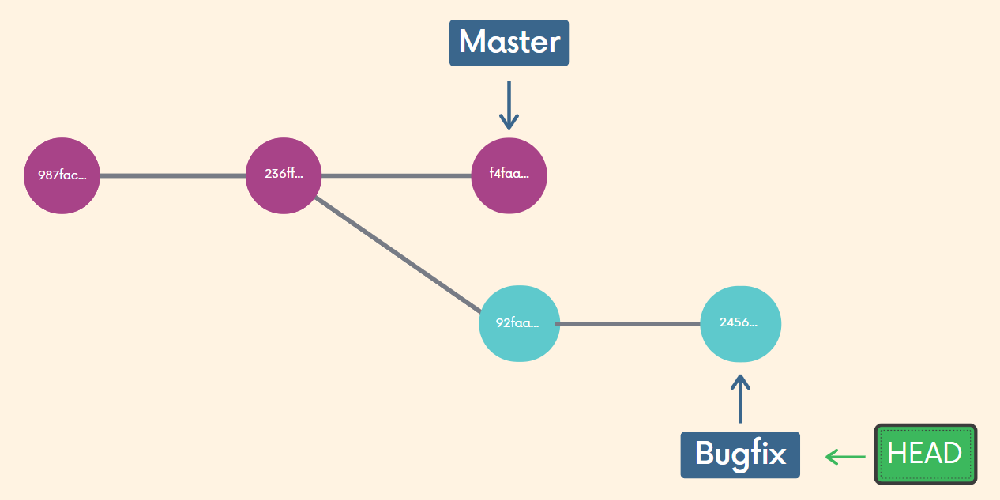
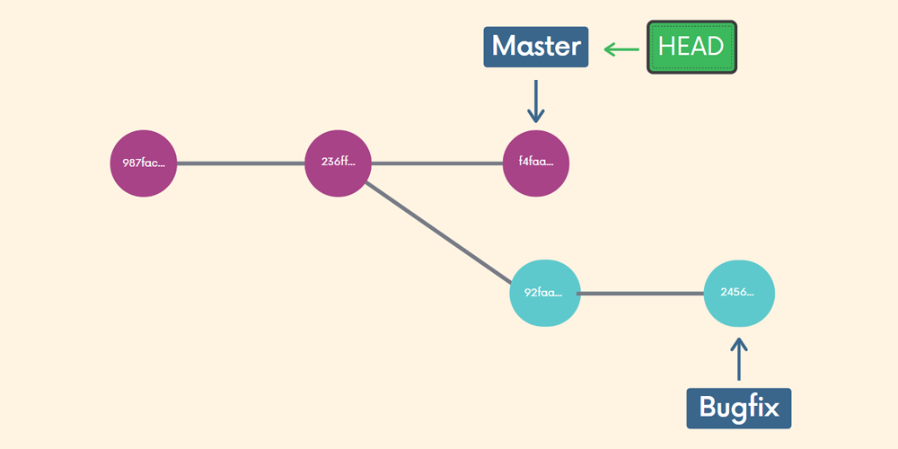

# Git & GitHub <!-- omit from toc -->


## Table of Contents <!-- omit from toc -->

- [1. Git Installation \& Terminal Commands](#1-git-installation--terminal-commands)
  - [1.1. Configuring Git](#11-configuring-git)
  - [1.2. Terminal Basic Commands](#12-terminal-basic-commands)
- [2. The Very Basics of Git](#2-the-very-basics-of-git)
  - [2.1. First git commands](#21-first-git-commands)
  - [2.2. Committing](#22-committing)
  - [2.3. Amending Commits](#23-amending-commits)
  - [2.4. Some Basic Guidelines](#24-some-basic-guidelines)
  - [2.5. Ignoring Files](#25-ignoring-files)
- [3. Branches](#3-branches)
  - [3.1. Working With Branches](#31-working-with-branches)
  - [3.2. Merging Branches](#32-merging-branches)
- [4. Comparing Changes](#4-comparing-changes)
  - [4.1. Comparisons with Git Diff](#41-comparisons-with-git-diff)
  - [4.2. Chunk Header](#42-chunk-header)


<br>
<br>

****************

## 1. Git Installation & Terminal Commands

### 1.1. Configuring Git

If you are using a GUI, it should prompt you for your name and email the first time you open the app.

**Your name**
```bash
git config --global user.name "Tom Hulce"
```

**Your email**
```bash
git config --global user.email blah@blah.com
```

### 1.2. Terminal Basic Commands

| Command  | Name                    | Description                                                                                       |
| -------- | ----------------------- | ------------------------------------------------------------------------------------------------- |
| `ls`     | List                    | Use `/s` to list the contents of your current directory. Use `-a` after `ls` to show hidden files |
| `pwd`    | Print Working Directory | Prints the path to the working directory (where you currently are)                                |
| `cd`     | Change Directory        | Use `cd ..` to "back up" one directory                                                            |
| `touch`  | Touch                   | Use touch to create a file (or multiple)                                                          |
| `mkdir`  | Make Directory          | `mkdir` will create a new directory (or directories)                                              |
| `rm`     | rm                      | `rm` will delete a file or files. It permanently removes them                                     |
| `rm -rf` | rm -rf                  | Use this to delete a directory (r = recursive. f = force)                                         |


<br>
<br>

****************

## 2. The Very Basics of Git

### 2.1. First git commands

```bash
git status
```
Gives information on the current status of a git repository and its contents.

```bash
git init
```
Use this to create a new git repository. Before we can do anything git-related, we must initialize a repo first! 

DO NOT INIT A REPO INSIDE OF A REPO!: Before running `git init`, use `git status` to verify that you are not currently inside of a repo.

```bash
git log
```
Use this to see a log of previous commits and their hash values.

```bash
git log --oneline
```
`--oneline` is used to shorten the hash values and concise the log.


### 2.2. Committing

```bash
git add file1 file2

git add .
```
We use this command to stage changes to be committed. Use `git add` to add specific files to the staging area. Separate files with spaces to add multiple at once. Use `git add .` to stage all changes at once 


```bash
git commit
```
Running `git commit` will commit all staged changes. It also opens up a text editor and prompts you for a commit message.

```bash
git commit -m "my message"
```
The `-m` flag allows us to pass in an inline commit message, rather than launching a text editor.


### 2.3. Amending Commits

Suppose you just made a commit and then realized you forgot to include a file! Or, maybe you made a typo in the commit message that you want to correct.
Rather than making a brand new separate commit, you can "redo" the previous commit using the `--amend` option.

```bash
git commit -m "some commit"

git add forgotten_file

git commit --amend
```

### 2.4. Some Basic Guidelines

- Commit early and often

- Make commits atomic (group similar changes together, don't commit a million things at once)

- Write meaningful but concise commit messages


### 2.5. Ignoring Files

We can tell Git which files and directories to ignore in a given repository, using a `.gitignore` file. This is useful for files you know you NEVER want to commit, including:
- Secrets, API keys, credentials, etc.
- Operating System files (.DS_Store on Mac)
- Log files
- Dependencies & packages

Create a file called `.gitignore` in the root of a repository.

```bash
touch .gitignore
```

Inside the file, we can write patterns to tell Git which files & folders to ignore:

- `.DS_Store` will ignore files named .DS_Store
- `folderName/` will ignore an entire directory
- `*.log` will ignore any files with the .log extension


<br>
<br>

****************
## 3. Branches

### 3.1. Working With Branches

We'll often come across the term `HEAD` in Git.
`HEAD` is simply a pointer that refers to the current "location" in your repository. It points to a particular branch reference.


```bash
git branch
```
Use git branch to view your existing branches. The default branch in every git repo is master, though you can configure this. 
Look for the `*` which indicates the branch you are currently on.

**Note:** Remember, branches are made based on the `HEAD`.

Use the `-v` flag with git branch to view more information about each branch:
```bash
git branch -v
```

```bash
git branch "branch-name"
```
Use this to make a new branch based upon the current HEAD
This just creates the branch. It **does not** switch you to that branch (the HEAD stays the same)

Use the `-d` flag to delete a branch:
```bash
git branch -d "branch-name"
```

Once you have created a new branch, use git switch "branch-name" to switch to it.
```bash
git switch "branch-name"
```

When you make a new commit, it exists only on your new branch, not on master.

Use git switch with the `-c` flag to create a new branch and switch to it all in one go:
```bash
git switch -c "branch-name"
```

Historically, we used `git checkout "branch-name"` to switch branches. This still works.
```bash
git checkout "branch-name"
```
The `checkout` command does a million additional things, so the decision was made to add a standalone switch command which is much simpler.


### 3.2. Merging Branches

We merge branches, not specific commits

We always merge to the current `HEAD` branch

To merge, follow these basic steps:

1. `switch` to or `checkout` the branch you want to merge the changes into (the receiving branch)
```bash
git switch "current-branch-name"
```

2. Use the `git merge` command to merge changes from a specific branch into the current branch (To merge the "specific-branch-name" into "current-branch-name")
```bash
git merge "specific-branch-name"
```

> What if we add a commit on master?
> 
> This happens all the time! Imagine one of your teammates merged in a new feature or change to master while you were working on a branch



> What happens when I try to merge?
> 
> Rather than performing a simple fast forward, git performs a "merge commit" We end up with a new commit on the master branch. Git will prompt you for a message.



**Whenever you encounter merge conflicts, follow these steps to resolve them:**
1. Open up the file(s) with merge conflicts
2. Edit the file(s) to remove the conflicts. Decide which branch's content you want to keep in each conflict.  Or keep the content from both.
3. Remove the conflict "markers" in the document:
The content from the branch you are trying to merge from is displayed between the `=======` and  `>>>>>>>` symbols.
4. Add your changes and then make a commit!


<br>
<br>

****************
## 4. Comparing Changes

### 4.1. Comparisons with Git Diff

We can use the `git diff` command to view changes between commits, branches, files, our working directory, and more!  

We often use `git diff` alongside commands like `git status` and `git log`, to get a better picture of a repository and how it has changed over time.

```bash
git diff
```
Without additional options, `git diff` lists all the changes in our working directory that are NOT staged for the next commit.


`git diff HEAD` lists all changes in the working tree since your last commit.
```bash
git diff HEAD
```

If you want to compare changes in different commits use `git diff <COMMIT1>..<COMMIT2>`

If you want to compare changes in different branches use `git diff <BRANCH_NAME1>..<BRANCH_NAME2>`

`git diff --staged` or `--cached` will list the changes between the staging area and our last commit. ("Show me what will be included in my commit if I run `git commit` right now")
	
	
### 4.2. Chunk Header

Each chunk starts with the chunk header, found between @@ and @@.

Example:

`@@ -3,4 +3,5 @@`

From file a, 4 lines are extracted starting from line 3. From file b, 5 lines are extracted starting from line 3.
