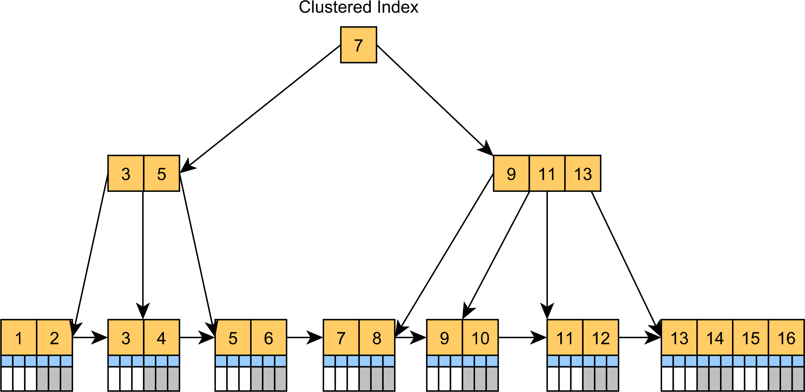
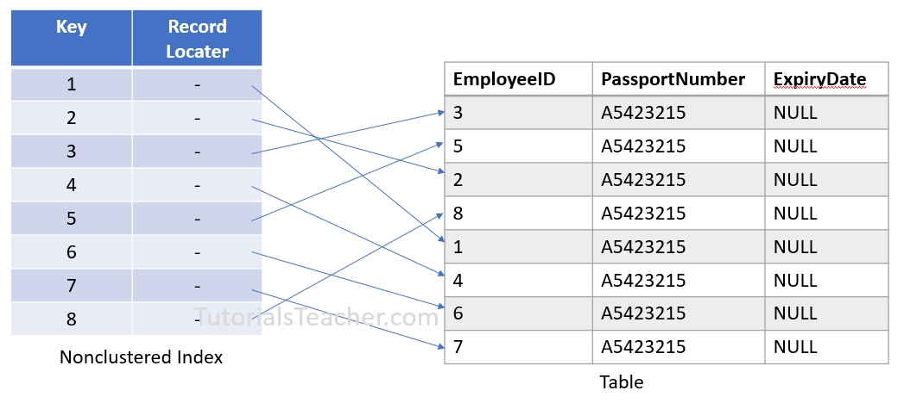
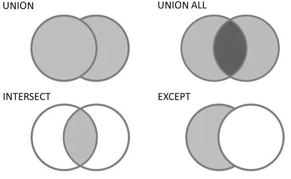

# Microsoft SQL Server Summary <!-- omit from toc -->

## Table of Contents <!-- omit from toc -->
- [1. How is Data Stored in SQL Server](#1-how-is-data-stored-in-sql-server)
  - [1.1. Simple Hierarchy \& Structure](#11-simple-hierarchy--structure)
  - [1.2. Why Relational](#12-why-relational)
  - [1.3. Indexes](#13-indexes)
- [2. DDL in SQL Server](#2-ddl-in-sql-server)
  - [2.1. Data Definition Language Commands](#21-data-definition-language-commands)
  - [2.2. How to Create](#22-how-to-create)
  - [2.3. How to Modify](#23-how-to-modify)
  - [2.4. How to Truncate](#24-how-to-truncate)
  - [2.5. How to Drop](#25-how-to-drop)
  - [2.6. Normalization](#26-normalization)
- [3. DML in SQL Server](#3-dml-in-sql-server)
  - [3.1. Data Manipulation Language Commands](#31-data-manipulation-language-commands)
  - [3.2. Begin with Retrieval](#32-begin-with-retrieval)
  - [3.3. Scalar Functions](#33-scalar-functions)
  - [3.4. Sorting](#34-sorting)
  - [3.5. Column \& Row Logic](#35-column--row-logic)
  - [3.6. Joins](#36-joins)
  - [3.7. Distinct Data](#37-distinct-data)
  - [3.8. Aggregate Functions](#38-aggregate-functions)
  - [3.9. Subqueries](#39-subqueries)
  - [3.10. Set Operations](#310-set-operations)
  - [3.11. Manipulate Data](#311-manipulate-data)
- [4. DCL in SQL Server](#4-dcl-in-sql-server)
  - [4.1. Data Control Language Commands](#41-data-control-language-commands)
  - [4.2. Grant \& Revoke](#42-grant--revoke)

<br>
<br>

****************
## 1. How is Data Stored in SQL Server

### 1.1. Simple Hierarchy & Structure
At the top level you have a SQL Server "Instance"

Within each instance you can have multiple "Databases"

Each database can have multiple "Schemas"

- **Schema** is a collection/container of database objects. It is associated with a username which is called the "Schema Owner". This schema owner is the owner of all the database objects
    within the schema
- The default schema for a newly created database object is **dbo** , which is owned by the dbo user account.

Each schema can contain:
- **Views**
- **Sorted Procedures**
- **Tables**
- And more ...

All of table data is organized in within 8K data pages


### 1.2. Why Relational
Some of the available constraints:
- <span style="color:gray">**NOT NULL**</span> – all columns by default can hold NULL values, but this constraint restricts any NULL values from being inserted into columns.
- <span style="color:gray">**UNIQUE**</span> – ensures uniqueness for the columns just like "Primary Key" but you can have many `UNIQUE` constraints per table and only one "Primary Key".
- <span style="color:gray">**DEFAULT**</span> – provides a default value for a column, if new record is entered and has no value for the column with `DEFAULT` constraint then the default value will be used.
- <span style="color:gray">**CHECK**</span> – limits the value range that can be placed in a column.

There are three types of relationships in SQL Server or in general relational database design:
- **One-to-One**
- **One-to-Many** or **Many-to-One**
- **Many-to-Many**


### 1.3. Indexes
When a table doesn't have an index – those 8K data pages are sorted in an unordered structure called a heap.

We have two types of indexes:
1. Clustered
    - Clustered index orders the physical structure of the table itself, which is why we can have only one clustered index per table.
    - Once the table has a clustered index it is called a "Clustered Table", since it is no longer a heap – aka stored in an unordered manner.



2. NonClustered
    - NonClustered index creates the order in a separate structure from the data
    pages, so it doesn't change the structure of the table itself; instead, it points to it.
    - Unlike clustered index you can have many NonClustered indexes on the same
    table since the order is sorted in separate structures for each NonClustered
    index.
    - Clustered index gets created by default when adding a primary key constraint, but it is possible to manually set it so that a NonClustered index gets created instead.




<br>
<br>

****************
## 2. DDL in SQL Server

### 2.1. Data Definition Language Commands
The main commands are:
- <span style="color:lightblue">**CREATE**</span> allows you to create a new database or objects in the database.
- <span style="color:lightblue">**DROP**</span> allows you to delete a whole database or just a database object.
- <span style="color:lightblue">**TRUNCATE**</span> deletes all records from a table irreversibly and resets table identity to initial value.
- <span style="color:lightblue">**ALTER**</span> allows you to modify database options or database object properties.


### 2.2. How to Create
Create a database:
```sql
CREATE DATABASE OurDatabase
```

Create a schema:
```sql
CREATE SCHEMA OurSchema
```

**Note:** by default, we're the schema owner but if we want to give it a custom schema owner then we have to write this code:
```sql
CREATE SCHEMA OurSchema2 AUTHORIZATION guest
```

Most common data types in SQL Server:
- <span style="color:lightblue">**INT**</span>
- <span style="color:lightblue">**DATETIME**</span> is used to store the date and time.
- <span style="color:lightblue">**DECIMAL**</span>, <span style="color:lightblue">**FLOAT**</span>
    - `DECIMAL` allows you to specify the number of decimal points to maintain and `FLOAT` does not.
- <span style="color:lightblue">**BIT**</span> stores a boolean value and is often used as a flag or an indicator of some sort.
- <span style="color:lightblue">**VARCHAR**( SIZE )</span>, <span style="color:lightblue">**CHAR**( SIZE )</span>
    - Both types are used to store non-Unicode (no national characters, other languages)
    - Both allocate 1 byte for each character so *CHAR(20)* or *VARCHAR(20)* means 20 bytes total allocated and 1 byte per character
    - `CHAR` is fixed size so if you only insert 4 characters and the total is 20 bytes you will end up with 16 bytes of wasted memory
    - `VARCHAR` is variable-length so if the total is 20 bytes but only 4 characters are inserted then it will only se 4 bytes and not waste the rest
- <span style="color:lightblue">**NVARCHAR**( SIZE )</span>, <span style="color:lightblue">**NCHAR**( SIZE )</span>
    - Both types are used to store Unicode and non-Unicode character values
    - Both allocated 2 bytes for each character
    - Rest of the properties are the same as above except the fact that 2 bytes are being allocated per character instead of 1 byte

How to create a table:
```sql
CREATE TABLE OurSchema.OurTable(
    OurTableID INT NOT NULL,
    OurTableName VARCHAR (50),
    OurTableValue INT
)

CREATE TABLE OurSchema.OurTable2(
    OurTableID INT NOT NULL,
    OurTableName VARCHAR (50),
    OurTableValue INT,
    PRIMARY KEY (OurTableID)
)
```

"OurTableID", "OurTableName", and "OurTableValue" are the names of our columns
`NOT NULL` is a constraint and `PRIMARY KEY()` is a constraint which guarantees uniqueness.

**Note:** the problem with *table2* is that each time we insert a new record we have to figure out what is the unique ID that we have to generate in order to not violate the constraint.

To fix the problem with *table2*, we use `IDENTITY()`. Every time we add a new row, it generates a unique ID.
```sql
CREATE TABLE OurSchema.OurTable3(
    OurTableID INT NOT NULL IDENTITY(1,1),
    OurTableName VARCHAR (50),
    OurTableValue INT
    PRIMARY KEY (OurTableID)
)

CREATE TABLE OurSchema.OurTable4(
    OurTableID INT NOT NULL,
    OurTable3ID INT NOT NULL,
    OurTableName VARCHAR (50),
    OurTableValue INT,
    PRIMARY KEY (OurTableID)
    FOREIGN KEY (OurTable3ID) REFERENCES OurSchema.OurTable3 (OurTableID)
)
```
In this example it says start the ID from 1 and increments by 1.

In *table4* we're defining a foreign key. With `FOREIGN KEY()` we specify the table we're going to refer and with `REFERENCES` we specify which column it is connected to.

Create a clustered index:
```sql
CREATE CLUSTERED INDEX OurClusterIndex ON OurSchema.OurTable (OurTableID)
```

Create a clustered index:
```sql
CREATE NONCLUSTERED INDEX OurNonClusterIndex ON OurSchema.OurTable (OurTableID)
```

There are two ways to create a comment:
1. Type <span style="color:#00AF50">**- -**</span> before the line
2. Use shortcuts:
    - **Ctrl + K + C** to comment the line
    -  **Ctrl + K + U** to uncomment the line
3. For longer comments use them between <span style="color:#00AF50">**/\* \*/**</span>

To know if schemas are assigned to the correct users:
```sql
SELECT
    s.name AS schema_name,
    s.schema_id,
    u.name AS schema_owner
FROM
    sys.schemas s
INNER JOIN 
    sys.sysusers u ON u.uid = s.principal_id
ORDER BY
    s.name
```


In the results we can see *OurSchema* is assigned to the default user (*dbo*)
And *OurSchema2* is assigned to the user named "*guest*"


### 2.3. How to Modify
Add a column with <span style="color:lightblue">**ALTER TABLE**</span>:
```sql
ALTER TABLE OurSchema.OurTable
    ADD NewColumn INT
```

If you would like to add multiple columns:
```sql
ALTER TABLE OurSchema.OurTable
    ADD NewColumn INT,
    AnotherColumn INT
```

Modify a column with `ALTER TABLE` (changing the type of our column):
```sql
ALTER TABLE OurSchema.OurTable
ALTER COLUMN NewColumn VARCHAR(50)
```

Drop a column with `ALTER TABLE` (remove our column):
```sql
ALTER TABLE OurSchema.OurTable
DROP COLUMN NewColumn
```


### 2.4. How to Truncate
Truncate a table:
```sql
TRUNCATE TABLE OurSchema.OurTable
```


### 2.5. How to Drop
Drop indexes (clustered and non-clustered):
```sql
DROP INDEX OurClusterIndex ON OurSchema.OurTable
DROP INDEX OurNonClusterIndex ON OurSchema.OurTable
```

Drop a table:
```sql
DROP TABLE OurSchema.OurTable
```

Drop a schema:
```sql
DROP SCHEMA OurSchema
```

**Note:** if the schema contains objects, the operation fails. Once we drop all the objects at first, the schema will be dropped successfully.

Drop a database:
```sql
DROP DATABASE OurDatabase
```


### 2.6. Normalization
Normalization is a database technique where we build and organize the table in such way that it reduces redundancy and dependency of data.

It divides larger tables to smaller ones and uses the relational features of RDBMS to link those tables together.

There are four "phases" to the database normalization process. In most practical applications normalization achieves its best result in the 3rd phase.
- First Normal Form (1NF)
- Second Normal form (2NF)
- Third Normal Form (3NF)
- Boyce-code Normal Form (BCNF)

Table is in First Normal Form if:
1. Each cell of a table has only one value
2. All of the data in a column must mean the same thing
3. Each row of a table must be unique
4. A table should not have any repeating groups

```
FullName                BookTitle
--------                ---------
Kurt Heinz, 9997        Think And Grow Rich
Michael Toner           The Power of Now
James Salas, Repeat     The Selfish Gene, The Power of Now
Felicia Reed, Repeat    Astrophysics for People in a Hurry, The Power of Now
```
The above table is not normalized and everything is saved in the same table

The table bellow is normalized in 1NF.

```
CustomerID  FirstName   LastName    CustomerType    BookTitle
----------  ---------   --------    ------------    ---------
1           Kurt        Heinz       None-Repeat     Think And Grow Rich
2           Michael     Toner       None-Repeat     The Power of Now
3           James       Salas       Repeat          The Selfish Gene
4           Felicia     Reed        Repeat          Astrophysics for People in a Hurry
3           James       Salas       Repeat          The Power of Now
4           Felicia     Reed        Repeat          The Power of Now
```

**Note:** The problem with the first normal form is that there is a lot of redundancy and if you change one record it has other ones which are related to it you would need to make the same type of change. Otherwise they will be wrong and over time this can get very cumbersome.<br>
So, if we change a customer type for James for example in the previous table, we would have to do it twice. If we had him there millions of times, we would have to perform to change millions of times. This is known as "**Functional Dependency**" in the current setup.

Table is in Second Normal Form if:
1. It has to be already in First Normal Form
2. Each non key field must be functionally dependent on the primary key (Every non key fields are directly related to the primary key)

```
Electric toothbrush models
---------------------------------------------------------------------------
Manufacturer    Model           ModuleFullName          ManufacturerCountry
------------    -----           --------------          -------------------
Forte           X-Prime         Forte X-Prime           Italy
Forte           Ultraclean      Forte Ultraclean        Italy
Dent-o-Fresh    EZbrush         Dent-o-Fresh EZbrush    USA
Brushmaster     SuperBrush      Brushmaster SuperBrush  USA
Kobayashi       ST-60           Kobayashi ST-60         Japan
Hoch            Toothmaster     Hoch Toothmaster        Germany
Hoch            X-Prime         Hoch X-Prime            Germany
```

The above relation <u>does not</u> satisfy 2NF because:
- {Manufacturer country} is functionally dependent on {Manufacturer}
{Manufacturer country} is not part of a candidate key, so it is a non-prime
attribute.
- {Manufacturer} is a subset of {Manufacturer, Model} candidate key
Therefore {Manufacturer country} is a <u>non-prime attribute functionally
dependent</u> on a part of a candidate key, and is in violation of 2NF
- Even if the designer has specified the primary key as {Model full name}, the
relation is not in 2NF because of the other candidate keys. {Manufacturer,
Model} is also a candidate key, and Manufacturer country is dependent on a
proper subset of it: Manufacturer.

```
Electric toothbrush manufacturers
-----------------------------------
Manufacturer    ManufacturerCountry
------------    -------------------
Forte           Italy
Dent-o-Fresh    USA
Brushmaster     USA
Kobayashi       Japan
Hoch            Germany


Electric toothbrush models
----------------------------------------------
Manufacturer    Model           ModuleFullName
------------    -----           --------------
Forte           X-Prime         Forte X-Prime
Forte           Ultraclean      Forte Ultraclean
Dent-o-Fresh    EZbrush         Dent-o-Fresh EZbrush
Brushmaster     SuperBrush      Brushmaster SuperBrush
Kobayashi       ST-60           Kobayashi ST-60
Hoch            Toothmaster     Hoch Toothmaster
Hoch            X-Prime         Hoch X-Prime
```


To make the design conform to 2NF, it is necessary to have two relations

Table is in Third Normal Form if:
1. Table is already in Second Normal Form
2. There is no other non-key attribute that you would need to change in a table if you changed a non-key attribute (**Transitive Dependency**). In other words, 3NF doesn't have Transitive Dependency.
```
Customer Table
------------------------------------------------
CustomerID  FirstName   LastName    CustomerType
----------  ---------   --------    ------------
1           Kurt        Heinz       None-Repeat
2           Michael     Toner       None-Repeat
3           James       Salas       Repeat
4           Felicia     Reed        Repeat


Book Table
-----------------------------------------------------------------------
BookID  BookTitle                           PublisherID RecentPublisher
------  ---------                           ----------- ---------------
1       Think And Grow Rich                 1           The Ralston Society
2       The Power of Now                    2           New World Library
3       The Selfish Gene                    3           Oxford University
4       Astrophysics for People in a Hurry  4           W. W. Norton


Customer Rating Table
--------------------------
CustomerID  BookID  Rating
----------  ------  ------
1           1       5
2           2       5
3           3       4
4           4       4
3           2       4
4           2       3
```

In the above table {PublisherID} and {RecentPublisher} are both dependent to {BookID} i.e. they are "Functionally dependent" (which is good). But they also
are dependent to each other so, if we want to change {PublisherID} then we
have to change {RecentPublisher} because they are "Transitive dependent".

In order to fix that, we change the tables into the tables bellow. We separate
publishers' info into Publisher Table.

```
Customer Table
------------------------------------------------
CustomerID  FirstName   LastName    CustomerType
----------  ---------   --------    ------------
1           Kurt        Heinz       None-Repeat
2           Michael     Toner       None-Repeat
3           James       Salas       Repeat
4           Felicia     Reed        Repeat


Publisher Table
---------------------------
PublisherID RecentPublisher
----------- ---------------
1           The Ralston Society
2           New World Library
3           Oxford University Press
4           W. W. Norton & Company


Book Table
-------------------------------------------------------
BookID  BookTitle                           PublisherID
------  ---------                           -----------
1       Think And Grow Rich                 1          
2       The Power of Now                    2          
3       The Selfish Gene                    3          
4       Astrophysics for People in a Hurry  4          


Customer Rating Table
--------------------------
CustomerID  BookID  Rating
----------  ------  ------
1           1       5
2           2       5
3           3       4
4           4       4
3           2       4
4           2       3
```

<br>
<br>

****************
## 3. DML in SQL Server

### 3.1. Data Manipulation Language Commands
The main commands are:
- <span style="color:lightblue">**SELECT**</span> allows you to retrieve data from a database
- <span style="color:lightblue">**INSERT**</span> allows you to insert data into a table
- <span style="color:lightblue">**UPDATE**</span> allows you to update data within an existing table
- <span style="color:lightblue">**DELETE**</span> allows you to delete records from a table, can be used with conditional statements unlike *TRUNCATE* (with *DELETE* you only remove the subset of a table not the entire table)

**Note:** Main differences between `TRUNCATE` and `DELETE` are that *TRUNCATE* is all or nothing, it is much faster, it resets the *IDENTITY* column and *DELETE* does not.

### 3.2. Begin with Retrieval
Simple `SELECT` statement that will retrieve everything from the Person table:
```sql
SELECT * FROM Person.Person
```

**Note:** "\*" means select every objects.

**Note:** The first Person in `Person.Person` is the name of the schema and the second one is the name of the table.

To select a specific column(s):
```sql
SELECT BusinessEntityID, FirstName, LastName, Suffix FROM Person.Person
```

**Note:** If there was a space between column names, we have to write it between square brackets. For example: `[First Name], [Last Name], Suffix`

When we're retrieving a column list we are not just limited to the specific columns on the table. We can perform modifications and change how we would like the column list to be displayed (This is called a **Calculated Field**)
```sql
SELECT SalesOrderDetailID, OrderQty*UnitPrice FROM Person.Person
```

And if we want to give those calculated fields an alias:
```sql
SELECT
    SalesOrderDetailID,
    OrderQty*UnitPrice AS [TotalPrice]
FROM
    Person.Person
```

We can also have table aliases:
```sql
SELECT SalesOrderDetailID, OrderQty*UnitPrice FROM Person.Person AS SOD
```

**Note:** To put a space between two concatenated fields, we use: `\+' '\+`
```sql
SELECT TOP 10 FirstName, 
              MiddleName, 
              LastName, 
              FirstName + ' ' + MiddleName + ' ' + LastName AS FullName
FROM [AdventureWorks2017].[Person].[Person]
WHERE Middlename IS NOT NULL;
```


### 3.3. Scalar Functions
Scalar function just means that a function is going to be performed on a single column. Main categories of scalar functions:
- String Functions
- Date & Time Functions
- Arithmetic Functions
- Conversion Functions

Some of the main String Functions are:
- <span style="color:pink">**CONCAT**</span> is similar to using "+"
    ```sql
    SELECT BusinessEntityID, CONCAT(FirstName, ' ', LastName)
    FROM Person.Person
    ```

- <span style="color:pink">**SUBSTRING**</span> allows us to get part of a string first parameter is name of the column to use, second parameter is the beginning of where to start, and the third parameter is the length of how much to cut.
    ```sql
    SELECT BusinessEntityID, SUBSTRING(FirstName,1,4)
    FROM Person.Person
    ```

- <span style="color:pink">**UPPER**</span>

- <span style="color:pink">**LOWER**</span>
    ```sql
    SELECT BusinessEntityID, UPPER(FirstName), LOWER(LastName)
    FROM Person.Person
    ```

- <span style="color:pink">**LTRIM**</span> removes a trailing space from the left side; it comes with `SELECT` and without `FROM`
    ```sql
    SELECT LTRIM('Peyman ')
    ```

- <span style="color:pink">**RTRIM**</span> removes a trailing space from the right side
    ```sql
    SELECT RTRIM(' Peyman')
    ```

- <span style="color:pink">**TRIM**</span> removes all trailing spaces from both sides
    ```sql
    SELECT TRIM(' Peyman ')
    ```

Date and time functions allows us to manipulate date and time values. Some of the main date and time functions are:

- <span style="color:pink">**GETDATE**</span> returns the current date
    ```sql
    SELECT GETDATE()
    ```

- <span style="color:pink">**DATENAME** gets you back to a specified part of a date; it has the parts "YEAR", "MONTH", "DAY"
    ```sql
    SELECT DATENAME(YEAR,'2019-10- 06')
    ```

- <span style="color:pink">**DATEDIFF**</span> returns the difference between two dates on the specified part of the date
    ```sql
    SELECT DATEDIFF(DAY,'2019-9-7','2019-9-10')
    ```

- <span style="color:pink">**DATEADD**</span> allows you to add to a specified part of the date and returns you the calculated date result
    ```sql
    SELECT DATEADD(DAY,1,'2019-9-10')
    ```

Arithmetic functions allow us to manipulate numeric values. Some of the main functions are:
- <span style="color:pink">**ABS**</span>
    ```sql
        SELECT ABS(-5)
    ```

- <span style="color:pink">**RAND**</span>
    ```sql
    SELECT RAND()
    ```

- <span style="color:pink">**CEILING**</span> rounds up the number
    ```sql
    SELECT CEILING(5.55)
    ```

- <span style="color:pink">**FLOOR**</span>
    ```sql
    SELECT FLOOR(5.55)
    ```

Conversion functions allows us to convert from one data type to another and have ways to deal with NULL values. Some of the main conversion functions are:
- <span style="color:pink">**CAST**</span> allows you to convert from one data type to another. The first parameter is the one to be converted and then you put `AS` and then the data type you want it to be converted to.
    ```sql
    SELECT CAST('10-01-2019' AS DATETIME)
    ```

- <span style="color:pink">**ISNULL**</span> allows you to specify a fallback result in case the first parameter happens to be NULL
    ```sql
    SELECT ISNULL('MyName', 'MyBackupName')
    SELECT ISNULL(NULL, 'MyBackupName')
    ```

- <span style="color:pink">**COALESCE**</span> does the same thing with some differences; it allows more than one input and the return type will depend on the type which it falls back to. Another difference between `ISNULL` and `COALESCE` is that if all of the fallback values of `COALESCE` are NULL it will throw an error however if all of the fallback values of `ISNULL` is NULL it will just return NULL
    ```sql
    SELECT COALESCE(NULL, 'MyBackupName')
    SELECT COALESCE(NULL, NULL, 'MyBackupName', 'MyLastBackupName')
    ```


### 3.4. Sorting
We have a way of returning our data back sorted:
```sql
SELECT [your_column(s)] FROM [your_table] ORDER BY [your_column(s)]
```

The default is ascending order but we can change it:
```sql
SELECT BusinessEntityID, FirstName, LastName FROM Person.Person
ORDER BY FirstName DESC

SELECT BusinessEntityID, FirstName, LastName FROM Person.Person
ORDER BY FirstName ASC , LastName DESC
```


### 3.5. Column & Row Logic
To perform conditional logic on a column(s) we need to use the `CASE` statement with associated reserved keywords.

Column logic allows us to manipulate our columns based on a given condition before we get back the result set.
```sql
SELECT
    CASE FirstName
        WHEN 'ken' THEN 'Ken Found'
        WHEN 'Miller' THEN 'Miller Found'
        ELSE FirstName
    END AS [FirstNameWithLogic]
FROM Person.Person
```

**Note:** `END` states that the condition column is finished

**Note:** In this code we used `AS` to give an alias to our conditional column

Column logic in search format:
```sql
SELECT
    CASE
        WHEN FirstName='ken' THEN 'Ken Found'
        WHEN LastName='Miller' THEN 'Miller Found'
        ELSE FirstName
    END AS [FirstNameOrLastNameWithLogic]
FROM Person.Person
```

Row logic allows us to retrieve only certain rows based on a given condition:
```sql
SELECT [your_column(s)] FROM [your_table] WHERE [row_logic] ORDER BY [your_column(s)]
```

```sql
SELECT BusinessEntityID, FirstName, LastName FROM Person.Person
WHERE Suffix='Jr.'
```

To select only the amount of records we want:
```sql
SELECT TOP 10 BusinessEntityID, FirstName, LastName FROM Person.Person
WHERE Suffix='Jr.'
```

Other reserved keys that comes with `WHERE`:
- <span style="color:grey">**AND**</span>
    ```sql
    SELECT TOP 10 BusinessEntityID, FirstName, LastName FROM Person.Person
    WHERE Suffix='Jr.' AND FirstName='Dan'
    ```

- <span style="color:grey">**OR**</span>
    ```sql
    SELECT TOP 10 BusinessEntityID, FirstName, LastName FROM Person.Person
    WHERE Suffix='Jr.' OR FirstName='Dan'
    ```

- <span style="color:grey">**IN**</span>
    ```sql
    SELECT TOP 10 BusinessEntityID, FirstName, LastName FROM Person.Person
    WHERE FirstName IN('Eric', 'Adam' )
    ```

- <span style="color:grey">**IS**</span>

- <span style="color:grey">**NOT**</span>
    ```sql
    SELECT TOP 10 BusinessEntityID, FirstName, LastName FROM Person.Person
    WHERE Suffix IS NOT NULL
    ```

- <span style="color:grey">**EXISTS**</span>


### 3.6. Joins
There are four types of joining along with a feature of Self-Joining:
- <span style="color:grey">**INNER JOIN**</span> (or <span style="color:grey">**JOIN**</span>)
- <span style="color:grey">**LEFT OUTER JOIN**</span> (or <span style="color:grey">**LEFT JOIN**</span>)
- <span style="color:grey">**RIGHT OUTER JOIN**</span> (or <span style="color:grey">**RIGHT JOIN**</span>)
- <span style="color:grey">**FULL OUTER JOIN**</span> (or <span style="color:grey">**FULL JOIN**</span>)
- Self Joining


```
Customer
------------------------------------------
CustomerID  FirstName   LastName    Gender
----------  ---------   --------    ------
1           Andy        Morrison    Male
2           Virginia    Reeder      Female
3           Bruce       Laster      Male
4           Ruth        Sands       Female
5           Michael     Villarreal  Male


Customer Order
--------------------------
CustomerOrderID CustomerID
--------------- ----------
1               1
2               1
3               2
4               3
5               3
6               10
7               11
```


The result of Inner Join is only the matching rows from {Customer} and {CustomerOrder} – anything that doesn't match will be ignored:
```sql
SELECT
    c.CustomerID,
    c.FirstName,
    c.LastName,
    co.CustomerOrderID
FROM
    dbo.Customer AS c
JOIN
    dbo.CustomeOrder co ON c.CustomerID = co.CustomerID
```
```
CustomerID  FirstName   LastName    CustomerOrderID
----------  ---------   --------    ---------------
1           Andy        Morrison    1
1           Andy        Morrison    2
2           Virginia    Reeder      3
3           Bruce       Laster      4
3           Bruce       Laster      5
```

The result of a Left Join is the matching rows from {Customer} and {CustomerOrder} including all the nonmatching rows from {Customer} as well:
```sql
SELECT
    c.CustomerID,
    c.FirstName,
    c.LastName,
    co.CustomerOrderID
FROM
    dbo.Customer AS c
LEFT JOIN
    dbo.CustomeOrder co ON c.CustomerID = co.CustomerID
```
```
CustomerID  FirstName   LastName    CustomerOrderID
----------  ---------   --------    ---------------
1           Andy        Morrison    1
1           Andy        Morrison    2
2           Virginia    Reeder      3
3           Bruce       Laster      4
3           Bruce       Laster      5
4           Ruth        Sands       NULL
5           Michael     Villarreal  NULL
```

The result of a Right Join is the matching rows from {Customer} and {CustomerOrder} including all the nonmatching rows from {CustomerOrder} as well:
```sql
SELECT
    c.CustomerID,
    c.FirstName,
    c.LastName,
    co.CustomerOrderID
FROM
    dbo.Customer AS c
RIGHT JOIN
    dbo.CustomeOrder co ON c.CustomerID = co.CustomerID
```
```
CustomerID  FirstName   LastName    CustomerOrderID
----------  ---------   --------    ---------------
1           Andy        Morrison    1
1           Andy        Morrison    2
2           Virginia    Reeder      3
3           Bruce       Laster      4
3           Bruce       Laster      5
NULL        NULL        NULL        6
NULL        NULL        NULL        7
```

Self-Joining is a technique which we're able to join same table with itself and to do that we can use any one of our joins.
```sql
SELECT
    CONCAT(c.FirstName, c.LastName) [EmployeeName],
    CONCAT(m.FirstName, m.LastName) [ManagerName]
FROM
    Employee e
INNER JOIN
    Employee m ON e. ManagerID = m.EmployeeID
```
```
CustomerID  FirstName   LastName    CustomerOrderID
----------  ---------   --------    ---------------
1           Andy        Morrison    1
1           Andy        Morrison    2
2           Virginia    Reeder      3
3           Bruce       Laster      4
3           Bruce       Laster      5
4           Ruth        Sands       NULL
5           Michael     Villarreal  NULL
NULL        NULL        NULL        6
NULL        NULL        NULL        7
```


### 3.7. Distinct Data
Whichever columns you provide in the <span style="color:lightblue">**SELECT DISTINCT**</span> statement will be used to check for uniqueness:
```sql
SELECT DISTINCT [your_column(s)]
FROM [your_table]
WHERE [condition(s)]
ORDER BY [your_column(s)]
```

```sql
SELECT DISTINCT JobTitle FROM HumanResources.Employee

SELECT DISTINCT Gender, JobTitle FROM HumanResources.Employee
```


### 3.8. Aggregate Functions
The most commonly used aggregate functions which are pre-defined in SQL for us:
- <span style="color:pink">**AVG**</span>
- <span style="color:pink">**MAX**</span>
- <span style="color:pink">**MIN**</span>
- <span style="color:pink">**SUM**</span>
- <span style="color:pink">**COUNT**</span>
    ```sql
    SELECT COUNT(*) FROM Orders

    SELECT COUNT(CustomerID) FROM Orders

    SELECT COUNT(DISTINCT CustomerID) FROM Orders
    ```

- <span style="color:lightblue">**GROUP BY**</span> allows us to separate our data into groups based on columns:
```sql
SELECT
    CustomerID,
    SUM(Amount)
FROM
    Orders
GROUP BY
    CustomerID
```

We can group results by more than one column:
```sql
SELECT
    CustomerID,
    Category,
    SUM(Amount)
FROM
    Orders
GROUP BY
    CustomerID,
    Category
```

**Note:** Remember to `SELECT` the column you want to use in `GROUP BY`

Just the way we can select which rows to get back with the `WHERE` reserved keyword, we can decide to get back with a new reserved keyword called <span style="color:lightblue">**HAVING**</span>.
```sql
SELECT
    CustomerID
    Category,
    SUM(Amount)
FROM
    Orders
GROUP BY
    CustomerID,
    Category
HAVING
    SUM(Amount) > 100
```


### 3.9. Subqueries
A subquery is a `SELECT` statement which is included in another `SELECT`, `INSERT`, `UPDATE`, or `DELETE` statement or in another subquery entirely.

A subquery can be included in any part of the `SELECT` statement except `GROUP BY`

The only difference is the way it's placed; part of the column list, tables, or conditions:
- When used as part of the columns we are talking about `SELECT` and `ORDER BY`
- When used as part of the tables we are talking about the `FROM`
- When used as part of the conditions we are talking about `WHERE` and `HAVING`
- We have two types of queries:
    - **Inner Query** is the inner one which is nested
    - **Outer Query** is the one outside which uses the inner query

**Note:** We can select run our Inner Query <u>independently</u>


### 3.10. Set Operations
Set operations allow us to combine `SELECT` queries together.

Unlike subqueries we are not nesting `SELECT` statements within each other – we have two or more separate `SELECT` queries which get their own results and the via set operations those results get combined.

We have the following set operations available to us in T-SQL:
- <span style="color:lightblue">**UNION**</span> combines result sets of two or more `SELECT` queries
- <span style="color:lightblue">**UNION ALL**</span> the difference between `UNION` and `UNION ALL` is that in `UNION`, if two or more records are completely similar, just one of them will be returned however, in `UNION ALL`, all of them will be returned
- <span style="color:lightblue">**INTERSECT**</span> allows you to see only the common matches between queries
- <span style="color:lightblue">**EXCEPT**</span> allows you to get the result set which is in only one set and completely not in the other



```sql
SELECT
    MemberID[CustomerID],
    FirstName,
    LastName,
    NULL[Age]
FROM
    Member
UNION
SELECT
    CustomerID,
    FirstName,
    LastName,
    Age
FROM
    Customer
```
```sql
SELECT
    MemberID[CustomerID],
    FirstName,
    LastName,
    NULL[Age]
FROM
    Member
UNION ALL
SELECT
    CustomerID,
    FirstName,
    LastName,
    Age
FROM
    Customer
```

**Note:** There are three rules to follow for these statements to work (these rules apply for all set operations):
1. The columns of all queries being combined, need to be into the same exact order
2. There needs to be the same number of columns and all queries
3. All columns in queries being combined need to be compatible or have the exact data type

```sql
SELECT
    MemberID[CustomerID],
    FirstName,
    LastName,
    NULL[Age]
FROM
    Members
INTERSECT
SELECT
    CustomerID,
    FirstName,
    LastName,
    Age
FROM
    Customer
```


### 3.11. Manipulate Data
- <span style="color:lightblue">**INSERT**</span>:
```sql
INSERT INTO [Person].[PhoneNumberType]
(
    [Name],
    [ModifiedDate]
)
VALUES
(
    'Emergency Phone Number',
    GETDATE()
)
```

- <span style="color:lightblue">**UPDATE**</span>:
```sql
UPDATE [Person].[PhoneNumberType]
SET [Name] = 'Emergency'
WHERE PhoneNumberTypeID = 4
```

- <span style="color:lightblue">**DELETE**</span>:
```sql
DELETE FROM [Person].[PhoneNumberType]
WHERE PhoneNumberTypeID = 4
```


<br>
<br>

****************
## 4. DCL in SQL Server

### 4.1. Data Control Language Commands
This part of SQL language is used to enforce database security in a multiple user database environment.

Privileges in SQL Server are access rights given to the database user for a database object. There are two types of privileges:
1. **System** privileges – These set of privileges allow the user to manipulate database objects by using `CREATE`, `ALTER` or `DROP` commands.
2. **Object** privileges – These set of privileges allow the user to manipulate data within the database objects or access the data by using `SELECT`, `INSERT`, `UPDATE`, `DELETE` and `EXECUTE`.

Roles are basically a group of privileges that can be assigned to many users.

When assigning a privilege to a user you only do it for that user but when there are many users for a given database it could become very difficult to manage all the privileges for each person.

A role could define a set of privileges for multiple users so that when you change a privilege on the role it automatically synchronizes it up to all the users attached to it.


### 4.2. Grant & Revoke
Two main commands are used to accomplish these tasks:
- <span style="color:lightblue">**GRANT**</span>
- <span style="color:lightblue">**REVOKE**</span>

**Note:** Only the database administrator or owner of the database object can grant/revoke privileges on a database object
```sql
GRANT [Name_of_the_privilege]
ON [Database_object]
TO [Username_or_PUBLIC_or_Role_name]

REVOKE [Name_of_the_privilege]
ON [Database_object]
FROM [Username_or_PUBLIC_or_Role_name]
```