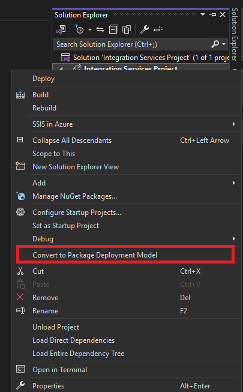
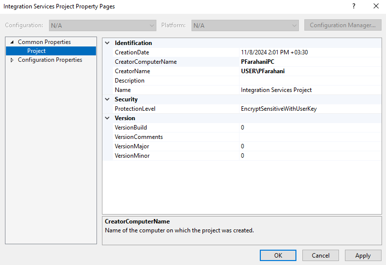
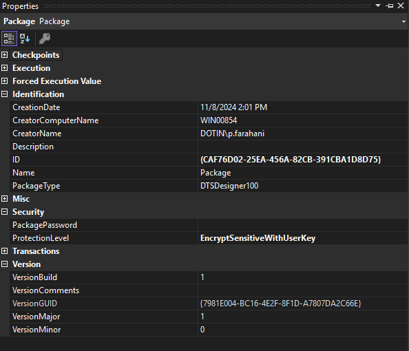
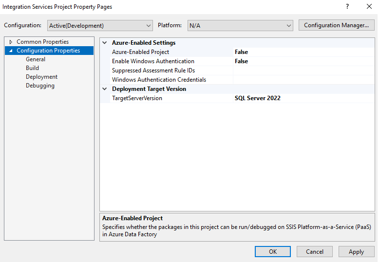

# SSIS dtproj Structure Breakdown <!-- omit from toc -->


## Table of Contents <!-- omit from toc -->
- [1. Project Metadata](#1-project-metadata)
- [2. DeploymentModelSpecificContent](#2-deploymentmodelspecificcontent)
  - [2.1. SSIS Properties](#21-ssis-properties)
  - [2.2. SSIS Packages](#22-ssis-packages)
  - [2.3. SSIS ConnectionManagers](#23-ssis-connectionmanagers)
- [3. SSIS DeploymentInfo](#3-ssis-deploymentinfo)
  - [3.1. ProjectConnectionParameters](#31-projectconnectionparameters)
  - [3.2. PackageInfo](#32-packageinfo)
- [4. Other Tags](#4-other-tags)
  - [4.1. Configurations](#41-configurations)

---

When you initially create a new SSIS solution or project in Visual Studio, a `.dtproj` file is automatically generated to store the entire project's metadata. At the outset, it appears like this, containing just one empty SSIS package:

This document provides a detailed breakdown of the tags found within the `.dtproj` XML file.

```xml
<?xml version="1.0" encoding="utf-8"?>
<Project xmlns:xsd="http://www.w3.org/2001/XMLSchema" xmlns:xsi="http://www.w3.org/2001/XMLSchema-instance">
  <DeploymentModel>Project</DeploymentModel>
  <ProductVersion>16.0.5685.0</ProductVersion>
  <SchemaVersion>9.0.1.0</SchemaVersion>
  <State>$base64$PFNvdXJjZUNvbnRyb2xJbmZvIHhtbG5zOnhzZD0iaHR0cDovL3d3dy53My5vcmcvMjAwMS9YTUxTY2hlbWEiIHhtbG5zOnhzaT0iaHR0cDovL3d3dy53My5vcmcvMjAwMS9YTUxTY2hlbWEtaW5zdGFuY2UiIHhtbG5zOmRkbDI9Imh0dHA6Ly9zY2hlbWFzLm1pY3Jvc29mdC5jb20vYW5hbHlzaXNzZXJ2aWNlcy8yMDAzL2VuZ2luZS8yIiB4bWxuczpkZGwyXzI9Imh0dHA6Ly9zY2hlbWFzLm1pY3Jvc29mdC5jb20vYW5hbHlzaXNzZXJ2aWNlcy8yMDAzL2VuZ2luZS8yLzIiIHhtbG5zOmRkbDEwMF8xMDA9Imh0dHA6Ly9zY2hlbWFzLm1pY3Jvc29mdC5jb20vYW5hbHlzaXNzZXJ2aWNlcy8yMDA4L2VuZ2luZS8xMDAvMTAwIiB4bWxuczpkZGwyMDA9Imh0dHA6Ly9zY2hlbWFzLm1pY3Jvc29mdC5jb20vYW5hbHlzaXNzZXJ2aWNlcy8yMDEwL2VuZ2luZS8yMDAiIHhtbG5zOmRkbDIwMF8yMDA9Imh0dHA6Ly9zY2hlbWFzLm1pY3Jvc29mdC5jb20vYW5hbHlzaXNzZXJ2aWNlcy8yMDEwL2VuZ2luZS8yMDAvMjAwIiB4bWxuczpkZGwzMDA9Imh0dHA6Ly9zY2hlbWFzLm1pY3Jvc29mdC5jb20vYW5hbHlzaXNzZXJ2aWNlcy8yMDExL2VuZ2luZS8zMDAiIHhtbG5zOmRkbDMwMF8zMDA9Imh0dHA6Ly9zY2hlbWFzLm1pY3Jvc29mdC5jb20vYW5hbHlzaXNzZXJ2aWNlcy8yMDExL2VuZ2luZS8zMDAvMzAwIiB4bWxuczpkZGw0MDA9Imh0dHA6Ly9zY2hlbWFzLm1pY3Jvc29mdC5jb20vYW5hbHlzaXNzZXJ2aWNlcy8yMDEyL2VuZ2luZS80MDAiIHhtbG5zOmRkbDQwMF80MDA9Imh0dHA6Ly9zY2hlbWFzLm1pY3Jvc29mdC5jb20vYW5hbHlzaXNzZXJ2aWNlcy8yMDEyL2VuZ2luZS80MDAvNDAwIiB4bWxuczpkZGw1MDA9Imh0dHA6Ly9zY2hlbWFzLm1pY3Jvc29mdC5jb20vYW5hbHlzaXNzZXJ2aWNlcy8yMDEzL2VuZ2luZS81MDAiIHhtbG5zOmRkbDUwMF81MDA9Imh0dHA6Ly9zY2hlbWFzLm1pY3Jvc29mdC5jb20vYW5hbHlzaXNzZXJ2aWNlcy8yMDEzL2VuZ2luZS81MDAvNTAwIiB4bWxuczpkd2Q9Imh0dHA6Ly9zY2hlbWFzLm1pY3Jvc29mdC5jb20vRGF0YVdhcmVob3VzZS9EZXNpZ25lci8xLjAiPg0KICA8RW5hYmxlZD5mYWxzZTwvRW5hYmxlZD4NCiAgPFByb2plY3ROYW1lPjwvUHJvamVjdE5hbWU+DQogIDxBdXhQYXRoPjwvQXV4UGF0aD4NCiAgPExvY2FsUGF0aD48L0xvY2FsUGF0aD4NCiAgPFByb3ZpZGVyPjwvUHJvdmlkZXI+DQo8L1NvdXJjZUNvbnRyb2xJbmZvPg==</State>
  <Database>
    <Name>Integration Services Project.database</Name>
    <FullPath>Integration Services Project.database</FullPath>
  </Database>
  <DataSources />
  <DataSourceViews />
  <DeploymentModelSpecificContent>
    <Manifest>
      <SSIS:Project SSIS:ProtectionLevel="EncryptSensitiveWithUserKey" xmlns:SSIS="www.microsoft.com/SqlServer/SSIS">
        <SSIS:Properties>
          <SSIS:Property SSIS:Name="ID">{3f6aeaa4-b62d-499f-9e19-64fe6aa4a476}</SSIS:Property>
          <SSIS:Property SSIS:Name="Name">Integration Services Project</SSIS:Property>
          <SSIS:Property SSIS:Name="VersionMajor">1</SSIS:Property>
          <SSIS:Property SSIS:Name="VersionMinor">0</SSIS:Property>
          <SSIS:Property SSIS:Name="VersionBuild">0</SSIS:Property>
          <SSIS:Property SSIS:Name="VersionComments">
          </SSIS:Property>
          <SSIS:Property SSIS:Name="CreationDate">2024-11-08T14:01:21.1966876+03:30</SSIS:Property>
          <SSIS:Property SSIS:Name="CreatorName">DOTIN\p.farahani</SSIS:Property>
          <SSIS:Property SSIS:Name="CreatorComputerName">WIN00854</SSIS:Property>
          <SSIS:Property SSIS:Name="Description">
          </SSIS:Property>
          <SSIS:Property SSIS:Name="PasswordVerifier" SSIS:Sensitive="1">AQAAANCMnd8BFdERjHoAwE/Cl+sBAAAALs+2rK40F0CaHsK3YuseQgAAAAACAAAAAAADZgAAwAAAABAAAAA6DIKzKljp3RejwugCzMx5AAAAAASAAACgAAAAEAAAAMrNCGeWU9l9y3jySWCkFreIAAAAfQkaFnfJkhl6n+IWTZuJ7thjeY9k4OLdsTggph9Xo4cNIyM9cikDNztiLkYp44i45/K48AhHRcPrvM/HhO1RF0xqQQRnVKABwRSVOmofGE/cRwnaAHXppzOwf3SIFJBQARia3Yt93YZA4IM1BePHDzfjAquYMb3XHNNTy0+uRtukl3kEMtwvrBQAAAC6X07eRQsphA0/sgabFCXzSeIjkw==</SSIS:Property>
          <SSIS:Property SSIS:Name="FormatVersion">1</SSIS:Property>
        </SSIS:Properties>
        <SSIS:Packages>
          <SSIS:Package SSIS:Name="Package.dtsx" SSIS:EntryPoint="1" />
        </SSIS:Packages>
        <SSIS:ConnectionManagers />
        <SSIS:DeploymentInfo>
          <SSIS:ProjectConnectionParameters />
          <SSIS:PackageInfo>
            <SSIS:PackageMetaData SSIS:Name="Package.dtsx">
              <SSIS:Properties>
                <SSIS:Property SSIS:Name="ID">{CAF76D02-25EA-456A-82CB-391CBA1D8D75}</SSIS:Property>
                <SSIS:Property SSIS:Name="Name">Package</SSIS:Property>
                <SSIS:Property SSIS:Name="VersionMajor">1</SSIS:Property>
                <SSIS:Property SSIS:Name="VersionMinor">0</SSIS:Property>
                <SSIS:Property SSIS:Name="VersionBuild">0</SSIS:Property>
                <SSIS:Property SSIS:Name="VersionComments">
                </SSIS:Property>
                <SSIS:Property SSIS:Name="VersionGUID">{C4A11216-51EE-42B7-8DE0-16C557EC363A}</SSIS:Property>
                <SSIS:Property SSIS:Name="PackageFormatVersion">8</SSIS:Property>
                <SSIS:Property SSIS:Name="Description">
                </SSIS:Property>
                <SSIS:Property SSIS:Name="ProtectionLevel">1</SSIS:Property>
              </SSIS:Properties>
              <SSIS:Parameters />
            </SSIS:PackageMetaData>
          </SSIS:PackageInfo>
        </SSIS:DeploymentInfo>
      </SSIS:Project>
    </Manifest>
  </DeploymentModelSpecificContent>
  <ControlFlowParts />
  <Miscellaneous />
  <Configurations>
    <Configuration>
      <Name>Development</Name>
      <Options>
        <OutputPath>bin</OutputPath>
        <ConnectionMappings />
        <ConnectionProviderMappings />
        <ConnectionSecurityMappings />
        <DatabaseStorageLocations />
        <TargetServerVersion>SQLServer2022</TargetServerVersion>
        <AzureMode>false</AzureMode>
        <LinkedAzureTenantId />
        <LinkedAzureAccountId />
        <LinkedAzureSSISIR />
        <LinkedAzureStorage />
        <RemoteExecutionFolder />
        <ParameterConfigurationValues />
      </Options>
    </Configuration>
  </Configurations>
</Project>
```

<br>
<br>

---

## 1. Project Metadata

| Tag                                | Description                                                                                  |
| ---------------------------------- | -------------------------------------------------------------------------------------------- |
| `<DeploymentModel>`                | Specifies the deployment model of the project (e.g., Project or Package).                    |
| `<ProductVersion>`                 | Indicates the version of the **SQL Server Integration Services** used to create the project. |
| `<SchemaVersion>`                  | Specifies the version of the schema used in the project file.                                |
| `<Database>`                       | Contains details about the database associated with the project.                             |
| `<Name>`                           | Name of the database.                                                                        |
| `<FullPath>`                       | Full path of the `.database` file.                                                           |
| `<State>`                          | Encoded state information representing the project's structure and components.               |
| `<DataSources>`                    | Section for data sources used in the project (currently empty).                              |
| `<DataSourceViews>`                | Section for data source views (currently empty).                                             |
| `<DeploymentModelSpecificContent>` | Contains project-specific content for deployment models.                                     |
| `<Manifest>`                       | Root element for the SSIS project, containing details about the project and its packages.    |


For more information on the differences between deployment models, refer to the official Microsoft documentation: 
[Compare Project Deployment Model and Legacy Package Deployment Model](https://learn.microsoft.com/en-us/sql/integration-services/packages/deploy-integration-services-ssis-projects-and-packages?view=sql-server-ver16#compare-project-deployment-model-and-legacy-package-deployment-model)

To change the deployment model, right-click on the project in Visual Studio and select `Convert to Package Deployment Model`:



The decoded value within the `<State>` tag is structured as follows:
```xml
<SourceControlInfo xmlns:xsd="http://www.w3.org/2001/XMLSchema" xmlns:xsi="http://www.w3.org/2001/XMLSchema-instance" xmlns:ddl2="http://schemas.microsoft.com/analysisservices/2003/engine/2" xmlns:ddl2_2="http://schemas.microsoft.com/analysisservices/2003/engine/2/2" xmlns:ddl100_100="http://schemas.microsoft.com/analysisservices/2008/engine/100/100" xmlns:ddl200="http://schemas.microsoft.com/analysisservices/2010/engine/200" xmlns:ddl200_200="http://schemas.microsoft.com/analysisservices/2010/engine/200/200" xmlns:ddl300="http://schemas.microsoft.com/analysisservices/2011/engine/300" xmlns:ddl300_300="http://schemas.microsoft.com/analysisservices/2011/engine/300/300" xmlns:ddl400="http://schemas.microsoft.com/analysisservices/2012/engine/400" xmlns:ddl400_400="http://schemas.microsoft.com/analysisservices/2012/engine/400/400" xmlns:ddl500="http://schemas.microsoft.com/analysisservices/2013/engine/500" xmlns:ddl500_500="http://schemas.microsoft.com/analysisservices/2013/engine/500/500" xmlns:dwd="http://schemas.microsoft.com/DataWarehouse/Designer/1.0">
  <Enabled>false</Enabled>
  <ProjectName></ProjectName>
  <AuxPath></AuxPath>
  <LocalPath></LocalPath>
  <Provider></Provider>
</SourceControlInfo>
```

<br>
<br>

---

## 2. DeploymentModelSpecificContent

| Tag                         | Description                                                                            |
| --------------------------- | -------------------------------------------------------------------------------------- |
| `<SSIS:Project>`            | Main element containing SSIS project-specific properties.                              |
| `<SSIS:Properties>`         | Contains various properties related to the SSIS project.                               |
| `<SSIS:Property>`           | Individual properties for the project, such as ID, Name, Version, and Creator details. |
| `<SSIS:Packages>`           | Element that holds the packages associated with the project.                           |
| `<SSIS:Package>`            | Represents an individual SSIS package within the project.                              |
| `<SSIS:PackageMetaData>`    | Metadata for a specific package, containing its properties and parameters.             |
| `<SSIS:Parameters>`         | Section for parameters of the package (currently empty).                               |
| `<SSIS:ConnectionManagers>` | Section for connection managers used within the project (currently empty).             |
| `<SSIS:DeploymentInfo>`     | Contains information regarding deployment settings and package metadata.               |
| `<SSIS:PackageInfo>`        | Holds specific information about a package, including metadata like name and version.  |


### 2.1. SSIS Properties

The properties of the project are stored within this tag. Each property is represented by an `<SSIS:Property>` tag, each associated with a specific class name:

| Property Name         | Description                                                                 |
| --------------------- | --------------------------------------------------------------------------- |
| `ID`                  | Specifies the GUID of the project                                           |
| `CreationDate`        | Date and the time the project was created                                   |
| `CreatorName`         | Domain and the user name of the individual who created the project          |
| `CreatorComputerName` | Name of the computer on which the project was created                       |
| `Description`         | Description of the project                                                  |
| `Name`                | The name property of the project. Not necessarily the same as the file name |
| `VersionBuild`        | The build number of the project                                             |
| `VersionComments`     | The version comments of the project                                         |
| `VersionMajor`        | The major version of the project                                            |
| `VersionMinor`        | The minor version of the project                                            |
| `PasswordVerifier`    | A hashed value that verifies the integrity of sensitive information         |
| `FormatVersion`       | Indicates the project deployment format                                     |

You can view and modify this information in the user interface:



**Note:** The protection level of the project is defined within the `<SSIS:Project>` tag's `SSIS:ProtectionLevel` class and has the following options:
- `DontSaveSensitive`: No `<SSIS:Property SSIS:Name="PasswordVerifier" SSIS:Sensitive="1">` property will exist
- `EncryptSensitiveWithUserKey`
- `EncryptSensitiveWithPassword`
- `EncryptAllWithUserKey`
- `EncryptAllWithPassword`

**Explanation of the `PasswordVerifier` Property:**

This property stores a hashed value that verifies the integrity of sensitive information, such as passwords or connection strings. It is not the actual password but a hash used to confirm the correct password was entered. The `SSIS:Sensitive="1"` attribute indicates that the property contains sensitive information, which should be handled securely during project execution and storage.

**Note:** The `FormatVersion` changes when the SSIS project is upgraded to a newer version.


### 2.2. SSIS Packages

This section lists all created SSIS packages in the following format:

```xml
<SSIS:Package SSIS:Name="PackageName.dtsx" SSIS:EntryPoint="1" />
```

**Note:** The `EntryPoint` can have two values: the default is 1, which can be set to 0 in the UI. The entry point package is executed first when the project runs, often containing the main workflow. Packages not set as entry points will not run unless explicitly called by another package.

It is crucial that all packages are listed under this tag; any missing packages will result in an error and prevent the solution from being built, as discrepancies between the directory and the `.dtproj` file metadata will occur. During collaborative work, ensure that all newly added packages are listed within the `<SSIS:Packages>` tag, particularly when resolving merge conflicts.


### 2.3. SSIS ConnectionManagers

Connection managers created in the SSIS project will be listed using the following syntax:

```xml
<SSIS:ConnectionManager SSIS:Name="ConnectionName.conmgr" />
```

<br>
<br>

---

## 3. SSIS DeploymentInfo

This section contains the main metadata for the SSIS packages, comprising two primary tags within `<SSIS:DeploymentInfo>`:

| Tag                             | Description                                                                   |
| ------------------------------- | ----------------------------------------------------------------------------- |
| `<ProjectConnectionParameters>` | Includes properties of each connection manager, varying by connection type    |
| `<PackageInfo>`                 | Stores the metadata and properties of each created package within the project |


### 3.1. ProjectConnectionParameters

The `<ProjectConnectionParameters>` element contains distinct class names for each tag:

| Tag Name                             | Description                                                     |
| ------------------------------------ | --------------------------------------------------------------- |
| `<SSIS:ProjectConnectionParameters>` | Contains parameters for the SSIS project connections.           |
| `<SSIS:Parameter>`                   | Defines a specific parameter related to the project connection. |
| `<SSIS:Properties>`                  | Encloses a set of properties for a specific parameter.          |
| `<SSIS:Property>`                    | Represents an individual property of a parameter.               |

**Key Properties within `<SSIS:Property>`:**

| Property Name        | Description                                                           |
| -------------------- | --------------------------------------------------------------------- |
| `SSIS:Name`          | The name identifier of the property.                                  |
| `ID`                 | Unique identifier for the property (often empty).                     |
| `CreationName`       | Name of the creator of the parameter (often empty).                   |
| `Description`        | A description of the property (often empty).                          |
| `IncludeInDebugDump` | Indicates if the property should be included in debug dumps. (0 or 1) |
| `Required`           | Indicates if the parameter is required (0 or 1).                      |
| `Sensitive`          | Indicates if the parameter contains sensitive data (0 or 1).          |
| `Value`              | The current value of the property (may vary by parameter).            |
| `DataType`           | Numeric representation of the data type of the property.              |

Properties may vary based on the connection manager type.


### 3.2. PackageInfo

As noted in section [2.2. SSIS Packages](#22-ssis-packages), all created packages are listed, and their properties are set. Ensure there are no discrepancies in the package list during collaboration; otherwise, the solution may not build properly.

Packages are listed within a `<SSIS:PackageMetaData>` tag, which is the root element containing metadata about the SSIS package:
```xml
<SSIS:PackageMetaData SSIS:Name="PackageName.dtsx">
```

There must be a corresponding `<SSIS:PackageMetaData>` tag for each package.

Each metadata tag includes a `<SSIS:Properties>` tag that contains properties associated with the package. Below are the distinct tags within each SSIS package metadata and their descriptions:

| **Tag**                     | **Description**                                                         |
| --------------------------- | ----------------------------------------------------------------------- |
| `<SSIS:Property>`           | Represents a specific property of the package, with name/value pairs    |
| `SSIS:ID`                   | Unique identifier for the package                                       |
| `SSIS:Name`                 | The name of the SSIS package                                            |
| `SSIS:VersionMajor`         | Major version number of the package                                     |
| `SSIS:VersionMinor`         | Minor version number of the package                                     |
| `SSIS:VersionBuild`         | Build number of the package version                                     |
| `SSIS:VersionComments`      | Comments related to the package version                                 |
| `SSIS:VersionGUID`          | Unique identifier (GUID) for the version of the package                 |
| `SSIS:PackageFormatVersion` | Version of the SSIS package format: <br> <table><thead><tr><th>SQL Version</th><th>Build #</th><th>PackageFormatVersion</th><th>Visual Studio Version</th></tr></thead><tbody><tr><td>2005</td><td>9</td><td>2</td><td>2005</td></tr><tr><td>2008</td><td>10</td><td>3</td><td>2008</td></tr><tr><td>2008 R2</td><td>10.5</td><td>3</td><td>2008</td></tr><tr><td>2012</td><td>11</td><td>6</td><td>2010 or BI 2012</td></tr><tr><td>2014</td><td>12</td><td>8</td><td>2012 CTP2 or 2013</td></tr><tr><td>2016</td><td>13</td><td>8</td><td>2015/2017</td></tr><tr><td>2017</td><td>14</td><td>8</td><td>2017</td></tr></tbody></table> [Source](https://sqlstudies.com/2015/04/27/what-sql-version-is-my-ssis-package/) |
| `SSIS:Description`          | Description of the package                                              |
| `SSIS:ProtectionLevel`      | Security level that protects the package <br> <table><tr><th>Protection Level Value</th><th>Description</th></tr><tr><td>0</td><td>Don't Save Sensitive</td></tr><tr><td>1</td><td>EncryptSensitiveWithUserKey</td></tr><tr><td>2</td><td>EncryptSensitiveWithPassword</td></tr><tr><td>3</td><td>EncryptAllWithPassword</td></tr><tr><td>4</td><td>EncryptAllWithUserKey</td></tr></table> |
| `<SSIS:Parameters>`         | Container for parameters used in the package                            |

All these properties can be viewed in the UI when accessing the package properties:



<br>
<br>

---

## 4. Other Tags

| Tag                  | Description                                                                                                                                          |
| -------------------- | ---------------------------------------------------------------------------------------------------------------------------------------------------- |
| `<ControlFlowParts>` | Section for control flow components. See [Control Flow](https://learn.microsoft.com/en-us/sql/integration-services/control-flow/control-flow)        |
| `<Miscellaneous>`    | Section for miscellaneous project items. See [Miscellaneous files](https://learn.microsoft.com/en-us/visualstudio/ide/reference/miscellaneous-files) |
| `<Configurations>`   | Contains different configurations for the project, such as Development, Production, etc.                                                             |


### 4.1. Configurations

Project configurations are stored within this tag, representing specific settings for the project. By default, only one configuration exists, but additional configurations can be created through the UI.



Each configuration is encapsulated within a `<Configuration>` tag, which includes the following options:

| Tag                              | Description                                                                                    |
| -------------------------------- | ---------------------------------------------------------------------------------------------- |
| `<Name>`                         | Name of the configuration (e.g., Development)                                                  |
| `<Options>`                      | Holds various options for the configuration, including output paths and target server version  |
| `<OutputPath>`                   | Specifies the output path for the build artifacts of the project                               |
| `<TargetServerVersion>`          | Indicates the version of the SQL Server the project is targeting (e.g., SQLServer2022)         |
| `<AzureMode>`                    | Indicates whether the project is set to run in Azure mode (true/false)                         |
| `<LinkedAzureTenantId>`          | Holds the linked Azure tenant ID                                                               |
| `<LinkedAzureAccountId>`         | Holds the linked Azure account ID                                                              |
| `<LinkedAzureSSISIR>`            | Holds linked Azure SSIS integration runtime                                                    |
| `<LinkedAzureStorage>`           | Holds linked Azure storage details                                                             |
| `<RemoteExecutionFolder>`        | Folder path for remote execution                                                               |
| `<ParameterConfigurationValues>` | Holds parameter configuration values for the project                                           |