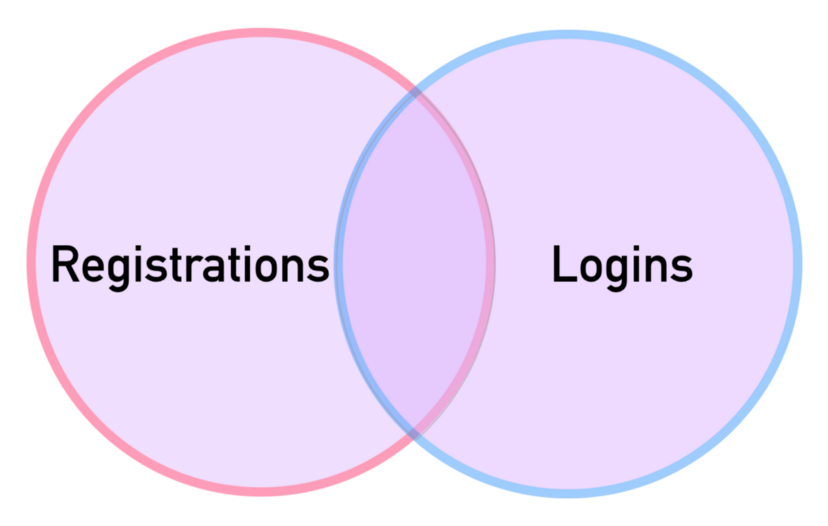
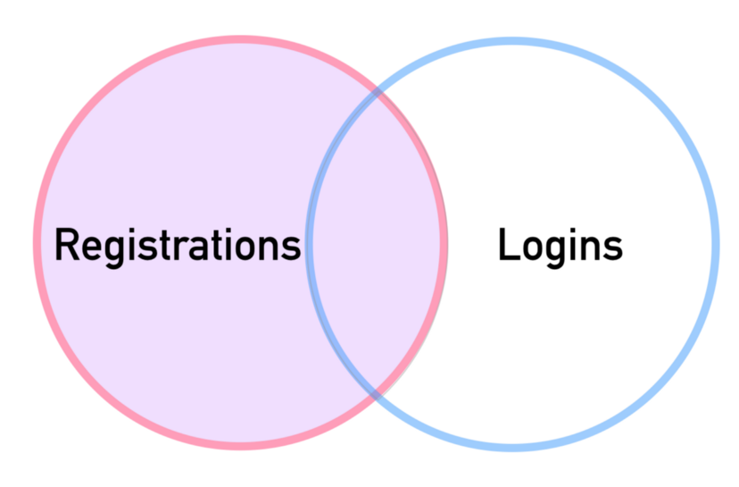
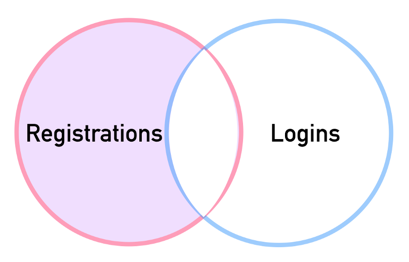
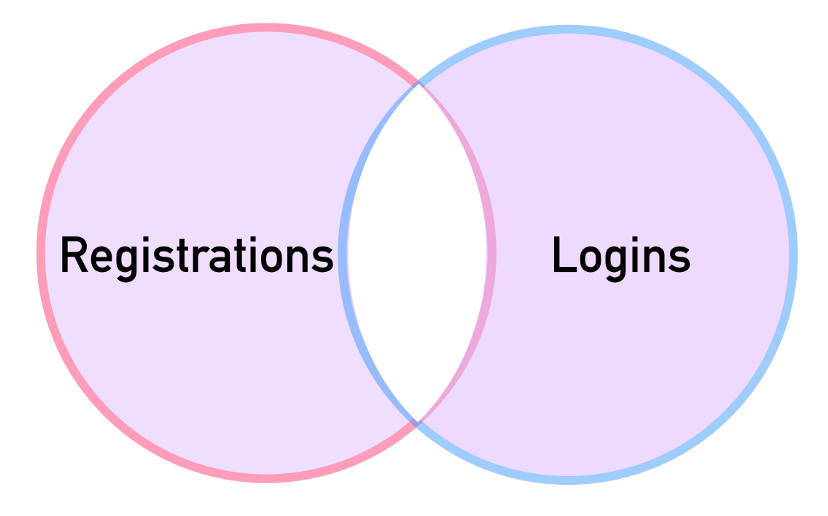

# PostgreSQL Summary (SQL Basics) <!-- omit from toc -->

## Table of Contents <!-- omit from toc -->

- [1. SQL Statement](#1-sql-statement)
  - [1.1. SELECT](#11-select)
  - [1.2. SELECT DISTINCT](#12-select-distinct)
  - [1.3. WHERE](#13-where)
  - [1.4. LIMIT](#14-limit)
  - [1.5. IN Operator](#15-in-operator)
  - [1.6. NOT IN Operator](#16-not-in-operator)
  - [1.7. ORDER BY](#17-order-by)
  - [1.8. BETWEEN](#18-between)
  - [1.9. LIKE](#19-like)
- [2. GROUP BY Statements](#2-group-by-statements)
  - [2.1. GROUP BY](#21-group-by)
  - [2.2. HAVING](#22-having)
- [3. Joins](#3-joins)
  - [3.1. INNER JOIN](#31-inner-join)
  - [3.2. FULL OUTER JOIN](#32-full-outer-join)
  - [3.3. LEFT OUTER JOIN](#33-left-outer-join)
  - [3.4. SELF JOIN](#34-self-join)
  - [3.5. Using WHERE Clauses for Exclusions](#35-using-where-clauses-for-exclusions)
  - [3.6. JOIN vs UNION vs UNION ALL](#36-join-vs-union-vs-union-all)
- [4. Advanced SQL Commands](#4-advanced-sql-commands)
  - [4.1. Timestamps and Extract](#41-timestamps-and-extract)
  - [4.2. Mathematical Functions](#42-mathematical-functions)
  - [4.3. String Functions and Operations](#43-string-functions-and-operations)
  - [4.4. SUBQUERY](#44-subquery)
  - [4.5. EXISTS](#45-exists)
- [5. Creating Databases and Tables](#5-creating-databases-and-tables)
  - [5.1. Data Types](#51-data-types)
  - [5.2. Constraints](#52-constraints)
  - [5.3. CREATE TABLE and Constraints](#53-create-table-and-constraints)
  - [5.4. INSERT](#54-insert)
  - [5.5. UPDATE](#55-update)
  - [5.6. DELETE](#56-delete)
  - [5.7. ALTER](#57-alter)
  - [5.8. CHECK](#58-check)
- [6. Conditional Expressions and Procedures](#6-conditional-expressions-and-procedures)
  - [6.1. CASE](#61-case)
  - [6.2. COALESCE](#62-coalesce)
  - [6.3. CAST](#63-cast)
  - [6.4. NULLIF](#64-nullif)
  - [6.5. Views](#65-views)
- [7. PostGreSQL with Python](#7-postgresql-with-python)


<br>
<br>

****************

## 1. SQL Statement

### 1.1. SELECT
One of the most common tasks, when you work with PostgreSQL, is to query data from
tables by using the `​SELECT`​ statement. The `​SELECT`​ statement is one of the most complex statements in PostgreSQL. It has many clauses that you can combine to form a powerful query.

The following are the clauses that appear in the `​SELECT` ​statement:

- Select distinct rows by using `DISTINCT` operator.
- Filter rows by using `WHERE` clause.
- Sort rows by using the `ORDER BY` clause.
- Select rows based on various operators such as `BETWEEN`, `IN` and `LIKE`.
- Group rows into groups by using `GROUP BY` clause
- Apply condition for groups by using `HAVING` clause.
- Join to another table by using `INNER` `JOIN`, `LEFT JOIN`, `RIGHT JOIN` clauses.

The following illustrates the syntax of the ​SELECT​ statement:
```sql
SELECT column_1, column_2,
FROM table_name
```

Let's examine the `​SELECT` ​statement in more detail:
- First, you specify a list of columns in the table from which you want to query
data in the `​SELECT` ​clause. You use a comma between each column in case
you want to query data from multiple columns. If you want to query data
from all column, you can use an asterisk (\*) as the shorthand for all
columns.
- Second, you indicate the table name after the `​FROM` ​keyword

**Note:** SQL language is case insensitive. It means if you use ​SELECT​ or ​select​ the effect is the same. By convention, we will use SQL keywords in uppercase to make the code easier to read and stand out clearly.


### 1.2. SELECT DISTINCT
The `​DISTINCT​` clause is used in the `SELECT` statement to remove duplicate rows from a result set. The `​DISTINCT​` clause keeps one row for each group of duplicates. You can use the `​DISTINCT​` clause on one or more columns of a table.
```sql
SELECT DISTINCT column_1
FROM table_name;
```

If you specify multiple columns, the `​DISTINCT​` clause will evaluate the duplicate based on the combination of values of those columns.
```sql
SELECT DISTINCT column_1,column_2
FROM tbl_name;
```

PostgreSQL also provides the `​DISTINCT ON` to keep the "first" row of each group of duplicates where the expression is equal:
```sql
SELECT DISTINCT ON (column_1), column_2
FROM tbl_name
ORDER BY column_1,column_2;
```
**Note:** The order of rows returned from the `​SELECT​` statement is unpredictable therefore the "first" row of each group of the duplicate is also unpredictable. It is good practice to always use the `ORDER BY​` clause with the `​DISTINCT ON`​ to make the result obvious.

**Note:** that the `​DISTINCT ON`​ must match the leftmost expression in the
`ORDER BY`​ clause.


### 1.3. WHERE
The syntax of the PostgreSQL `​WHERE​` clause is as follows:
```sql
SELECT column_1, column_2 ... column_n
FROM table_name
WHERE conditions;
```

The following table illustrates the standard comparison operators.
| OPERATOR | DESCRIPTION           |
| -------- | --------------------- |
| =        | Equal                 |
| >        | Greater than          |
| <        | Less than             |
| >=       | Greater than or equal |
| <=       | Less than or equal    |
| <> or != | Not equal             |
| AND      | Logical operator AND  |
| OR       | Logical operator OR   |


If you want to get all customers whose first names are ​Jamie​, you can use the `​WHERE` clause with the equal (=) operator as follows:
```sql
SELECT last_name, first_name
FROM customer
WHERE first_name = 'Jamie';
```

If you want to select the customer whose first name is ​Jamie​ and last names is ​rice​, you can use the `​AND​` logical operator that combines two conditions as the following query:
```sql
SELECT last_name, first_name
FROM customer
WHERE first_name = 'Jamie' AND
last_name = 'Rice';
```

If you want to know who paid the rental with amount is either less than 1USD or greater than 8USD, you can use the following query with `​OR​` operator:
```sql 
SELECT customer_id,amount,payment_date
FROM payment
WHERE amount <= 1 OR amount >= 8;
```


### 1.4. LIMIT
PostgreSQL `LIMIT` is used in the `SELECT` statement to get a subset of rows returned by the query. The following is the common syntax of the `LIMIT` clause:
```sql 
SELECT *
FROM table_name
LIMIT n;
```
PostgreSQL returns ​n​ number of rows generated by the query. If ​n​ is zero or ​NULL​, it produces the result that is same as omitting the `​LIMIT​` clause.

In case you want to skip a number of rows before returning ​n​ rows, you use `​OFFSET` clause followed by the `​LIMIT​` clause as follows:
```sql
SELECT * FROM table_name
LIMIT n OFFSET m;
```
PostgreSQL first skips ​m​ rows before returning n rows generated by the query. If m is zero, PostgreSQL will behave like without the `​OFFSET​` clause.

**Note:** Because the order of the rows in the database table is unknown and unpredictable,
when you use the ​LIMIT​ clause, you should always use the `​ORDER BY`​ clause to control the order of rows. If you don't do so, you will get an unpredictable result.


### 1.5. IN Operator
You use the `​IN​` operator in the `WHERE` clause to check if a value matches any value in a list of values. The syntax of the `​IN​` operator is as follows:
```sql
value IN (value1,value2,...)
```
The expression returns true if the value matches any value in the list i.e., value1,
value2, etc. The list of values is not limited to a list of numbers or strings but also a result set of a `​SELECT` ​statement as shown in the following query:
```sql
value IN (SELECT value FROM tbl_name);
```
The statement inside the parentheses is called a subquery, which is a query nested
inside another query.


Suppose you want to know the rental information of customer id 1 and 2, you can use
the `​IN` ​operator in the `WHERE` clause as follows:
```sql 
SELECT customer_id, rental_id, return_date
FROM rental
WHERE customer_id IN (1, 2)
ORDER BY return_date DESC;
```


### 1.6. NOT IN Operator
You can combine the `​IN​` operator with the `​NOT​` operator to select rows whose values do not match the values in the list. The following statement selects rentals of customers whose customer id is not 1 or 2.
```sql
SELECT customer_id, rental_id, return_date
FROM rental
WHERE customer_id NOT IN (1, 2);
```


### 1.7. ORDER BY
The `​ORDER BY​` clause allows you to sort the rows returned from the `​SELECT` ​statement in ascending or descending order based on criteria specified by different criteria. The following illustrates the syntax of the `​ORDER BY​` clause:
```sql
SELECT column_1,column_2
FROM tbl_name
ORDER BY column_1 ASC, column_2 DESC;
```
**Note:** If you leave it blank, the `​ORDER BY` ​clause will use `ASC` ​by default.


The following query sorts customers by the first name in ascending order:
```sql
SELECT first_name,last_name
FROM customer
ORDER BY first_name ASC;
```


### 1.8. BETWEEN
We use the `​BETWEEN​` operator to match a value against a range of values. The following illustrates the syntax of the `​BETWEEN​` operator:
```sql
value BETWEEN low AND high;
```

If the value is greater than or equal to the low value and less than or equal to the high value, the expression returns true, or vice versa. We can rewrite the `​BETWEEN​` operator by using the greater than or equal (​>=​) or less than or equal (​<=​) operators as the following statement:
```sql
value >= low and value <= high
```

If we want to check if a value is out of a range, we use the `​NOT BETWEEN​` operator.


The following query selects any payment whose amount is between 8 and 9:
```sql
SELECT customer_id, payment_id,amount
FROM payment
WHERE amount BETWEEN 8 AND 9;
```


### 1.9. LIKE
You can use the PostgreSQL `​LIKE​` operator to as the following query:
```sql
SELECT first_name,last_name
FROM customer
WHERE first_name LIKE 'Jen%';
```
The query returns rows whose values in the first name column begin with ​Jen ​and may
be followed by any sequence of characters. This technique is called pattern matching.


You construct a pattern by combining a string with wildcard characters and use the `​LIKE` or `​NOT LIKE​` operator to find the matches. PostgreSQL provides two wildcard characters:
- Percent (**​%​**) for matching any sequence of characters.
- Underscore (**_​**) for matching any single character.

**Note:** `LIKE` is case-sensitive, if you want to define an case-insensitive pattern, use `ILIKE` instead. 

<br>
<br>

****************
## 2. GROUP BY Statements

### 2.1. GROUP BY
The following statement illustrates the syntax of the `​GROUP BY​` clause:
```sql
SELECT column_1, aggregate_function(column_2)
FROM tbl_name
GROUP BY column_1;
```

The `​GROUP BY​` clause must appear right after the `​FROM​` or `​WHERE​` clause. 


To get how much a customer has been paid:
```sql
SELECT customer_id,
SUM (amount)
FROM payment
GROUP BY customer_id;
```

### 2.2. HAVING
We often use the `​HAVING` ​clause in conjunction with the `GROUP BY` clause to filter group rows that do not satisfy a specified condition.
The following statement illustrates the typical syntax of the `​HAVING` ​clause:
```sql
SELECT column_1, aggregate_function (column_2)
FROM tbl_name
GROUP BY column_1
HAVING condition;
```

In PostgreSQL, you can use the `​HAVING` ​clause without the `​GROUP BY​` clause. In this case, the `​HAVING` ​clause will turn the query into a single group. In addition, the `SELECT​` list and `​HAVING` ​clause can only refer to columns from within aggregate functions. This kind of query returns a single row if the condition in the `​HAVING` ​clause is true or zero row if it is false.


You can apply the `​HAVING` ​clause to selects the only customer who has been spending more than ​ 200 ​as the following query:
```sql
SELECT customer_id,
SUM (amount)
FROM payment
GROUP BY customer_id
HAVING SUM (amount) > 200;
```

<br>
<br>

****************
## 3. Joins

Imagine we have two tables, Registrations and Logins:
```
Registrations       Logins
id name             id  name
-- ----             --  ----
1  Bobby            1   Yolanda
2  Xavier           2   Bobby
3  Albert           3   William
4  Zack             4   Albert
```
These tables represent a social media website with two tables. Registrations has an event id and then the name of who registered, and Logins has an event id and the name of who logged in.

### 3.1. INNER JOIN
An `INNER JOIN` will result with the set of records that match in both tables.
```sql
SELECT * FROM Registrations
INNER JOIN Logins
ON Registrations.name = Logins.name
```
```
id  name       id   name
--  ----       --   ----
1   Albert     2    Albert
3   Bobby      4    Bobby
```
")


### 3.2. FULL OUTER JOIN
A `FULL OUTER JOIN` will result in the set of all records in both tables.
```sql
SELECT * FROM Registrations
FULL OUTER JOIN Logins
ON Registrations.name = Logins.name
```
```
id    name       id    name
--    ----       --    ----
1     Albert     2     Albert
2     Xavier     null  null
3     Bobby      4     Bobby
4     Zack       null  null
null  null       1     Yolanda
null  null       3     William
```
Note how if there is no match, the missing side will produce a null.




### 3.3. LEFT OUTER JOIN
A `LEFT OUTER JOIN` results in the set of records that are in the left table, if there is no match with the right table, the results are null.
```sql
SELECT * FROM Registrations
LEFT OUTER JOIN Logins
ON Registrations.name = Logins.name
```
```
id  name       id    name
--  ----       --    ----
1   Albert     2     Albert
2   Xavier     null  null
3   Bobby      4     Bobby
4   Zack       null  null
```



### 3.4. SELF JOIN
`SELF JOIN` is used to join a table to itself as if the table were two tables, by temporarily renaming at least one table in the SQL statement.
```sql
SELECT a.column_name, b.column_name
FROM table1 a, table1 b
WHERE a.common_field = b.common_field;
```
Assume we have a table like this:
```
emp_id  name    report
------  ----    ------
1       Andrew  3
2       Bob     3
3       Charlie 4
4       David   1
```
Each employee sends reports to another employee. We want results showing the employee name and their reports recipient name. So we use the code below:
```sql
SELECT emp.name, report.name AS rep
FROM employees AS emp
JOIN employees AS report ON
emp.emp_id = report.report_id
```

The result would be:
```
name    rep
----    ----
Andrew  Charlie
Bob     Charlie
Charlie David
David   Andrew
```

**Note:** It's better to use more descriptive self-joins than just using less descriptive aliases like <u>t1</u>, <u>t2</u>

### 3.5. Using WHERE Clauses for Exclusions
We can use the `OUTER JOINS` we previously saw along with some `WHERE` clauses to exclude records we don't want. Since we know some JOIN statements will result in null values, we can use this to our advantage.

For example, if we wanted to produce a set of records that only appear in the Registration table, we can specify to:
```sql
SELECT * FROM Registrations
LEFT OUTER JOIN Logins
ON Registrations.name = Logins.name
WHERE Logins.id IS null
```
```
id  name       id     name
--  ----       --     ----
2   Xavier     -      -
4   Zack       -      -
```


Another example of this is trying to produce a set of records that is unique to the Left Table and the Right Table. In other words, for our case: Produce a table that has the records that are unique to either Registrations or Logins.
```sql
SELECT * FROM Registrations
FULL OUTER JOIN Logins
ON Registrations.name = Logins.name
WHERE Registrations.id IS null
OR Logins.id IS null
```
```
id    name       id    name
--    ----       --    ----
2     Xavier     --    ---
4     Zack       --    ---
--    ---        1     Yolanda
--    ---        3     William
```



### 3.6. JOIN vs UNION vs UNION ALL 
A `JOIN` allows a user to find records on another table based on a given condition between the two tables.

A `UNION` operations allows a user to add 2 similar dat sets to create a resulting data set that contains all the data from the source data sets. The syntax for a `UNION` looks like:
```sql
SELECT * FROM Table_A
UNION
SELECT * FROM Table_B;
```

`UNION ALL` is almost the same at `UNION` except it will return all rows of both datasets, even if there are duplicates.


<br>
<br>

****************
## 4. Advanced SQL Commands

### 4.1. Timestamps and Extract
- <span style="color:lightblue">**TIME**</span> contains only time 
- <span style="color:lightblue">**DATE**</span> contains only date
- <span style="color:lightblue">**TIMESTAMP**</span> contains date and time 
- <span style="color:lightblue">**TIMESTAMPTZ**</span> contains date,time, and timezone

**Note:** `SHOW` in PostgreSQL, shows values of run-time parameters which has different options. By using `SHOW ALL` all of the parameters with their values will be listed.

```sql
-- Time zone of the database (in PostgreSQL)
SHOW TIMEZONE

-- Current timestamp
SELECT NOW()
-- Current timestamp as a string
SELECT TIMEOFDAY()
-- Current time with time zone
SELECT CURRENT_TIME()
-- Current date
SELECT CURRENT_DATE()
```

`EXTRACT()` allows you to extract or obtain a sub-component of a date value:
- YEAR
- MONTH
- DAY
- WEEK
- QUARTER
```sql
EXTRACT(YEAR FROM date_col)
```

`AGE()` calculates and returns the current age given a timestamp.
```sql
AGE(date_col)
/*
Its result would be (for example):
13 years 1 mon 5 days 01:34:13.003423
*/
```

`TO_CHAR()` is a general function to convert data types to text which is useful for timestamp formatting.
```sql
TO_CHAR(date_col, "mm-dd-yyyy")
```


### 4.2. Mathematical Functions
Some common mathematical operations and functions are listed below:

| Operator | Description                                      | Example | Result |
| -------- | ------------------------------------------------ | ------- | ------ |
| +        | addition                                         | 2 + 3   | 5      |
| -        | subtraction                                      | 2 - 3   | -1     |
| *        | multiplication                                   | 2 * 3   | 6      |
| /        | division (integer division truncates the result) | 4 / 2   | 2      |

| Function          | Description                                       | Example         | Result           |
| ----------------- | ------------------------------------------------- | --------------- | ---------------- |
| ABS()             | absolute value                                    | ABS(-17.4)      | 17.4             |
| CBRT()            | cube root                                         | CBRT(27.0)      | 3                |
| CEIL()            | nearest integer greater than or equal to argument | CEIL(-42.8)     | -42              |
| EXP()             | exponential                                       | EXP(1.0)        | 2.71828182845905 |
| FLOOR()           | nearest integer less than or equal to argument    | FLOOR(-42.8)    | -43              |
| POWER(a dp, b dp) | a raised to the power of b                        | POWER(9.0, 3.0) | 729              |
| ROUND()           | round to nearest integer                          | ROUND(42.4)     | 42               |
| SQRT()            | square root                                       | SQR(2.0)        | 1.4142135623731  |

See the full list:
[Mathematical Functions and Operators](https://www.postgresql.org/docs/9.5/functions-math.html)


### 4.3. String Functions and Operations
Some common string operations and functions are listed below:

| Function              | Description                                                                                      | Example            | Result     |
| --------------------- | ------------------------------------------------------------------------------------------------ | ------------------ | ---------- |
| LENGTH()              | Number of characters in string                                                                   | LENGTH('jose')     | 4          |
| string\|\|string      | String concatenation                                                                             | 'Post'\|\|'greSQL' | PostgreSQL |
| LOWER()               | Convert string to lower case                                                                     | LOWER('TOM')       | tom        |
| UPPER()               | Convert string to upper case                                                                     | UPPER('tom')       | TOM        |
| LEFT(str text, n int) | Return first n characters in the string. When n is negative, return all but last "n" characters. | LEFT('abcde', 2)   | ab         |

See the full list:
[PostgreSQL String Functions and Operators](https://www.postgresql.org/docs/9.1/functions-string.html)


### 4.4. SUBQUERY
A subquery is a query nested inside another query such as `​SELECT`, `INSERT`, `DELETE​` and `UPDATE​`. To construct a subquery, we put the second query in brackets and use it in the `WHERE` clause as an expression:
```sql
SELECT film_id, title, rental_rate
FROM film
WHERE rental_rate > (
SELECT AVG (rental_rate)
FROM film );
```

The query inside the brackets is called a subquery or an inner query. The query that contains the subquery is known as an outer query.
PostgreSQL executes the query that contains a subquery in the following sequence:
- First, executes the subquery.
- Second, gets the result and passes it to the outer query.
- Third, executes the outer query.

We can also use the `IN` operator in conjunction with a subquery to check against multiple results returned. A subquery can operate on a separate table:
```sql
SELECT student,grade 
FROM test_scores 
WHERE student  IN 
(SELECT student 
FROM honor_roll_table)


SELECT student,grade 
FROM test_scores 
WHERE student  IN 
(('Zach' , 'Chris' , 'Karissa'))
```


### 4.5. EXISTS
The `EXISTS` operator is used to test for existence of rows in a subquery.
Typically a subquery is passed in the `EXISTS()` function to check if any rows are returned with the subquery. Typical Syntax:
```sql
SELECT column_name 
FROM table_name
WHERE EXISTS
(SELECT column_name FROM table_name WHERE condition);
```
```sql
SELECT first_name, last_name
FROM customer AS c
WHERE EXISTS
(SELECT * FROM payment AS p
WHERE p.customer_id = c.customer_id
AND amount > 11)
```


<br>
<br>

****************
## 5. Creating Databases and Tables

### 5.1. Data Types
Some common data types are:
| Data Type | Examples                                |
| --------- | --------------------------------------- |
| Boolean   | `True/False`                            |
| Character | `char`, `varchar`, `text`               |
| Numeric   | `int`, `float`                          |
| Temporal  | `date`, `time`, `timestamp`, `interval` |

See the full list:
[Datatypes](https://www.postgresql.org/docs/current/datatype.html)


### 5.2. Constraints
The following are the commonly used **column constraints** in PostgreSQL:
- `NOT NULL` - the value of the column cannot be ​NULL​.
- `UNIQUE` - the value of the column must be unique across the whole table.
    
    **Note:** The column can have many ​NULL​ values because PostgreSQL treats each ​NULL​ value to be unique. Notice that SQL standard only allows
    one ​NULL​ value in the column that has the `​UNIQUE` ​constraint.
- `PRIMARY KEY` - this constraint is the combination of `​NOT NULL`​ and
`UNIQUE​` constraints. You can define one column as ​PRIMARY KEY​ by using
column­level constraint. In case the primary key contains multiple columns,
you must use the table­level constraint.
- `CHECK` - enables to check a condition when you insert or update data. For
example, the values in the ​price​ column of the ​product​ table must be
positive values.
- `EXCLUSION` - ensures that if any two rows are compared on the specified column or expression using the specified operator, not all of these comparisons will return TRUE.
- 
- REFERENCES - constrains the value of the column that exists in a column
in another table. You use ​REFERENCES​ to define the foreign key constraint.

The **table constraints** are similar to column constraints except that they are applied to the entire table rather than to an individual column. The following are the table constraints:
- `UNIQUE` (column_list)​- to force the value stored in the columns listed inside
the parentheses to be unique.
- `PRIMARY KEY`(column_list)​ - to define the primary key that consists of
multiple columns.
- `CHECK` (condition)​ - to check a condition when inserting or updating data.
- `REFERENCES​`- to constrain the value stored in the column that must exist in
a column in another table.


### 5.3. CREATE TABLE and Constraints
To create a new table in PostgreSQL, you use the `​CREATE TABLE`​ statement. The
following illustrates the syntax of the `​CREATE TABLE​` statement:
```sql
CREATE TABLE table_name (
column_name TYPE column_constraint,
column_name TYPE column_constraint,
table_constraint table_constraint
) INHERITS existing_table_name;
```

**Note:** after the column list, you define a table­level constraint that defines
rules for the data in the table. After that, you specify an existing table from which the new table inherits. It means the new table contains all columns of the existing table and the columns defined in the `​CREATE TABLE​` statement. This is a PostgreSQL's extension to SQL.

`SERIAL` will create a sequence object and set the next value generated by the sequence as the default value for the column. This is perfect for the primary key,because it logs unique integer entries for you automatically upon insertion.

**Example:** We will create a new table named ​account​ that has the following columns with the
corresponding constraints:
- user_id - primary key
- username - unique and not null
- password - not null
- email - unique and not null
- created_on - not null
- last_login - null

```sql 
CREATE TABLE account(
user_id SERIAL PRIMARY KEY,
username VARCHAR(50) UNIQUE NOT NULL,
password VARCHAR(50) NOT NULL,
email VARCHAR(355) UNIQUE NOT NULL,
created_on TIMESTAMP NOT NULL,
last_login TIMESTAMP);


CREATE TABLE job(
    job_id SERIAL PRIMARY KEY,
    job_name VARCHAR(200) UNIQUE NOT NULL
)


CREATE TABLE account_job(
    -- Because here we use user_id and job_id as foreign keys, we use REFERENCES
    user_id INTEGER REFERENCES account(user_id),
    job_id INTEGER REFERENCES job(job_id),
    hire_date TIMESTAMP
)
```

### 5.4. INSERT
The general syntax is as follows:
```sql
INSERT INTO table_name(column_1, column_2)
VALUES
    (value1, value2),   -- 1st row
    (value1, value2),   -- 2nd row
    (value1, value2);   -- 3rd row and ...
```

**Note:** `SERIAL` columns do not need to be provided a value

```sql
INSERT INTO account(username, password, email, created_on)
VALUES
    ('Jose', '12345678', 'jose@mail.com', CURRENT_TIMESTAMP)
```

### 5.5. UPDATE
The `UPDATE` keyword allows for the changing of values of the columns in a table. The general syntax is as follows:
```sql
UPDATE table_name
SET column_1 = value1,
    column_2 = value2
WHERE
    condition
```

For example:
```sql
UPDATE account
SET last_login = CURRENT_TIMESTAMP
WHERE last_login IS NULL;

-- Reset everything without WHERE condition
UPDATE account
SET last_login = CURRENT_TIMESTAMP
    
-- Set based on another column
UPDATE account
SET last_login = created_on
    
-- Using another table's values (UPDATE join)
UPDATE TableA
SET original_col = TableB.new_col
FROM tableB
WHERE tableA.id = TableB.id
```

If you want to see the affected rows:
```sql
UPDATE account
SET last_login = created_on
-- Choosing whoch columns we want to see after it's updated
RETURNING account_id, last_login
```

### 5.6. DELETE
We can use the `DELETE` clause toremove rows from a table:
```sql
DELETE FROM table_name
WHERE condition

-- Delete rows based on their presence in other tables
DELETE FROM tableA
USING tableB
WHERE tableA.id = TableB.id

-- Delete all rows from a table
DELETE FROM table_name
```

**Note:** We can use `RETURNING` call to return rows that were removed.


### 5.7. ALTER

The `ALTER` clause allows for changes to an existing table structure. The general syntax is as follows:
```sql
ALTER TABLE table_name

-- Adding Columns
ADD COLUMN new_col TYPE
-- Removing Columns
DROP COLUMN col_name
-- Alter constraints
ALTER COLUMN col_name
SET DEFAULT value   -- Set a default value
DROP DEFAULT    -- Drop a default value
SET NOT NULL
DROP NOT NULL
ADD CONSTRAINT constraint_name  -- Add a general constraint
```


### 5.8. CHECK
The `CHECK` constraint allows us to create more customized constraints that adhere to a cetrain condition.
```sql
CREATE TABLE table_name(
    ex_id SERIAL PRIMARY KEY,
    age SMALLINT CHECK (age > 21),
    parent_age SMALLINT CHECK (parent_age > age)
);
```

<br>
<br>

****************
## 6. Conditional Expressions and Procedures

### 6.1. CASE
There are two main ways to use a `CASE` statement, either a general `CASE` or a `CASE` expression.
```sql
-- General syntax
CASE
	WHEN condition1 THEN result1
    WHEN condition2 THEN result2
    ELSE some_other_result
END

-- CASE Expression Syntax
CASE expression
	WHEN value1 THEN result1
    WHEN value2 THEN result2
    ELSE some_other_result
END
```

**Example:** Assume we have this simple table

|   a   |
| :---: |
|   1   |
|   2   |

```sql
-- General syntax
SELECT a, 
CASE 
    WHEN a =  1 THEN 'one'
    WHEN a = 2 THEN 'two'
ELSE 'other' AS label
END
FROM test;

-- CASE Expression Syntax
SELECT a,
        CASE a 
            WHEN 1 THEN 'one'
            WHEN 2 THEN 'two'
            ELSE 'other'
        END
FROM test;
```

The result would be:
|   a   | label |
| :---: | :---: |
|   1   |  one  |
|   2   |  two  |


### 6.2. COALESCE
The `COALESCE` function accepts an unlimited number of arguments. It returns the first argument that is not null. If all arguments are null, the `COALESCE` function will return null.
```sql
SELECT COALESCE (1, 2)
-- result: 1
SELECT COALESCE(NULL, 2, 3)
-- result: 2 
```
The `COALESCE` function becomes useful when querying a table that contains null values and substituting it with another value.

**Example:** Assume we want to know the final price from the table below:
| item  | price | discount |
| :---: | :---: | :------: |
|   A   |  100  |    20    |
|   B   |  300  |   NULL   |
|   C   |  200  |    10    |
```sql
SELECT item,(price - COALESCE(discount,0)) 
AS final FROM table
```

The result would be:
| item  | final |
| :---: | :---: |
|   A   |  80   |
|   B   |  300  |
|   C   |  190  |

Another example:

| EmployeeID |       Name       |    Title     | Previouse_Title |
| :--------: | :--------------: | :----------: | :-------------: |
|    399     |    Jess Ramos    | Sr. Analyst  |  Data Analyst   |
|    912     |    Megan Lieu    |              |  Data Analyst   |
|    349     | Christian Wanser | Data Analyst | Product Analyst |
|    889     |   Mark Freeman   | Head of data | Data Scientist  |
|    623     |  Matthew Blasa   |              |                 |

```sql
SELECT EmployeeID, Name, Title, Previouse_Title,
    COALESCE(Title, Previouse_Title, 'Unknown') AS Title_Recoded
From EmployeesTable
```

| EmployeeID |       Name       |    Title     | Previouse_Title | Title_Recoded |
| :--------: | :--------------: | :----------: | :-------------: | :-----------: |
|    399     |    Jess Ramos    | Sr. Analyst  |  Data Analyst   |  Sr. Analyst  |
|    912     |    Megan Lieu    |              |  Data Analyst   | Data Analyst  |
|    349     | Christian Wanser | Data Analyst | Product Analyst | Data Analyst  |
|    889     |   Mark Freeman   | Head of data | Data Scientist  | Head of Data  |
|    623     |  Matthew Blasa   |              |                 |    Unknown    |


### 6.3. CAST
The `CAST` operator let’s you convert from one data type into another.
```sql
SELECT CAST('5' AS INTEGER)

-- PostgreSQL CAST operator
SELECT '5'::INTEGER
```
Keep in mind you can then use this in a `SELECT` query with a column name instead of a single instance.
```sql
SELECT CAST(date_col AS TIMESTAMP) 
FROM table_name
```


### 6.4. NULLIF
The `NULLIF` function takes in two inputs and returns NULL if both are equal, otherwise it returns the first argument passed.
```sql
NULLIF(10,10)   -- result: NULL
NULLIF(10,12)   -- result: 10
```


### 6.5. Views
Often there are specific combinations of tables and conditions that you find yourself using quite often for a project.
Instead of having to perform the same query over and over again as a starting point, you can create a `VIEW` to quickly see this query with a simple call.
A view is a database object that is of a stored query and can be accessed as a virtual table in PostgreSQL.
Notice that a view does not store data physically, it simply stores the query.
```sql
-- Create a view
CREATE VIEW customer_info AS
SELECT first_name,last_name,address FROM customer
INNER JOIN address
ON customer.address_id = address.address_id

-- Call the view
SELECT * FROM customer_info

-- Edit the view
CREATE OR REPLACE VIEW customer_info AS
SELECT first_name,last_name,address,district FROM customer
INNER JOIN address
ON customer.address_id = address.address_id

-- Drop the view
DROP VIEW IF EXISTS customer_info
```


## 7. PostGreSQL with Python
To use PostGreSQL in Python, we use the `pyscopg2` library.

```python
"""
Using PostgreSQL in Python (with Psycopg2)
A library that allows Python to connect to an existing PostgreSQL database to utilize SQL functionality.

Documentation:
http://initd.org/psycopg/docs/install.html

"""

# After installing with pip install psycopg2
import psycopg2 as pg2

# Create a connection with PostgreSQL
# 'password' is whatever password you set, we set password in the install video
conn = pg2.connect(database='postgres', user='postgres',password='password')

# Establish connection and start cursor to be ready to query
cur = conn.cursor()

# Pass in a PostgreSQL query as a string
cur.execute("SELECT * FROM payment")

# Return a tuple of the first row as Python objects
cur.fetchone()

# Return N number of rows
cur.fetchmany(10)

# Return All rows at once
cur.fetchall()

# To save and index results, assign it to a variable
data = cur.fetchmany(10)

# Inserting Information
query1 = '''
        CREATE TABLE new_table (
            userid integer
            , tmstmp timestamp
            , type varchar(10)
        );
        '''

cur.execute(query1)

# commit the changes to the database
cur.commit()

# Don't forget to close the connection!
# killing the kernel or shutting down Juptyer Notebook will also close it
conn.close()
```